# NavLM v2 — Developer Manual

NavLM fine-tunes a small vision-language model to give **spoken walking
directions from a phone photo + GPS, without a compass** — the model
infers camera heading by triangulating visible landmarks against a
nearby-POI map. Training data is self-supervised from 8 unlabelled
YouTube Zurich walking-tour videos; the contribution is the data
pipeline, not the model.

This manual describes the method directly. `reference/` holds the old
`navlm_ss` code, cited only as an implementation reference.

---

## 1. Pipeline overview

```
videos ─▶ frames ─▶ quality filter ─▶ POI scan (Gemini Pro · Vertex AI)
                                          │
   Street View reference grid ◀───────────┘
        │
        ▼
   GPS+heading recovery:  DINOv2 match  +  VLM place-naming  ─▶  weighted score
        │
        ▼
   OSM + HMM road-snapping ─▶ trusted (GPS, heading) frames    ─── label extraction
        │
        ▼                                                       ─── instruction annotation
   route planning ─▶ teacher annotation (Gemini 2.5 Pro) ─▶ verify
        │
        ▼                                                       ─── LoRA training & eval
   LoRA SFT (Modal GPU)  ·  zero-shot baselines (local)  ·  eval
```

**Label extraction** (video → trusted GPS+heading frames) is built
first — everything downstream depends on its output
(`gps_recovery_full.jsonl`).

---

## ▶ How to run — commands, in order

Once per terminal, `cd` into the repo and activate the local conda env
`navlm_v2` (Python 3.11, on the C: drive — the earlier Drive venv hung
because every Python import had to read `.py` files from Google Drive):

```powershell
cd C:\Users\z0502\Desktop\cs231n\navlm_v2
conda activate navlm_v2          # or use the env python directly:
# function python { & "C:\Users\z0502\anaconda3\envs\navlm_v2\python.exe" @args }
```

The env was created via `conda create -n navlm_v2 -c conda-forge
python=3.11 pip -y`, then `pip install` of: torch (CUDA 12.4),
transformers, Pillow, numpy, tqdm, requests, folium, opencv-python,
imagehash, osmnx, networkx, modal, yt-dlp, pytest. Local SSD only —
no Google Drive in the import path.

Then run these one by one. Only ✅ steps exist yet; ⏳ land as built (§7).

**Pipeline run order** — label extraction is steps 1–7c; teacher
annotation is steps 9–9d; LoRA training & eval is steps 10a–10d.
Later steps depend on earlier ones (a step's *needs* are noted).

| # | Step | Command | Needs | Status |
|---|------|---------|-------|--------|
| 0 | sanity-check config | `python config.py` | — | ✅ |
| 0b| run the unit tests | `python -m pytest tests/ -q` | — | ✅ |
| 1 | build the OSM POI table | `python -m src.pois` | — | ✅ |
| 2 | (download videos — already present) | `python -m src.download_videos` | — | ✅ |
| 3 | extract frames (quality-filtered) | `python -m src.extract_frames` | step 2 | ✅ |
| 4 | POI scan — Gemini Pro (Vertex) → OSM match | `python -m src.poi_scan --limit 3` then `--every-n 30` | steps 1, 3 | ✅ |
| 4b| POI-scan map (matched POIs + derived bboxes) | `python -m src.viz_scan` | step 4 | ✅ |
| 5 | Street View — bbox / scan / download (targeted, §2.4) | `python -m src.streetview --bbox` · `--scan` · `--download` | step 4 | ✅ — 1,108 panos × 4 headings = **4,431 crops** purchased (~$31) |
| 5b| **DINOv2 match pilot** — v2 frames vs the v1 712 SV images | `python -m src.dinov2_match --every-n 40 --min-sim 0.60` | step 3 + local copy of SV images | ✅ (pilot) |
| 5c| **DINOv2 re-embed** on the full 4,431-crop SV index | `python -m src.dinov2_match --every-n 1` (embeds the full 26,034 video frames) | step 5 | ✅ — `sv_v1.npz` (4431, 768), `frames_n1_l0.npz` (26034, 768) |
| 6 | **GPS recovery** (strict F1/F2/F3 + same-pano heading) | `python -m src.gps_recovery` | steps 3, 4, 5 | ✅ |
| 6b| GPS-recovery map + per-frame photo grid (sanity check) | `python -m src.viz_recovery` · `python -m src.viz_recovery_grid` | step 6 | ✅ |
| 6e| **Sample-50 photo grid** for the new VLM-agreed cohort (eyeball check; sample is BEFORE heading_qc) | `python -m src.viz_recovery_grid --input gps_recovery_full.jsonl --output gps_recovery_full_grid_vlm_agreed_50.html --limit 50 --random --seed 42 --tier 1` | step 6d | ✅ — `viz/gps_recovery_full_grid_vlm_agreed_50.html` (50 of 2,470 VLM-agreed + 50 each of 1,432 disagree / 199 unresolved). See §2.5c. |
| 6f| **POI + heading distribution charts** for the VLM-agreed cohort | `python -m src.viz_distributions --tier 1 --top-n 30 --prefix vlm_agreed --poi-field place_guess` (also try `--poi-field dino_nearest_name` for the 71-POI geometric view) | step 6d | ✅ — `viz/poi_distribution_vlm_agreed_place_guess.png` (**105 distinct OSM POIs after VLM check**, top 5: Bahnhofstrasse 295 / Augustinergasse 167 / Niederdorfstrasse 137 / Limmatquai 127 / Hauptbahnhof 120) + `viz/heading_rose_vlm_agreed.png` (circular) + `viz/heading_linear_vlm_agreed.png` (10°). N–S camera bias ~55 % matches the Bahnhofstrasse / Limmat walking corridor. Charts embedded in §2.5. |
| 6c| **VLM expansion** — re-scan visual-match-only frames at cos≥0.75 to make them VLM-confirmed | `python _vlm_test.py --limit 0` → `poi_scan_cos0.75.jsonl` (4,101 rows, ~$48 on Pro/Vertex) | step 6 | ✅ |
| 6d| **Re-run GPS+heading recovery** using the expanded VLM signal | `python -m src.gps_recovery --poi-scan poi_scan_cos0.75.jsonl --output gps_recovery_full.jsonl` | step 6c | ✅ — VLM-confirmed accepted 324 → 2,470 |
| 7a| **Build OSM walking-graph pickle** (one-time, ~30 s, hits osmnx Overpass) | `python -m src.build_walking_graph` → `data/cities/zurich/osm_walking.pkl` | — | ✅ (script) |
| 7 | **HMM road-snapping** on the VLM-agreed + top-30 POI cohort (~1,900 frames) | `python -m src.road_snap --input gps_recovery_full.jsonl --tier 1 --top-pois 30 --poi-field place_guess --output road_snapped.jsonl` | step 6d + 7a | ✅ (script) |
| 7b| **Heading QC** — Q1-only (per-frame DINOv2 confidence `heading_gap ≥ 0.05`). See §2.5b for why Q2/Q3 were dropped from the filter. | `python -m src.heading_qc --input gps_recovery_full.jsonl --snapped road_snapped.jsonl --output trusted_frames.jsonl` | step 7 | ✅ (script) |
| 7c| Per-video route map for the **trusted** cohort (eyeball: do the polylines trace real walks?) | `python -m src.viz_routes --input trusted_frames.jsonl --show-headings --output viz/routes_trusted_frames.html` | step 7b | ✅ — `viz/routes_trusted_frames.html` (1,697 frames, 8 videos). See §2.5c. |
| 7d| Heading-QC diagnostic plots (KEPT vs Q1 fail · `heading_gap` histogram · per-video pass rate) | `python -m src.viz_heading_qc` | step 7b | ✅ — 3 PNGs under `viz/heading_qc_*.png`. See §2.5b. |
| 7e| **Sample-50 photo grid** for the **trusted** cohort (data sanity check on the actual training input) | `python -m src.viz_recovery_grid --input gps_recovery_full.jsonl --filter-from trusted_frames.jsonl --output trusted_frames_grid_50.html --limit 50 --random --seed 42` | step 7b | ✅ — `viz/trusted_frames_grid_50.html` (50 of 1,697 trusted). See §2.5c. |
| 7f| **Per-video route comparison + POI grid context** (recovered walk dark→light gradient vs OSM ideal per video, with the 30 POI destination markers always-on and the 435 POI-pair routes available as a toggleable background) | `python -m src.viz_route_compare` | step 7 + 7a + 7b | ✅ — `viz/route_compare_per_video.html` (8 per-video layers + 30 POI markers + 435 POI-pair routes; all toggleable). See §2.5d. |
| 7g| **Complete POI-pair route grid** (C(30,2) = 435 OSM shortest paths overlaid across the top-30 destinations — heatmaps the main corridors) | `python -m src.viz_poi_route_grid --input trusted_frames.jsonl --top-n 30 --output viz/poi_route_grid.html` | step 7b + 7a | ✅ — `viz/poi_route_grid.html` (30 ranked markers + 435 viridis_r-coloured routes). See §2.5f. |
| 7h| **Heading-direction sanity check** (split-pane: map of N frames + heading arrows ⟷ scrollable photo gallery with per-card compass) | `python -m src.viz_heading_check --n 30 --seed 42` | step 7b | ✅ — `viz/heading_check.html` (30 random trusted frames; click any card to fly the map). See §2.5c. |
| 8 | other visualizations | `python -m src.poi --map` · `python -m src.viz` | varies | ✅/⏳ |
| 9 | **Annotation smoke** — 5 frames, Gemini 2.5 Pro, picked system prompt | `python -m src.annotate --limit 5 --prompt-variant strict` | step 7b | ✅ (script) |
| 9b| Annotation QA map — eyeball direction-correctness | `python -m src.viz_annotate --sample 60` | step 9 | ✅ (script) |
| 9c| **Annotation full batch** | `python -m src.annotate --prompt-variant <chosen>` | step 9 OK | ⏳ |
| 9d| Derive {given, implicit, explicit} training views | `python -m src.derive_variants` | step 9c | ✅ (script) |
| 9e| Build held-out test sets (video + POI ablations) | `python -m src.eval_split` | step 9c | ✅ (script) |
| 9f| Upload SFT data + eval test sets to Modal volumes | `modal volume put navlm-data data/sft /sft` · `modal volume put navlm-data data/cities/zurich/eval_test_video.jsonl /eval/` · `modal volume put navlm-data data/cities/zurich/eval_test_poi.jsonl /eval/` | step 9d/9e | ⏳ |
| 10a| **Train 3 LoRA variants on Modal** | `modal run train_modal.py --variant given` · `--variant implicit` · `--variant explicit` | step 9f | ✅ (script) |
| 10b| **Eval — one cell** (smoke) | `modal run eval_modal.py --condition B-given --ablation video --limit 5 --no-anchor` | step 9f (+10a for L-*) | ✅ (script) |
| 10c| **Eval — 6×2 full sweep** | `python experiments.py --mode all` | steps 9f, 10a | ✅ (script) |
| 10d| **Pull results back** | `python pull_eval.py <run_id>` | step 10c | ✅ (script) |

(`--list` previews most steps; `--limit N` does a small trial run.)

Notes:
- Step 3 writes frames to `data/cities/zurich/frames/<name>/` plus an
  `extract_report.json` with per-video keep/drop counts.
- `config.py` locates `ffmpeg` automatically (installed via winget).
- Each `src` module also accepts `-h` for its options.

---

## 2. Pipeline stages

Each stage is one `src/` module, runnable on its own (see the run table
above). Every stage section gives **Code · In · Out · Run**.

**Label extraction — video → trusted (GPS, heading) frames:**

| § | Stage | Module | Produces |
|---|-------|--------|----------|
| 2.1 | Video acquisition | `download_videos.py` | the 8 source `.mp4` |
| 2.2 | Frame extraction | `extract_frames.py` | quality-filtered frames |
| 2.3 | POI layer | `pois.py`, `poi_scan.py` | `pois.json`, `poi_scan.jsonl` |
| 2.4 | Street View reference | `streetview.py` | the SV image index |
| 2.5 | GPS recovery | `gps_recovery.py`, `reconcile.py` | per-frame GPS + heading |
| 2.6 | Routing | `routing.py`, `road_snap.py` | OSM routes, snapped GPS |

**Teacher annotation, training & evaluation, and supporting:**

| § | Stage | Module |
|---|-------|--------|
| 2.7  | Instruction-tuning annotation (Gemini Pro) | `annotate.py` |
| 2.8  | Image ↔ POI indexing & route map | `viz.py` · `viz_routes.py` |
| 2.9  | Gemini API budget | — |
| 2.10 | **Annotation run sheet** — VLM expansion → re-recover → HMM → heading-QC → annotate → verify | `_vlm_test.py` · `gps_recovery.py` · `road_snap.py` · `heading_qc.py` · `viz_routes.py` · `annotate.py` · `viz_annotate.py` |
| 2.11 | **System-prompt variants** for the annotation teacher | `annotate.py` (`SYS_PROMPTS`) |
| 2.12 | **Variant derivation** — one annotation file → `{given, implicit, explicit}` SFT files | `derive_variants.py` |
| 2.13 | **Eval-split builder** — make held-out test jsonl per ablation | `eval_split.py` |
| 4.5  | **Modal experiment matrix** — 3 LoRA train + 12 eval cells + pull | `train_modal.py` · `eval_modal.py` · `experiments.py` · `pull_eval.py` · `eval_metrics.py` |

### 2.1 Video acquisition

8 YouTube walking-tour videos (`milestone2/videos/video_urls.md`);
`saturday_morning` is the evaluation hold-out.

**Download — `src/download_videos.py`** (a yt-dlp wrapper). It reads the
8 video IDs from `config.VIDEOS`, downloads each (best mp4 video + m4a
audio, ffmpeg-merged) and is resumable — it skips any file already
present.

**Code:** `src/download_videos.py` · **In:** `config.VIDEOS` (8 IDs) ·
**Out:** `videos/<name>.mp4` · **Run:**

```bash
python -m src.download_videos              # all 8
python -m src.download_videos --only saturday_morning
python -m src.download_videos --list       # list, do not download
```

All 8 videos are already in `videos/Zurich/` — this is for
reproducibility / a missing video only.

### 2.2 Frame extraction — `src/extract_frames.py`

Three steps per video; thresholds in `config.py`.

**Step 1 — dense sampling.** `ffmpeg -vf fps=1 -q:v 3` samples one JPEG
per second of video into a `<name>_dense/` cache (kept, so the filters
can be re-tuned without re-decoding).

**Step 2 — quality gate** (new — removes unusable frames):
- **Blur — variance of the Laplacian.** Convert the frame to grayscale,
  apply the Laplacian operator (a 2nd-derivative edge detector), and
  take the *variance* of the result. A sharp frame has strong, varied
  edges → high variance; a motion-blurred frame is smooth → low
  variance. Frames below `BLUR_MIN_VAR` (100) are dropped.
- **Exposure — mean luminance.** Mean grayscale value (0–255). Below
  `EXPOSURE_DARK` (25) the frame is too dark (tunnel, deep shade);
  above `EXPOSURE_BRIGHT` (230) it is blown out. Both are dropped.

**Step 3 — perceptual-hash dedup.** Each surviving frame gets a 64-bit
pHash (downscale → DCT → low-frequency coefficients thresholded at their
median) — a fingerprint robust to small changes. Greedy keep: the first
frame is always kept; a later frame is kept only if the Hamming distance
of its pHash from the *last kept* frame is ≥ `PHASH_THRESHOLD` (10 bits).
A long static stretch therefore collapses to a single representative.

Order matters: quality gate **before** dedup, so a blurry frame is never
chosen as a scene's representative.

**Code:** `src/extract_frames.py` · **In:** `videos/**/*.mp4` ·
**Out:** `data/cities/zurich/frames/<name>/frame_NNNNN.jpg` +
`frames/extract_report.json` (per-video keep/drop counts) ·
**Run:** `python -m src.extract_frames` (`--list` preview, `--only <name>`).

### 2.3 POI table

A POI is a named place with coordinates. v2 uses **one POI table**:

- **OSM-extracted points** — `src/pois.py` queries OpenStreetMap via
  osmnx Overpass over the project bbox and keeps point landmarks tagged
  tourism / historic / amenity / station / leisure / place, filtered by
  name. The bbox (`config.POI_BBOX` = 8.520, 47.360, 8.570, 47.395
  W,S,E,N) is central Zurich's old town — Hauptbahnhof → Altstadt →
  Grossmünster → lakefront, ≈ 3.8 km × 3.9 km. **This bbox is the GPS
  scope of the project.**
- **Way / area features** — streets, the Limmat, Lake Zurich, bridges.
  These matter for navigation ("walk along Bahnhofstrasse") but OSM tags
  them as *ways / polygons*, which the point extraction above skips.
  **(Q1)** v2 does **not** hand-curate these. It pulls them from OSM
  *programmatically* — `highway` (named streets), `waterway` +
  `natural=water` (river, lake), `man_made=bridge` — keeping their real
  geometry, so "near a street/river" is a true point-to-line distance,
  not a hand-set radius.

> **Dropped:** both hand-curated tables — `zurich_landmarks_gps.py` (31
> entries, only ever used for OCR alias matching, and OCR is removed) and
> `scenery_pois.py` (13 entries with hand-set radii). v2 has **one POI
> table, fully OSM-extracted** — points + way/area features above.

**Purpose of the way / area features.** Walking instructions constantly
reference them — "walk *along Bahnhofstrasse*", "*cross Münsterbrücke*",
"follow *the Limmat*". A point landmark (a single dot) cannot represent
a street or a river, so these are kept with line/polygon geometry;
"near a street" is then a true **point-to-line distance**, not a
hand-set radius. They serve as **destinations**, as in-route
**anchors/checkpoints**, and their `kind_label` ("the main shopping
street") gives the spoken answer its natural wording.

**Code to derive the table — `src/pois.py`** (osmnx Overpass over the
project bbox):

```python
import osmnx as ox
# point landmarks
pts  = ox.features_from_bbox(bbox, tags={
    "tourism": True, "historic": True, "railway": "station",
    "amenity": ["theatre", "museum", "place_of_worship", "townhall"]})
# way / area features — kept WITH geometry
ways = ox.features_from_bbox(bbox, tags={
    "highway": ["primary", "secondary", "residential",
                "pedestrian", "living_street"],   # named streets
    "waterway": "river", "natural": "water",       # the Limmat, the lake
    "man_made": "bridge"})                         # bridges
```

Each row → `{name, aliases, kind_group, osm_kind, kind_label,
description, lat, lon, geometry}` — `osm_kind` is the raw OSM tag
(`amenity=theatre`), `kind_label` a human descriptor derived from it
("a theatre", always present), `description` the OSM `description` tag
where it exists (≈ 3 % of POIs). Point POIs keep a lat/lon, ways/areas
keep the polyline/polygon. Output: `data/cities/zurich/pois.json` (1,289
POIs). Run: `python -m src.pois`.

**Aliases & name resolution.** One place has many names — "ETH" /
"ETH Zürich" / "Eidgenössische Technische Hochschule". `src/pois.py`
collects the OSM alternative-name tags (`alt_name`, `short_name`,
`official_name`, `loc_name`, `name:en`, `name:de` — English/German only,
**no Chinese**) into a per-POI `aliases` list. `resolve_poi(name)`
matches a query against the name **and** its aliases — exact first, then
substring — so "how do I get to ETH?" resolves even when the table's
canonical name differs. A modern VLM already *knows* "ETH" is the
university; the alias list is what lets the deterministic POI lookup
agree. A name that still misses can be canonicalised by the geo-check VLM.

**How the POI table is used** downstream:
1. **Destination sampling** (§2.7) — annotation draws each frame's 3
   destinations from it, distance-banded.
2. **Nearby-POI list** — the VLM prompt lists POIs within range with
   coordinates, so the model can triangulate its heading against them.
3. **Place-name resolution** (§2.5) — the geo-check VLM names a place;
   it is resolved to GPS through this table.
4. **Route anchors / checkpoints** — streets and bridges named in
   multi-turn directions ("when you reach Bahnhofstrasse…").
5. **Routing targets** (§2.6) — the route planner routes to a POI.
6. **POI-region split** (§3) — the POI set is partitioned for the
   POI-generalization ablation.

**POI scan of the video frames — `src/poi_scan.py`.** This identifies
which named places each frame actually shows. It matters because **the
POIs that appear in the videos shape what the instruction tuning can
cover — i.e. what a user can ask the model to navigate to**, so the scan
must be honest about provenance.

- **Inference-based, open-set.** Each frame goes to **Gemini 2.5 Pro**
  (`config.GEMINI_SCAN`, via Vertex AI — see *API backend* below), asked
  to *reason about where the photo was taken* — from shop names,
  architecture, trams, churches,
  the lake — with **no** need for a visible street sign. It replies as
  JSON: `visible` (places directly seen / read), `guess` (its best
  inference of the street / square / area), `confidence`
  (high/medium/low) and a one-sentence `reasoning`. (This replaces both
  the v1 closed 27-candidate Gemma scan and an earlier strict "name only
  what is clearly visible" prompt that returned "none" for generic
  streetscapes.)
- **Matched to OSM.** Each `visible` name and the `guess` are resolved
  against the OSM POI table with the alias-aware, diacritic-folded
  `resolve_poi()` (Gemini gives a German + English variant so at least
  one form matches). A match keeps a `source` field (`visible` /
  `guess`); names matching nothing go to `unmatched` — surfacing real
  places missing from the OSM table.
- **Tiered by OSM tag.** Each matched POI is tagged **L1 / L2 / L3** by
  `poi_tier()` in `src/poi_scan.py`, classifying on the POI's **OSM tag**
  — not hand keywords. `src/pois.py:osm_kind()` records each POI's
  primary tag (`tourism=museum`, `amenity=place_of_worship`,
  `highway=primary`, …) into `pois.json`; `poi_tier()` maps that tag via
  the editable `TIER_BY_TAG` / `TIER_BY_KEY` tables. L1 = landmark
  categories you navigate *to* (attractions, churches, monuments,
  stations); L2 = supporting POIs (museums, parks, bridges, named
  streets, the river/lake); L3 = the rest. Current Zurich table:
  **L1 ≈ 115, L2 ≈ 1168, L3 ≈ 6** of 1,289 POIs.
  > Note: OSM tags give the *category*, not *fame* — every named street
  > lands in L2, so L2 is broad (≈ 770 streets). To tighten it, demote
  > `highway` in `TIER_BY_KEY`, or rank prominence by a separate signal
  > (e.g. POI-scan appearance frequency).
- **Output** `data/cities/zurich/poi_scan.jsonl`, per frame:
  `{video, frame_id, guess, confidence, reasoning, visible[],
  matched[{variants, matched_name, source, osm_name, osm_kind,
  kind_label, tier}], unmatched[]}`. This *is* the POI provenance — it
  shows where each frame is, and which POIs (and tiers) the dataset can
  anchor and route to.
- **Every API call is logged.** `src/gemini_api.py` owns the Gemini call
  and appends one line per call to `logs/gemini_api.jsonl` — input /
  output token counts, USD cost, `finishReason` and the **full response
  text** (the inspectable conversation log). It retries 429s and
  refreshes the Vertex OAuth token on 401.

**API backend (`config.GEMINI_BACKEND`).** Gemini 2.5 **Pro is not on
the Gemini-API free tier** (`limit: 0`), and an *Education* / free-trial
GCP billing account does **not** unlock the API-key paid tier. So the
scan reaches Pro through **Vertex AI** (`GEMINI_BACKEND = "vertex"`) —
OAuth via `gcloud`, billed to project `cs231n-navlm-2026`, which the
Education credit covers. `GEMINI_BACKEND = "aistudio"` uses the
`GEMINI_API_KEY` endpoint instead (free tier — Flash only).

**Run:**
```bash
python -m src.poi_scan --limit 3       # 3-frame trial first
python -m src.poi_scan --every-n 30    # the full run used here
python -m src.poi_scan                 # every 10th frame (default)
```

**`--every-n` (default 10)** is the temporal-stride control: the scan
processes every Nth of the 26,034 kept frames. The kept frames are
*already* pHash-deduped at extraction, so even `--every-n 1` has no
near-duplicates; `--every-n` simply trades coverage for cost —
- `10` (default) → ~2,600 frames;
- `30` → ~870 frames — the setting used (~3.5 h, ~$12 on Pro via Vertex);
- `1`  → all 26,034 — fullest, most API calls.
`--limit N` caps the total (for trial runs).

The `src/poi.py` 27-candidate list is now only the **iconic-POI
reference / map** (`--map`) — it is no longer the scan input.

**Code:** `src/poi.py` · **Out:** `viz/poi_candidates_map.html` (a
signature emoji icon per POI kind) · **Run:** `python -m src.poi --list`
(table) · `python -m src.poi --map` (icon map).

| # | English | 中文 | kind | # | English | 中文 | kind |
|--|---------|------|------|--|---------|------|------|
| 1 | Hauptbahnhof | 苏黎世中央车站 | station | 15 | Stadthaus | 市政府大楼 | civic |
| 2 | Lindenhof | 林登霍夫山丘 | hill | 16 | Opernhaus | 苏黎世歌剧院 | culture |
| 3 | Paradeplatz | 阅兵广场 | square | 17 | Kunsthaus | 苏黎世美术馆 | museum |
| 4 | Münsterhof | 明斯特霍夫广场 | square | 18 | Landesmuseum | 瑞士国家博物馆 | museum |
| 5 | Fraumünster | 圣母大教堂 | church | 19 | Polyterrasse | 联邦理工观景台 | hill |
| 6 | Grossmünster | 大教堂 | church | 20 | Globus | 高乐斯百货 | store |
| 7 | St. Peter | 圣彼得教堂 | church | 21 | Jelmoli | 耶尔莫利百货 | store |
| 8 | Bellevueplatz | 贝尔维尤广场 | square | 22 | Bahnhofstrasse | 班霍夫大街 | street |
| 9 | Sechseläutenplatz | 六鸣节广场 | square | 23 | Niederdorfstrasse | 下村街 | street |
| 10 | Bürkliplatz | 比尔克利广场 | square | 24 | Limmatquai | 利马特河滨道 | street |
| 11 | Quaibrücke | 码头桥 | bridge | 25 | Rennweg | 伦韦格街 | street |
| 12 | Münsterbrücke | 大教堂桥 | bridge | 26 | Limmat river | 利马特河 | water |
| 13 | Rathausbrücke | 市政厅桥 | bridge | 27 | Lake Zurich | 苏黎世湖 | water |
| 14 | Rathaus | 市政厅 | civic | | | | |

### 2.4 Street View reference grid

The reference index that video frames are matched against is Google
Street View panoramas, built by **`src/streetview.py`**:

- **`--scan`** — the free metadata endpoint sweeps a grid and returns
  every panorama ID + exact GPS, at $0 → `panos.jsonl`.
- **`--download`** — the Street View Static API ($7/1000) then downloads
  4 headings (N/E/S/W) per panorama → `images/` + `meta.jsonl`.

**Crawl bbox (Q3).** The grid bbox is *derived*, not hand-set — it is
the **bounding box of the POIs the videos actually visit**,
**+ a ~300 m margin** (`config.SV_MARGIN_M`) so an edge POI, or a route
segment leaving the box, still has reference imagery:

```
bbox = (min_lon − m, min_lat − m, max_lon + m, max_lat + m)
       over the visited POIs,  m ≈ 300 m
```

`streetview.bbox_from_scan()` reads the `matched` POIs from
`poi_scan.jsonl` (§2.3), looks their GPS up in `pois.json`, and applies
the margin. Before the scan exists it falls back to the `src/poi.py` 27
candidates. The metadata sweep is free, so the box can be widened and
re-crawled incrementally if routes reach an edge.

**Code:** `src/streetview.py` · **In:** `poi_scan.jsonl` + `pois.json`
(→ bbox) + Google Maps key · **Out:**
`data/cities/streetview/zurich/{images/, panos.jsonl, meta.jsonl}` ·
**Run:** `python -m src.streetview --bbox` (print the derived box) →
`--scan` (free) → `--download` (Static API).

> **Targeted-crawl strategy — only buy where the videos go.** The free
> `--scan` finds ~1,915 unique panos in the central-Zurich bbox; at
> $7/1000 × 4 headings that's $54 for the lot. But the POI scan
> (`poi_scan.jsonl`) already tells us *where the 8 videos actually
> walked* (227 matched OSM POIs). A pano is only useful if it's near
> one of those — everywhere else in the bbox is dead weight.
>
> The recipe:
> 1. take each of the 227 matched POIs from `poi_scan.jsonl` (street
>    polylines, square polygons, point landmarks);
> 2. **buffer by ~150 m** (covers one city-block around each visited
>    POI);
> 3. union the buffers → the "visited footprint";
> 4. filter the 1,915 metadata-scanned panos → keep only those inside
>    the footprint (typically ~800–1,000 panos);
> 5. `--download` just that subset (~$22–28).
>
> | strategy | panos | cost | what it covers |
> |---|---:|---:|---|
> | already-bought (v1, sunk) | 178 | $5 | Bahnhofstrasse strip only — 1 video well |
> | **targeted 150 m POI buffer** | ~800–1,000 | **$22–28** | every street the videos walk, dense |
> | tight 75 m POI buffer | ~400–600 | $11–17 | same routes, sparser, gaps likely |
> | blanket — every pano | 1,915 | $54 | whole bbox including streets never visited |
>
> **Iterate if needed.** After the targeted download, re-run
> `gps_recovery`. If `dino_weak` is still high (>20%), the remaining
> dino_weak frames' VLM-guess positions are exactly where the gap is —
> buffer those + a small top-up download (~100 panos, $3) fills it.
> "Data tells us where to spend" loop. Total expected spend ≈ **$25–35**
> vs $54 for blanket, with **fewer location-bias false positives** in
> `accepted` (we won't be over-biased toward over-represented streets).

### 2.5 GPS recovery

Each video frame needs a recovered **GPS** *and* **heading**. Neither
DINOv2 nor a VLM is reliable enough alone, so v2 combines two
independent estimates with a weighted score.

**Estimate 1 — DINOv2 visual match.** `dinov2-base` (CLS-token)
embeds the frame; cosine-match against the Street View index. Output:
the matched pano GPS `g_dino` and the best cosine similarity `s ∈ [0,1]`.
An absolute floor `min_sim` rejects weak matches (cosine similarity is
relative — without a floor an argmax always returns *something*).

> **DINOv2 match pilot — `src/dinov2_match.py`.** Before paying for a
> larger Street View crawl, we test how well DINOv2 actually matches
> v2 video frames against the **712 SV images already on disk** from
> v1 (178 panos × 4 headings). The script embeds both sets (CLS-token,
> cached to `data/cities/zurich/dinov2/*.npz`), computes top-K cosine,
> prints the top-1 distribution, and writes an HTML grid
> an HTML grid partitioned by `--min-sim` (default 0.60) —
> **MATCHED** rows (top-1 ≥ threshold, sorted desc) and **NO MATCH**
> rows. (The pilot HTML was 27 MB and was cleaned up; re-generate
> locally if you want to inspect.)
>
> **How the pilot was actually run** (reproducible):
>
> 1. **Copy the 712 SV images Drive → local SSD.** The originals live in
>    `G:\My Drive\cs231n\project\cs231n\cs231n\navlm_ss\data\cities\
>    streetview\zurich\images\`. An earlier run hung for 24 h reading
>    them over Drive, so we copy to the canonical v2 path
>    (`config.STREETVIEW_DIR / "images"`):
>    ```powershell
>    robocopy "G:\My Drive\cs231n\project\cs231n\cs231n\navlm_ss\data\cities\streetview\zurich\images" `
>             "C:\Users\z0502\Desktop\cs231n\navlm_v2\data\cities\streetview\zurich\images" `
>             /NFL /NDL /NJH /NJS /MT:8
>    # 712 jpgs, 60 MB
>    ```
>    The v1 `meta.jsonl` / `panos.jsonl` / `embeddings.npz` are **not**
>    copied — v2's extracted frames differ from v1, so the v1
>    embeddings are stale; meta is only needed once we wire GPS recovery.
> 2. **Create the local conda env.** The first attempts hung because the
>    venv lived on Google Drive (every Python import hit Drive). Fix:
>    ```powershell
>    cmd /c "call C:\Users\z0502\anaconda3\Scripts\activate.bat && `
>            conda create -n navlm_v2 -c conda-forge --override-channels `
>            python=3.11 pip -y"
>    # then install packages (see § How to run)
>    ```
> 3. **Run the pilot.** With `navlm_v2` activated (or via the env's
>    `python.exe` directly):
>    ```bash
>    python -m src.dinov2_match --every-n 40 --min-sim 0.60 -k 3
>    # ~655 v2 frames vs 712 SV refs, threshold cos >= 0.60
>    ```
>    Wall time ~1 min on an RTX 3060 (45 + 41 batches at ~3 batch/s).
>
> **Pilot results (first run, all 8 videos, every-40 sampling):**
>
> ```
> top-1 cosine: mean=0.586  median=0.617  min=0.089  max=0.844
>   > 0.85 very strong            0/655  ( 0%)
>   > 0.75 strong                79/655  (12%)
>   >= 0.60 MATCHED              352/655 (54%)   <- headline
>   > 0.50 weak                  484/655 (74%)
> ```
>
> **~54 % of frames matched** at cos ≥ 0.60 — the 712 v1 SV images cover
> about half the videos' routes. The remaining 46 % are the gap a fresh
> `--download` needs to fill. Max cos 0.844 (no near-identity) reflects
> viewpoint mismatch between phone-walk frames and SV's 4 fixed compass
> crops — exactly why the pipeline combines DINOv2 with VLM
> place-naming (§2.5 Estimate 2) instead of relying on cosine alone.

**Estimate 2 — VLM place-naming.** The geo-check VLM (**Gemini 2.5
Pro**, Q6) is shown the frame and is *not* asked to localize precisely —
it **names a place**. It returns strict JSON:

```json
{"place": "<named street/square/landmark>",
 "lat": <decimal>, "lon": <decimal>,
 "confidence": "high|medium|low",
 "reasoning": "<one sentence>"}
```

The `place` string is resolved to GPS `g_vlm` via the POI table
(preferred over the VLM's own lat/lon, which is coarser).

**Reconciliation — strict F1/F2/F3 (the current default).** A single
weighted-Q score was too forgiving — a high cosine + high VLM
confidence could drag a frame past `tau` even when the two GPSes
disagreed by hundreds of metres. Replaced with **three independent
filters; all three must pass to accept** (`src/reconcile.py:
reconcile_strict`, the legacy weighted version is kept as
`reconcile_weighted` for ablation):

```
F1.  cos_dino  >=  config.MIN_SIM                   (DINOv2 real visual match)
F2.  vlm_gps  is not None                            (VLM resolved to OSM POI)
F3.  exact-name match  OR
     distance(vlm_POI_geometry, dino_nearest_POI_geometry)
                                  <= config.NEIGHBORHOOD_RADIUS_M  (250 m)
```

F3 is **semantic agreement** (the *name* of the place VLM guessed
matches the OSM POI nearest to DINOv2's matched SV pano), with a
**neighborhood fallback** at 250 m (`distance_pois_m` uses point-to-line
distance via shapely, not centroid-to-centroid — so a long street like
Bahnhofstrasse is matched correctly anywhere along it). `src/spatial.py`
owns the geometric helpers + an STRtree on the OSM POI geometries.

> **Why semantic, not just spatial.** A naïve distance check
> (`|g_dino − g_vlm| ≤ 150 m`) was rescuing frames where the two
> signals were spatially close *by coincidence* — and a tighter
> threshold lost too many true positives because VLM's resolved POI is
> often a long street whose centroid is far from the photo. Comparing
> at the *name* level (with a 250 m buffer to absorb nearest-POI
> noise) is much more robust: for both estimates to converge on the
> same wrongly-named OSM place by accident, the visual and the
> linguistic failure modes have to correlate, which is statistically
> much rarer than positional coincidence.

**GPS on accept = `g_dino` always.** The SV pano is a real
photograph at a *known* coordinate (~5 m accuracy from Google).
The VLM's resolved POI is the *centroid* of an OSM feature —
acceptable for a small point POI, but kilometres off for long
features (Limmat, Zürichsee, Bahnhofstrasse). Trust the pano's
coords; the VLM's role here is purely to **confirm the place name
in F3**, not to contribute to the position. (`variance_m` =
`haversine(g_dino, g_vlm)` is still logged as a diagnostic, but
unused for the accepted GPS.)

**Heading — same-pano cosine-weighted mean.** Earlier we averaged
headings across the top-K SV crops, which mixed crops from *different
panos* (different locations). Now we commit to one location (top-1's
pano) and ask only "which direction at that pano?":

```
   heading  =  atan2( Σᵢ cosᵢ · sin θᵢ ,   Σᵢ cosᵢ · cos θᵢ )

where θᵢ ∈ {0°, 90°, 180°, 270°} are the 4 compass headings of the
SV crops at top-1's pano, and cosᵢ is the cosine similarity of the
query frame to each of those 4 crops (clamped to ≥0).
```

This is the cosine-weighted circular mean — a walker heading 45°
(where the pano's 0° and 90° crops both score high) gets `heading ≈
45°` instead of snapping to one of the four 90°-spaced discretized
directions.

**Heading confidence — `heading_gap`.** Per frame:

```
   gap  =  (best_at_pano − 2nd_at_pano) / best_at_pano
```

High gap (≥ 0.15) → DINOv2 *can* tell direction at this pano; low gap
(< 0.05) → 2+ directions look nearly identical, heading is genuinely
ambiguous (e.g., front-vs-back symmetric architecture). **Frames
with `heading_gap < 0.05` are dropped by `heading_qc` (§2.5b);**
the rest keep their per-frame DINOv2 heading unchanged.

> *Historical note.* The v1 design called for replacing the
> ambiguous frames' heading with the HMM-snapped edge bearing
> instead of dropping them. That idea was rejected once we measured
> the cohort's temporal-gap distribution (§2.5b): pHash-deduped
> frames can be 30 s+ of real video apart, so "the walker is
> currently walking along the snapped edge" can't be assumed.
> Overriding with the edge bearing would have replaced one
> unreliable number with another. The Q1-only filter (drop, don't
> rewrite) is what's actually in the production pipeline.

> **Why `heading_gap` rather than top-K circular spread?** Spread
> conflates two failure modes — *wrong pano* and *wrong direction at
> the right pano*. The same-pano gap isolates the second, which is the
> one that actually matters once F1/F2/F3 have locked in the location.

**Road-snapping (`src/road_snap.py`).** The accepted per-frame GPS
sequence is smoothed onto the OSM walking graph with HMM map-matching
(Newson-Krumm Viterbi). Three things it does beyond per-frame
filtering:
- **Snap GPS** to walkable geometry (removes the small jitter from our
  ±30 m reconciled position).
- **Attach a segment bearing** to every frame — `heading_qc` then
  cross-checks the per-frame DINOv2 heading against it (Q2).
- **Provide neighbouring snapped GPS for temporal-difference (TD)
  bearings** — `heading_qc`'s Q3 bearing is computed from the snapped
  positions of frames `t-k` and `t+k`, so it lives downstream of HMM.

### 2.5b Heading QC — per-frame DINOv2 confidence (Q1 only)

heading_qc keeps a frame iff its per-frame DINOv2 heading is
unambiguous at the matched Street View pano:

```
Q1   heading_gap >= 0.05    (default; tighten with --min-gap)

     where heading_gap = (best_cos - 2nd_best_cos) / best_cos,
     computed at the 4 compass crops of the matched SV pano.
```

heading_gap measures how confidently DINOv2 picked one of the 4 SV
directions (N/E/S/W) at the matched pano. **High gap** → one direction
clearly dominates → the cosine-weighted circular mean used as the
recovered heading is trustworthy. **Low gap** (< 0.05) → two
near-equal cosines (typically a front/back-symmetric facade where
the building looks roughly the same in opposite directions) → the
heading is essentially a coin flip; drop the frame.

**What was tried before and dropped (history).** The first two
iterations of heading_qc also enforced two motion-based checks:

  - Q2: `|recovered − segment_bearing| ≤ 60°` (camera vs the HMM-snapped OSM edge)
  - Q3: `|recovered − td_bearing| ≤ 60°` (camera vs the bearing
        derived from neighbouring snapped GPS,
        `bearing(gps_snapped[t-3], gps_snapped[t+3])`)

Both Q2 and Q3 silently assume the videographer is in continuous
forward walking — camera aligned with the next OSM edge, with the
walker actually moving along that edge during the t−3..t+3 window.
**Neither assumption survives contact with the data.** Two reasons:

1. **The cohort is pHash-deduped at extraction.** Visually similar
   consecutive 1-fps frames collapse to one, so the surviving rows
   are scenically-distinct moments rather than a temporally-continuous
   sequence. On the 2,028-frame top-30 cohort the median real-time
   span of the t−3..t+3 window is **32.5 s** (p90 = 176 s, max =
   761 s). A bearing computed across "where I was 30 s ago" vs "where
   I'll be 30 s from now" has no defensible relationship to the
   walker's facing at t. Even shrinking the window to k=1 with a
   temporal-budget gate left a large fraction of frames with no
   usable td signal; the rest had 3 m of net displacement that could
   equally well have come from "walked straight 30 s" or "stopped
   25 s then walked 5 s".

2. **These are walking-tour videos.** A defining behaviour of the
   genre is pausing at landmarks to film them from multiple angles —
   the walker stops, rotates the camera left to film a facade, then
   right to film the next, then resumes walking. Every stop-and-look
   frame has a *correct* per-frame camera heading that bears no
   relationship to the nearest OSM walking edge. Q2 wrongly flagged
   these as "DINOv2 must be wrong, since camera doesn't agree with
   the edge". Q3 had the same flaw plus the temporal-sparsity
   problem above.

The decision sequence on the same 2,028-frame top-30 cohort:

| heading_qc version | kept | what changed |
|---|---:|---|
| v1: Q1 ∧ Q2 ∧ Q3 (no gating)                | 691 (34 %) | Q2/Q3 spuriously rejected stop-and-look + temporally-isolated frames |
| v2: Q1 ∧ (motion-gated Q2) ∧ (motion-gated Q3) | 1,169 (58 %) | Motion gate skipped Q2/Q3 when walker stationary or no TD signal; still falsely failed some moving stop-and-look frames |
| **v3 (current): Q1 only**                   | **1,697 (84 %)** | Drop Q2/Q3 from the hard filter entirely; they cannot be made reliable on a pHash-deduped cohort |

Q1 alone catches what it can catch reliably — the symmetric-pano
ambiguity that *is* a per-frame DINOv2 failure mode and that *doesn't*
need a temporal context to detect. Frames with `heading_gap ≥ 0.05`
are kept; their per-frame heading is good enough for the teacher
annotator's purposes. Frames with `heading_gap < 0.05` are dropped
because there is no per-pano evidence to pick a direction.

**Measured on 2026-05-26** (`gps_recovery_full.jsonl` →
`road_snap --tier 1 --top-pois 30` → `heading_qc`):

```
N considered (the HMM-snapped, top-30 cohort):  2,028 frames
  dropped Q1 (heading_gap < 0.05):                331  (16 %)
  KEPT → trusted_frames.jsonl:                  1,697  (84 %)

heading_gap distribution:
  median = 0.127     p25 = 0.072     p75 = 0.219
```

Per-video kept counts (held-out `saturday_morning` in **bold**):

| video | considered | kept | pass |
|---|---:|---:|---:|
| looks_perfect    |  582 | 484 | 83 % |
| most_elegant     |  256 | 232 | 91 % |
| hidden_streets   |  286 | 221 | 77 % |
| old_town_limmat  |  228 | 196 | 86 % |
| most_famous      |  209 | 183 | 88 % |
| **saturday_morning** |  172 | **149** | 87 % |
| zurich_main      |  168 | 143 | 85 % |
| bahnhofstrasse   |  127 |  89 | 70 % |
| **total** | **2,028** | **1,697** | **84 %** |

Pass rates land in a narrow 70–91 % band across videos including the
eval hold-out — Q1 is not systematically biased against any one
video's footage.

**Drop-reasons bar** (KEPT vs Q1 fail):

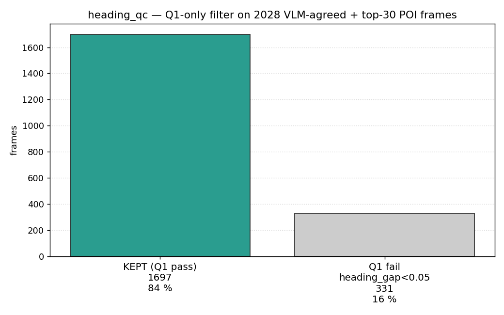

**heading_gap histogram** — anything left of the red `0.05` line is
dropped. The mass left of it is small and concentrated near 0, which
is exactly where the symmetric-facade cases live:

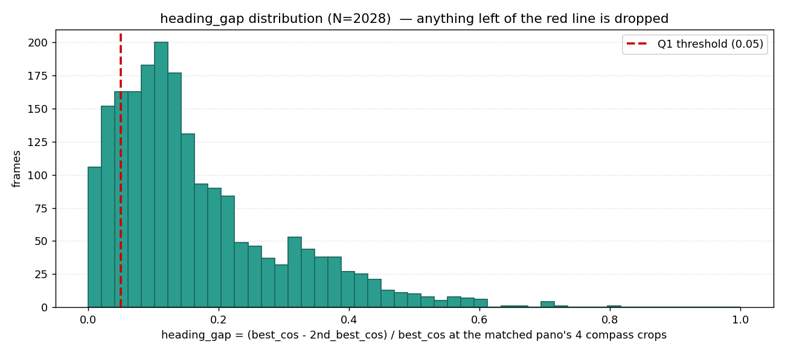

**Per-video pass rate:**

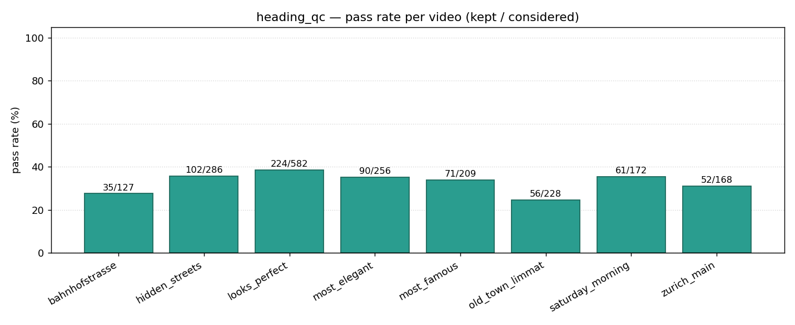

**HMM road-snap stays in the pipeline** (step 7 in §2.10) — its
snapped GPS and `segment_id` are passed through to
`trusted_frames.jsonl` because downstream annotation viz benefits
from the smoothed positions. It just no longer feeds a heading
filter.

**Re-enabling Q2/Q3 for an ablation.** They can be put back as hard
filters with `--use-q2 --use-q3`; in that mode the motion gate and
temporal-window logic from v2 still apply. Useful for an ablation
study showing "what does the answer-quality look like when we use
the stricter motion checks?" — not the default because the default
should be honest about what evidence we actually have.

### 2.5c Sanity-check HTML for the trusted cohort

Three HTML files in `viz/` are the human-inspectable record of the
trusted cohort going into annotation. Keep these open in a browser
when reviewing the dataset; regenerate them after any change to the
label-extraction pipeline so the docs and the artifacts stay in sync.

| File | What it shows | How to regenerate |
|---|---|---|
| **`viz/routes_trusted_frames.html`** | Per-video coloured polylines + heading arrows on a Leaflet map for all **1,697 trusted_frames**. Saturday_morning hold-out is plotted in black so it's visually distinguishable. Click any frame dot for video name, frame_id, heading, heading_gap. **Use this to eyeball that every video's recovered route traces a plausible walking path** (not a teleporting cloud). | `python -m src.viz_routes --input trusted_frames.jsonl --show-headings --output viz/routes_trusted_frames.html` |
| **`viz/trusted_frames_grid_50.html`** | Random **50 of 1,697 trusted frames** rendered as the per-frame photo grid: QUERY photo + the 4 compass crops at the matched SV pano + the chosen-direction red outline + heading_gap + VLM info. **Use this to spot-check that DINOv2 actually picked the right pano direction for trusted frames** — pick a row, see what the camera shows, see which of the 4 SV crops it matched. `--filter-from trusted_frames.jsonl` intersects the gps_recovery_full schema with the trusted-frames key set, so the photo-grid rendering still works (the trusted_frames schema is thinner). | `python -m src.viz_recovery_grid --input gps_recovery_full.jsonl --filter-from trusted_frames.jsonl --output trusted_frames_grid_50.html --limit 50 --random --seed 42` |
| **`viz/gps_recovery_full_grid_vlm_agreed_50.html`** | Random **50 of 2,470 VLM-agreed** (the cohort **before** heading_qc) — also showing 50 of DISAGREE and 50 of VLM_UNRESOLVED for compare-and-contrast. **Use this to understand what Q1 (and the F1/F2/F3 reconcile gate) rejected.** The DISAGREE section especially is informative: VLM and DINOv2 named different places at the same frame. | `python -m src.viz_recovery_grid --input gps_recovery_full.jsonl --tier 1 --limit 50 --random --seed 42 --output gps_recovery_full_grid_vlm_agreed_50.html` |
| **`viz/heading_check.html`** | **Heading-direction sanity check, split-pane**: interactive Leaflet map of N=30 random trusted frames with their heading arrows (left), scrollable photo gallery (right) with photo + compass widget + GPS/heading/place_guess/HMM-edge-bearing per card. Click a card to fly the map to that frame and flash its marker. Quick way to scan "does the recovered heading match what the photo shows?" — the symmetric-pano flips (~180° wrong) jump out because the compass needle points the opposite way from the photo's view. Worked example + problem statement in §2.5c.1 below. | `python -m src.viz_heading_check --n 30 --seed 42` |

#### 2.5c.1 Heading-check viz — what it does and why it exists

**The problem.** Per-frame DINOv2 recovers a heading by cosine-
weighted averaging over the 4 compass crops at the matched Street
View pano (§2.5). Q1 (`heading_gap ≥ 0.05`) drops the easy
ambiguous cases — symmetric facades where the best and 2nd-best
crops score nearly the same — but **a confidently-wrong heading
can still slip through** when one direction's cosine is just barely
higher than the symmetric opposite (the front/back flip pattern).
There is no purely-automated way to catch these post-Q1: the data
itself looks consistent (high gap → "trustworthy"), only the human
looking at the photo can see "actually this view is north-facing,
not south-facing as the number says".

`viz/heading_check.html` is the **human-in-the-loop verification
tool** for that residual error. It puts the photo *next to* a
compass widget showing the recovered heading on the same row, so a
mismatch is visible in one glance.

**Layout** — split-pane HTML, ~600 KB self-contained (base64 photos
+ CDN Leaflet):

```
┌─────────────────────────────────┬─────────────────────────────────────┐
│                                 │  [photo, 220×160] │ place_guess:    │
│                                 │                   │   Bahnhofstrasse│
│   ┌─────┐                       │                   │ heading: 0°     │
│   │ N   │ Leaflet map           │                   │ heading_gap 0.21│
│   │ │   │ (OSM tiles, POI_BBOX  │                   │ GPS: 47.37..    │
│   │ │   │ rectangle, all N=30   │  ┌──────┐         │ HMM bearing: 5° │
│   │ ●─→ │ frames as coloured    │  │  N   │         │                 │
│   │ ●─→ │ dots + 25 m heading   │  │  │   │ compass │                 │
│   │ ●   │ arrows in the video's │  │  │   │ widget  │                 │
│   │     │ colour)               │  │ ●─→  │ (red    │                 │
│   │     │                       │  │      │ needle  │                 │
│   │     │ Click a card on the   │  └──────┘ in video │                 │
│   │     │ right → map flies to  │           colour)  │                 │
│   │     │ that frame & opens    │  ─────────────────────────────────  │
│   │     │ its tooltip.          │  [photo, 220×160] │ place_guess: …  │
│   │     │                       │                   │ heading: …      │
│   └─────┘                       │   …               │ …               │
│                                 │                                     │
└─────────────────────────────────┴─────────────────────────────────────┘
   ←————— map: ~58 % width ——————→ ←————— gallery: ~42 % width ——————→
                                          (scrollable, one card per frame)
```

**What the human checks, per card.** Three pieces of data are
co-located:

| What | Where on the card | What you compare it to |
|---|---|---|
| The actual photo | Left (220 × 160 thumbnail) | The compass widget — does the *view direction* visible in the photo match the *needle direction* on the compass? |
| The recovered heading | Compass needle pointing 0–360°, drawn in the video's colour | The photo — N-facing should show what you'd expect for that GPS spot |
| Metadata (place_guess, heading number, heading_gap, HMM segment bearing) | Right of the compass | The numbers themselves — high `heading_gap` (e.g. 0.21) should give you more confidence the heading is right; low (e.g. 0.06) less |

**Two worked-example cards** showing the failure modes the check
catches:

```
─────────────────────────────────────────────────────────────────────
  ┌──────────────────┐    ●──────────┐   place_guess: Bahnhofstrasse
  │                  │    │  N       │   heading:     0° ↑
  │   [tram tracks   │    │  │       │   heading_gap: 0.21
  │    going N down  │    │  │       │   GPS:         47.37498, 8.53696
  │    a long        │    │  ●─→     │   HMM edge:    5°
  │    boulevard]    │    │ E        │
  │                  │    └──────────┘   ✅  PHOTO ↔ COMPASS AGREE
  └──────────────────┘                       Camera shows N-facing
                                              tracks; compass says N.
─────────────────────────────────────────────────────────────────────
  ┌──────────────────┐    ●──────────┐   place_guess: Niederdorfstrasse
  │                  │    │  N       │   heading:     180° ↓
  │   [view of an    │    │  │       │   heading_gap: 0.07  ← only just
  │    old-town      │    │  │       │   GPS:         47.37596, 8.54403   passed Q1
  │    facade that's │    │  ●       │   HMM edge:    0°
  │    clearly the   │    │  │       │
  │    N-facing one] │    │  ▼       │   ❌  PHOTO SAYS N,  COMPASS SAYS S
  │                  │    │  S       │       This is a front/back flip
  └──────────────────┘    └──────────┘       — symmetric-facade Q1
                                              didn't catch.  Discard or
                                              note for a tighter Q1
                                              (--min-gap 0.10).
─────────────────────────────────────────────────────────────────────
```

**Workflow.** Open the file (`file:///…/viz/heading_check.html`),
scroll the gallery on the right, and for each card spend ~2 seconds
on the photo-vs-compass match. Flag any obvious flips. Click the
card to fly the map to that frame's GPS — useful for "what street is
this on?" context. A 30-frame pass takes ~2 minutes; a 60-frame
pass takes ~5.

**What it lets you decide.** After scanning N=30 frames:

- 0 flips → trusted_frames cohort is clean; full annotation can
  proceed at the current `--min-gap 0.05` Q1 threshold.
- 1–2 flips (≈ 5–10 %) → acceptable noise; the per-sample verifier
  (§2.7.6) will drop the wrong-heading frames at annotation time.
- More than 5 flips (≈ 17 %+) → tighten Q1 first: re-run
  `python -m src.heading_qc --min-gap 0.10` and re-render the
  check. Cuts ~30 % more frames but the survivors are cleaner.

**What it does NOT do.** It is **not** a hard filter — it doesn't
write a new `*.jsonl` excluding flagged frames. Discoveries from the
visual scan feed back into `--min-gap` or into per-frame manual
blocklists (not implemented yet). The closed-loop verifier at
annotation time (§2.7.6) is the automated filter that *does* drop
wrong-heading samples downstream, but it pays per-Pro-call to
discover them. Catching them with the eyeball check first is the
order-of-magnitude cheaper option.

Open each with `file:///C:/Users/z0502/Desktop/cs231n/navlm_v2/viz/<name>.html`.

**Reproducibility.** All three accept `--seed`; the commands above
pin `--seed 42` so the same 50 frames are sampled every time. Change
the seed to look at a different draw. The route map (1st file) is
deterministic — it plots every trusted frame.

### 2.5d Per-video route comparison — recovered vs OSM ideal

`viz/route_compare_per_video.html` overlays, **per video**, the two
routes you actually want to compare:

- **OSM ideal** (dashed grey) — `nx.shortest_path` on the walking
  graph from the first frame's GPS to the last frame's GPS, via the
  middle frame as a waypoint (so loops still produce a meaningful
  comparison instead of collapsing to "stay at A").
- **Recovered** (per-video colour, **dark → light gradient from
  start to end**) — the chronological sequence of HMM-snapped GPS
  positions. The shading is the direction cue: dark end of the line
  is where the walk started, light end is where it finished.

```powershell
python -m src.viz_route_compare
# default in : road_snapped.jsonl  +  osm_walking.pkl
# default out: viz/route_compare_per_video.html
# --only saturday_morning to focus one video
```

Markers per video:
- green pin = start frame
- red pin = end frame
- blue pin = middle waypoint used by the OSM shortest path

**Plus two POI-grid layers** (the same content as §2.5f's standalone
`viz/poi_route_grid.html` overlaid into this map for context):

- **top-30 POI destination pool** — 30 ranked markers with name
  labels. Default **ON** — useful context for every video; lets you
  see at a glance which destinations any video walked past.
- **435 POI-pair OSM routes** — the complete C(30,2) grid as faded
  thin lines, coloured short→long by `viridis_r`. Default **OFF**
  (toggle in the layer control) so per-video lines stay readable
  when you first open the page. Turn it on to see the full
  "tour-route" graph the annotator can sample from.

The LayerControl (top right of the map) toggles videos / POI markers
/ POI route grid independently; the legend (top left) shows each
video's dark/base/light gradient swatches + frame count + OSM node
count, and notes which layers are on by default.

What you can spot in this view:
- segments where the recovered polyline jumps far off the OSM graph
  → a remaining gps_recovery error (the dot doesn't snap cleanly to
  a walking edge);
- big detours from the OSM ideal → the videographer deliberately
  routed through a landmark (tour-walk pattern; expected);
- recovered route doubling back on itself → loop walks (Niederdorf-
  strasse → Limmatquai is a common circuit in our videos);
- saturday_morning hold-out (black gradient) traces a path that's
  visually distinct from training videos, confirming the eval split
  is genuinely held-out scenery.

### 2.5e HMM road-snap parameters — what each one calculates

`src/road_snap.py` runs Newson-Krumm HMM map-matching. For each
frame's GPS observation, Viterbi picks the most-likely OSM graph
node by combining two log-probabilities scored at every step.

**(1) `emission_logp σ = 20 m`** — *how well does this candidate node
explain this GPS reading?*

```python
def emission_logp(gps_dist_m, sigma_m=20.0):
    return -0.5 * (gps_dist_m / sigma_m) ** 2
```

For each observation and each candidate node, the log-probability
that the GPS reading came from the walker being at that node,
modelling GPS error as a zero-mean Gaussian with standard deviation
σ. `gps_dist_m` = haversine distance from the raw GPS to the
candidate. σ = 20 m calibrates the tolerance:

| GPS-to-node distance | penalty | weight |
|---:|---:|---:|
| 0 m  | 0.00 | 1.00 |
| 10 m | 0.13 | 0.88 |
| 20 m (1 σ) | 0.50 | 0.61 |
| 40 m (2 σ) | 2.00 | 0.14 |
| 60 m (3 σ) | 4.50 | 0.011 |

Why σ = 20 m: urban GPS is ~5–10 m accurate; our `g_dino` (Street
View pano coordinate) adds another ~5–15 m of pano-position error.
20 m covers both without letting candidates 100 m away (parallel
street) compete.

**(2) `transition_logp β = 30 m`** — *how plausible is it that the
walker moved from candidate A to candidate B between two consecutive
frames?*

```python
def transition_logp(great_circle_m, route_m, beta_m=30.0):
    return -abs(route_m - great_circle_m) / beta_m
```

For each pair of consecutive observations, compute two distances
between any pair (previous candidate A, current candidate B):

- `great_circle_m` = haversine straight-line distance A→B
- `route_m` = `nx.shortest_path_length(G, A, B, weight="length")` —
  the actual walking distance along the OSM edges

The gap `|route − great_circle|` is what's penalised. Zero gap means
A and B are directly walking-reachable. A 200-m gap (50 m apart as
the crow flies, but 250 m via the OSM edges) means the candidate
implies walking around a whole block — implausible between two
consecutive frames. β = 30 m calibrates:

| `\|route − gc\|` gap | penalty | weight |
|---:|---:|---:|
| 0 m  | 0.0 | 1.00 |
| 30 m (1 β) | 1.0 | 0.37 |
| 60 m (2 β) | 2.0 | 0.14 |
| 150 m | 5.0 | 0.007 |
| unreachable (`NetworkXNoPath`) | 10 × gc | ~0 |

Why β = 30 m: intersections introduce small `route ≠ great_circle`
gaps from kerb/crosswalk node placement (5–15 m typical). 30 m
absorbs that without forgiving multi-block teleports.

**(3) Candidate set per observation** — *which OSM nodes does Viterbi
consider for each frame?*

```python
nearest = ox.distance.nearest_nodes(G, x, y)
candidates = [nearest] + list(G.neighbors(nearest))
```

The single nearest graph node + its direct topological neighbours
(typically 3–6 nodes on Zurich's walking graph). No hard distance
cap on candidates — a neighbour 200 m away is still in the set; the
emission penalty just makes it very unlikely. This is intentional:
Viterbi can recover from a single bad nearest-node pick at frame t
by jumping to a neighbour at frame t+1.

Why this strategy vs alternatives:

- *All nodes within R metres* — slower (per-frame spatial range
  query), risks excluding the right node in sparse areas
- *Top-K nearest by distance* — ignores graph topology, may pick K
  nodes all on the same edge
- *Nearest + neighbours (ours)* — O(log N) per frame, graph-aware,
  ≤6 candidates so per-frame transition cost is tiny

**(4) Graph projection — UTM 32N (EPSG:32632)** — *why we project the
graph at build time.*

`ox.distance.nearest_nodes(G, x, y)` has two performance paths:

- **G in lat/lon (EPSG:4326)** — distance must be haversine
  (great-circle). osmnx falls back to a `sklearn.neighbors.BallTree`
  — needs scikit-learn installed AND is slow per query.
- **G projected** — distance is Euclidean (Pythagorean). osmnx uses
  `scipy.spatial.cKDTree` — already installed via scipy, queries in
  O(log N) with cheap arithmetic.

UTM zone 32N covers longitudes 6°E–12°E and so includes Zurich.
Coordinates in this zone are in **metres** from the zone's origin,
making Euclidean distance correct (the projection distortion at
Zurich's latitude is < 0.1 %).

Where the projection happens — `src/build_walking_graph.py`:

```python
G = ox.graph_from_bbox(bbox=(W, S, E, N), network_type="walk")
G_proj = ox.project_graph(G)        # → EPSG:32632 (UTM 32N)
pickle.dump(G_proj, f, …)
```

`road_snap.py` then loads the projected graph, projects each GPS
observation `(lat, lon) → (x, y)` via `pyproj.Transformer`, runs
the HMM in projected space, and converts the chosen nodes back to
(lat, lon) when writing output.

**How the three numbers combine in one Viterbi step.**

```
score(state_t) = max over prev in candidates_{t-1} of:
                   score(prev)
                 + emission_logp( dist(gps_t, state_t),               σ=20 )
                 + transition_logp( |route(prev,state_t) − gc|,       β=30 )
```

For each candidate at time t, pick the previous-step candidate that
gives the best *cumulative* score — accumulated path + how well
candidate t explains observation t (emission) + how plausible the
move from prev to t is (transition). Repeat for every frame. At the
end, the highest-scoring final state's back-pointer chain is the
snapped path.

Result: a sequence of OSM nodes that's globally optimal under the
soft penalties — never strays too far from the GPS, never teleports
through buildings. **No candidate is ever hard-rejected by
distance**, only weighted.

**Tuning knobs.** Edit `sigma_m=20.0` in `emission_logp` and/or
`beta_m=30.0` in `transition_logp` in `src/road_snap.py` and re-run
step 7. Looser σ → more tolerant of GPS jitter (recovered route hugs
GPS less tightly); looser β → more tolerant of OSM gaps between
consecutive frames (allows more detours). The defaults above are
the v1 numbers; we have not yet swept these.

| Parameter | Default | What it controls | Where set |
|---|---:|---|---|
| `emission_logp` σ | **20 m** | Gaussian penalty on GPS-to-candidate distance | `src/road_snap.py:emission_logp` |
| `transition_logp` β | **30 m** | Linear penalty on `\|route − great_circle\|` between consecutive candidates | `src/road_snap.py:transition_logp` |
| candidate set per observation | nearest node + neighbours | typically 3–6 nodes; no hard cap | `src/road_snap.py:_per_video_snap` |
| projection | **UTM 32N (EPSG:32632)** | fast cKDTree nearest-node lookup | `src/build_walking_graph.py` |

### 2.5f Complete POI-pair route grid

`viz/poi_route_grid.html` overlays the OSM shortest path between
**every pair** of the top-30 destination POIs — C(30, 2) = **435
routes** on one map — together with the 30 POI markers labelled by
rank.

```powershell
python -m src.viz_poi_route_grid --input trusted_frames.jsonl `
                                  --top-n 30 `
                                  --output viz/poi_route_grid.html
```

Why this map matters: at the §2.7 instruction-annotation stage we
sample destinations from this top-30 pool, so the routes we're going
to plan during annotation are **subsets of these 435 paths**. The
overlay heatmaps the streets the trained model will most rely on:
Bahnhofstrasse, Limmatquai, Münsterbrücke and the old-town axes
visibly heat up because they're shared by dozens of POI pairs.

What's drawn:

- **30 POI markers** — coloured by visit-count rank (top 1 dark red,
  fading toward pink/grey for the lowest of the top-30). Labelled
  with rank + name in a small badge next to the dot. Tooltip / popup
  shows frame count and the centroid GPS used to seed the routes.
- **435 OSM shortest paths** — semi-transparent thin polylines
  (`opacity 0.18`, `weight 2`), coloured by route length using the
  `viridis_r` colormap (yellow = short, purple = long). The
  transparency is deliberate: where N paths overlap on the same
  edge the visual density compounds into a heatmap.
- LayerControl toggles the markers and routes independently.

**Each POI's location** is the **median (lat, lon) of all frames
whose `place_guess` resolves to that POI**, not the OSM-table
centroid. This is the same GPS the annotator uses as a destination
seed for the instruction prompts — using it here means the routes
on the map are the routes the teacher will actually plan during
annotation.

**Cohort.** The default input is `trusted_frames.jsonl` (1,697
frames, all 30 top-POIs survived heading_qc — see §2.5b table).
You can switch to `gps_recovery_full.jsonl --tier 1` for the wider
2,470-frame VLM-agreed cohort if you want to see the POI ranks
before Q1 filtering — it's the same 30 POIs in nearly the same
order.

**Tuning knobs:**

- `--top-n 50` — widen the destination pool (1,225 routes for N=50)
- `--max-route-km 1.5` — drop unrealistically long routes (drops a
  handful of "across the lake" pairs at default N=30; nothing
  dropped at N=30 on this cohort)
- `--poi-field dino_nearest_name` — rank by DINOv2-nearest OSM POI
  instead of VLM-resolved POI (the 71-POI universe from §2.5)

**Why 60° tolerances.** The 4 action verbs (continue, left, right,
around) bin direction into 90° quadrants. We need the recovered
heading to land in the right quadrant after the verb is applied; 60°
leaves a 30° margin on either side, the same margin the closed-loop
verifier (§2.7) uses. Tighter (e.g. 45°) starts cutting frames whose
heading is correct but where the segment bearing is averaged over a
curved street; looser (e.g. 90°) lets ±90° camera rotations slip
through.

The diagnostics file `data/cities/zurich/heading_qc_diagnostics.jsonl`
gets the per-frame Q1/Q2/Q3 verdicts + the actual angular deltas;
`src/viz_heading_qc.py` plots them.

**Measured on 2026-05-25** (`gps_recovery_full.jsonl` →
`road_snap --tier 1 --top-pois 30` → `heading_qc`):

```
N considered (the HMM-snapped, top-30 cohort):  2,028 frames
  dropped Q1 (heading_gap < 0.05):                331  (16 %)
  dropped Q2 (|Δseg| > 60°):                      499  (25 %)
  dropped Q3 (|Δtd|  > 60°):                      507  (25 %)
  KEPT (all three pass) → trusted_frames.jsonl:   691  (34 %)

|Δseg|: median 97.6°  p90 168.2°  max 179.8°
|Δtd|:  median 92.4°  p90 167.1°  max 180.0°
```

Per-video kept counts (held-out `saturday_morning` in **bold**):

| video | snapped | kept | pass |
|---|---:|---:|---:|
| looks_perfect    | 582 | 224 | 38 % |
| hidden_streets   | 286 | 102 | 36 % |
| most_elegant     | 256 |  90 | 35 % |
| most_famous      | 209 |  71 | 34 % |
| **saturday_morning** | 172 | **61** | 35 % |
| old_town_limmat  | 228 |  56 | 25 % |
| zurich_main      | 168 |  52 | 31 % |
| bahnhofstrasse   | 127 |  35 | 28 % |
| **total** | **2,028** | **691** | **34 %** |

That the median |Δseg| and |Δtd| are both ~95° — much higher than
the 60° tolerance — is informative: a substantial fraction of
per-frame DINOv2 headings is wrong by a ~quadrant or more, and Q2/Q3
catch them. Q2 and Q3 also overlap heavily (a single rotated camera
fails both), so the union dropped is not (499+507) but a tighter
807 frames once first-fail counting is applied.

**Drop-reasons bar** (first-fail counting Q1 → Q2 → Q3, bars sum to N):


**Q2 disagreement histogram** — `|recovered − segment_bearing|`. The
60° red line is the threshold; everything to the right is dropped:

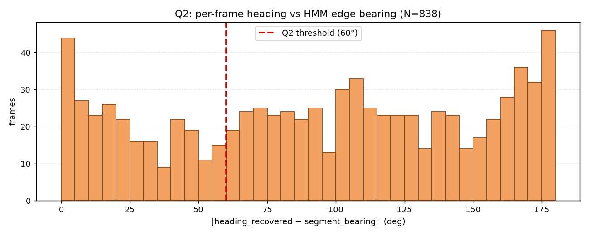

**Q3 disagreement histogram** — `|recovered − td_bearing|`. Note the
similar shape to Q2 (the two checks are correlated but not identical
— each catches a different ~12 % the other misses):

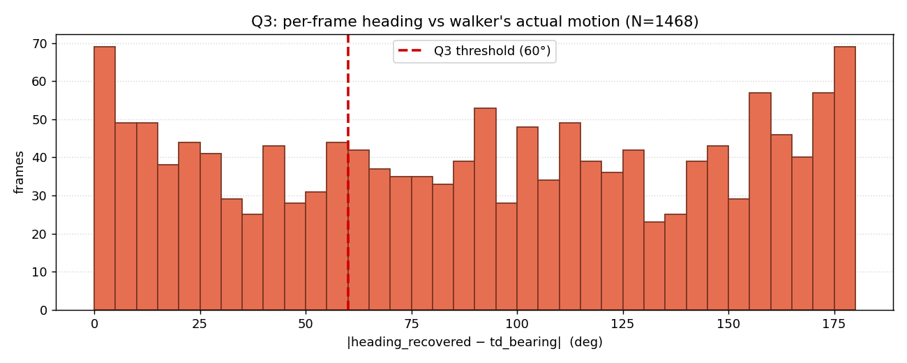

**Joint Q2/Q3 scatter** — each frame is one dot at (|Δseg|, |Δtd|).
Green = passes both, red = fails at least one. The lower-left
quadrant (both under 60°) is what survives:

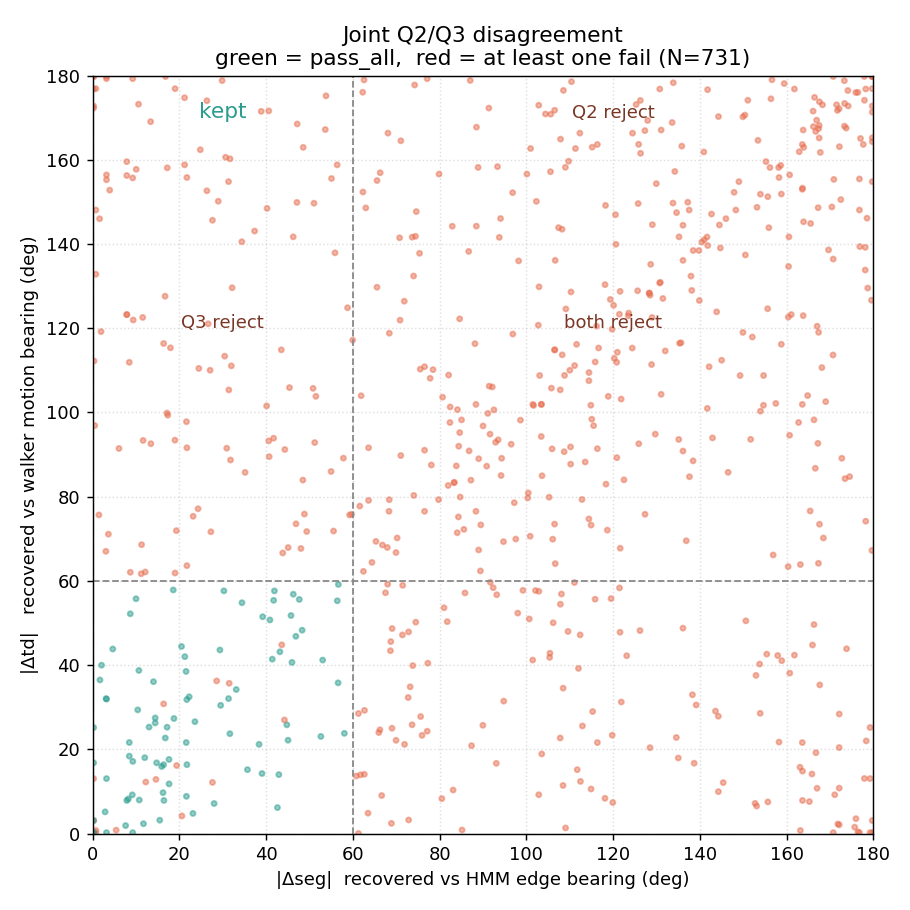

**Per-video pass rate** — pass rates land in a narrow 25–38 % band
across videos, including the eval hold-out (`saturday_morning` at
35 %), which is reassuring: the QC isn't systematically biased
against any one video's footage:


**Cohort scope — HMM runs on the VLM-agreed + top-30 POI subset.**
By default `src/road_snap.py` uses `--tier 1 --top-pois 30`, meaning
it only HMM-snaps frames that (a) survived the F1∧F2∧F3 strict gate
**and** (b) whose VLM-resolved POI is among the 30 most common in
the input (Bahnhofstrasse, Augustinergasse, Niederdorfstrasse, …; see
§2.5 chart). Rationale:

- This is the **same cohort the teacher annotator will use** (§2.7
  destination pool). Snapping anything more is wasted compute — those
  frames won't be annotated.
- Of the 2,470 VLM-agreed frames, the top-30 filter keeps **~1,900**
  (≈ 77 %). The trimmed 23 % are 1-frame singletons that wouldn't
  contribute to a route polyline anyway.
- Override with `--top-pois 0` to snap all 2,470 (or `--tier 0` to
  also include the 12,583 visual-match-only frames — HMM's sequence
  continuity is in principle exactly what those frames need, but the
  cost-controlled default skips them).

Label-extraction output: **trusted frames, each with `(gps, heading, edge_id)`**.

**GPS recovery — two paths through the filter, depending on whether
the frame has a VLM scan.** The gps_recovery loop iterates **every
frame in the DINOv2 cache** (the default `frames_n1_l0.npz` covers
all ~26 k extracted frames). Each frame is sent down one of two paths:

```
VLM-confirmed path   the frame is in <poi-scan file> (default: every-30
                     VLM sample; current production:
                     poi_scan_cos0.75.jsonl — see "--poi-scan lever"
                     below for the upgrade path)
                     F1 cos_dino  >= MIN_SIM            (DINOv2 real match)
                     F2 vlm_gps   is not None            (VLM resolved to OSM)
                     F3 exact-name match  OR
                        distance(vlm_POI, dino_nearest_POI)
                                            <= NEIGHBORHOOD_RADIUS_M
                     gps = g_dino  (the matched SV pano's coords)
                     → highest-confidence label, used directly by the
                       teacher.

visual-match path    the frame has no VLM signal (everything else)
                     F1 cos_dino  >= MIN_SIM
                     gps = g_dino
                     → "DINOv2 candidate"; weaker per-frame confidence
                       but useful in bulk. HMM road-snapping uses
                       sequence continuity to filter single-frame errors.
```

Both paths compute the same **heading** (cosine-weighted circular
mean of the 4 compass crops at top-1's pano) and **heading_gap**
(same-pano cosine ratio) as confidence diagnostics.

**Headline per-frame stage measurement — full version
(`gps_recovery_full.jsonl`, 2026-05-25):**

```
26,034 frames in the DINOv2 cache; F1 cos_dino >= 0.60 keeps 16,684

VLM-confirmed path (4,101 frames have VLM at cos≥0.75
                    after the §2.10 expansion):
  accepted            2,470  (60%)   ← F1∧F2∧F3 strict-trusted
  disagree            1,432  (35%)   ← VLM and DINOv2 disagree (rejected)
  vlm_unresolved        199  ( 5%)   ← VLM named a place missing from OSM

visual-match path (12,583 frames pass F1 only):
  accepted           12,583          ← DINOv2-only, sequence-continuity job

heading_gap among the 2,470 VLM-confirmed accepted:
  ≥ 0.15 confident   43%
  ≥ 0.05 some signal 85%
  <  0.05 ambiguous  15%   ← dropped by heading_qc Q1 (§2.5b)

per-video VLM-confirmed accepted (eval hold-out saturday_morning bolded):
  looks_perfect     668     bahnhofstrasse  136
  hidden_streets    329     **saturday_morning  222**
  most_elegant      306     zurich_main     252
  most_famous       281     old_town_limmat 276
```

Total label-extraction output: **2,470 strict-trusted frames** for the
teacher + **12,583 DINOv2-only frames** for HMM to filter on sequence
continuity = 15,053 frames headed into the annotation step.

**Visualizations of the 2,470 VLM-agreed cohort** (generated by
`python -m src.viz_distributions --tier 1 --prefix vlm_agreed`):

POI distribution — what the VLM thinks each frame is, after OSM
alias resolution (**105 distinct OSM POIs** across 2,470 sightings;
top 30 shown):

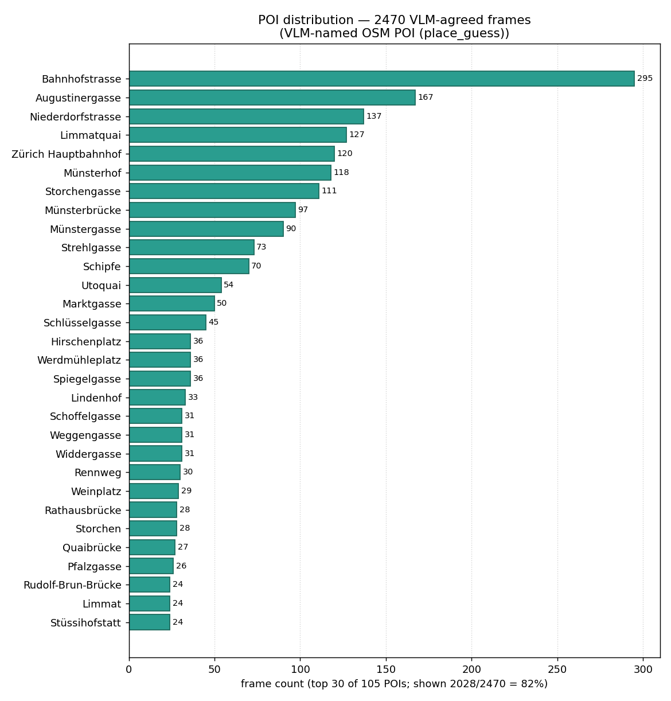

Top 10: Bahnhofstrasse 295 (12.0 %) · Augustinergasse 167 ·
Niederdorfstrasse 137 · Limmatquai 127 · Zürich Hauptbahnhof 120 ·
Münsterhof 118 · Storchengasse 111 · Münsterbrücke 97 · Münstergasse 90 ·
Strehlgasse 73. Top 10 = 56 % of the cohort.

**Three distinct POI counts** — make sure you ask about the right one:

| Source column | Distinct count | What it counts |
|---|---:|---|
| `vlm_guess_raw` | 243 | Raw strings Gemini Pro wrote (e.g. "Grossmünster &#124; Great Minster") |
| `place_guess`   | **105** | OSM POIs the VLM resolved to (alias-aware match against pois.json) |
| `dino_nearest_name` | 71 | OSM POIs DINOv2 found geometrically nearest the matched SV pano |

(Only 237/2,470 = 10 % have `place_guess == dino_nearest_name` exactly
— most VLM-agreed frames pass F3 via the **250 m neighborhood**
fallback, where the VLM named a landmark and DINOv2's nearest is the
adjacent street/square. That's expected: "Grossmünster" vs
"Grossmünsterplatz" should both pass.)

Heading distribution — per-frame recovered headings (15° bins,
circular polar; 0° = N, clockwise):

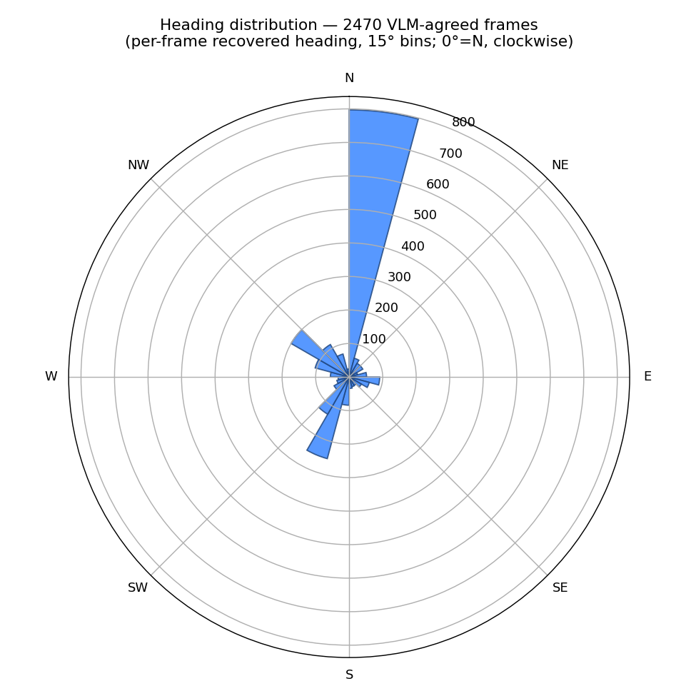

Linear 10° histogram for exact counts:

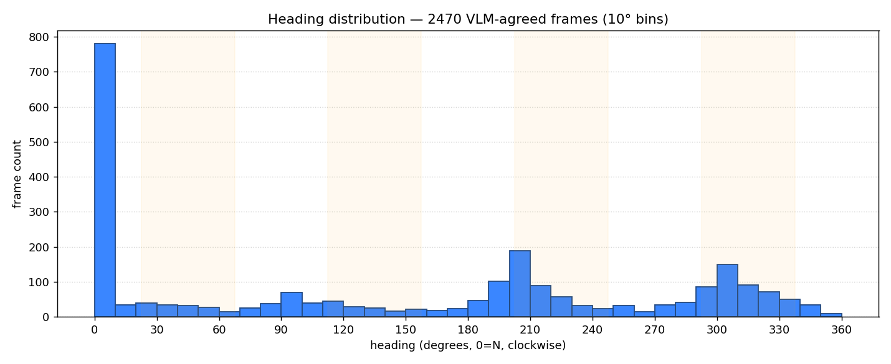

The strong N–S concentration (~55 % of headings within ±22.5 ° of
0 °/180 °) reflects Zurich's main walking corridor along
Bahnhofstrasse / the Limmat — the videos themselves are walked along
this N–S axis. East/west headings (~25 % combined) are mostly
cross-street segments. The 4-bin orange shading on the linear chart
marks the diagonal compass intercardinals (NE/SE/SW/NW) — visibly
underrepresented, which is geographical rather than a recovery
artefact.

**Pilot reference (for context — `gps_recovery_all.jsonl`, every-30
sample only):** VLM-confirmed accepted 324 / 576 candidates that
passed F1, visual-match accepted 16,108. The full version above is
the `--poi-scan poi_scan_cos0.75.jsonl` upgrade of this pilot — same
DINOv2 cache, same F1/F2/F3 logic, only the VLM-scan source changed.
See "The `--poi-scan` lever" below for the controlled comparison.

**Where `s_dino` (and therefore the cos≥0.75 filter) comes from.**

```
purchased SV images                 DINOv2-base                  matmul
data/cities/streetview/zurich/   →  CLS token, L2-norm  ─┐    sims = SV·frame
    images/*.jpg  (4,431 crops      ─────────────────┐   │       ↓
    = 1,108 panos × 4 headings)                      │   │   s_dino = sims.max()
    meta.jsonl    (lat/lon/heading                   ▼   │       │
                   per crop)                  sv_v1.npz  │       ▼
                                              (4431,768) │   gps_recovery_all.jsonl
                                                         │     one row per frame,
extracted video frames                                   │     s_dino column
data/cities/zurich/frames/<video>/   →  DINOv2-base  →   │       │
    frame_NNNNN.jpg  (26,034)            frames_n1_l0.npz┘       │
                                         (26034,768)             ▼
                                                          _vlm_test.py
                                                            r['s_dino'] >= 0.75
                                                                 │
                                                                 ▼
                                                          4,101 frames →
                                                          Gemini Pro scan →
                                                          poi_scan_cos0.75.jsonl
```

So **the 0.75 is a filter on a precomputed column** (`s_dino` in
`gps_recovery_all.jsonl`), not a fresh DINOv2 run. `s_dino` itself is
`(sv_v1.npz @ frames_n1_l0.npz[i]).max()` — the best cosine between
the frame and any of the 4,431 purchased Street View crops.

**The `--poi-scan` lever.** `gps_recovery.py --poi-scan <file>` picks
which VLM-scan file defines the VLM-confirmed candidate set.
Everything else is held constant — same `frames_n1_l0.npz` cache,
same `MIN_SIM=0.6`, same `NEIGHBORHOOD_RADIUS_M=250 m`, same
`reconcile_strict` logic — so the comparison isolates *exactly* the
effect of the VLM expansion.

**Measured side-by-side on 2026-05-25** (output files both on disk):

| | pilot — `gps_recovery_all.jsonl` (--poi-scan poi_scan.jsonl) | full — `gps_recovery_full.jsonl` (--poi-scan poi_scan_cos0.75.jsonl) |
|---|---:|---:|
| VLM-scan source rows                       | 872 (every-30) | 4,101 (every-30 ∪ cos≥0.75 visual-match promotions) |
| VLM-confirmed candidates surviving F1 (cos≥0.6) | 576 (296 dropped) | 4,101 (all pass F1 by definition) |
| **VLM-confirmed accepted (F1∧F2∧F3 strict)**| **324**  | **2,470** ← **~7.6× more** |
| VLM-confirmed rejected (F3 disagree)       | 252  | 1,631 |
| Visual-match accepted (DINOv2-only, F1)    | 16,108 | 12,583 |
| Total rows written                         | 16,684 | 16,684 |
| Total accepted (VLM-confirmed + visual-match) | 16,432 | 15,053 |

Two things to notice:

1. **VLM-confirmed accepted ~7.6×.** The cos≥0.75 expansion handed F3
   the VLM evidence to confirm 2,470 frames as strict-trusted, vs 324
   from the every-30 pilot. These are the frames the teacher
   annotator can use directly without needing HMM rescue.

2. **Total accepted slightly down** (15,053 vs 16,432). This is a
   *quality win*, not a loss: 1,631 frames that the pilot accepted on
   the visual-match path (DINOv2-only) now have VLM evidence that
   DINOv2 was wrong (F3 disagree), so they get rejected. Pre-filtering
   those out before HMM saves the road-snapper from chasing route
   outliers it would have had to drop anyway.

Run the second variant (the §2.10 step 6d command):

```powershell
python -m src.gps_recovery --poi-scan poi_scan_cos0.75.jsonl `
                           --output gps_recovery_full.jsonl
```

~12 s; no API; the output filename differs from the pilot's so both
stay on disk side-by-side for viz comparisons (`viz_recovery.py
--input gps_recovery_full.jsonl --output viz/gps_recovery_full_map.html`).

**Modules:** `src/gps_recovery.py` (main orchestrator; iterates all
frames in the DINOv2 cache, routes each frame down the VLM-confirmed
or visual-match path) · `src/spatial.py` (POI geometry index + name
match + neighborhood distance) · `src/geo_check.py` (per-frame
VLM → GPS for the VLM-confirmed path; no live API call when the
frame is already in the chosen poi-scan file) · `src/reconcile.py`
(the F1/F2/F3 logic, gps = g_dino always) · `src/viz_recovery.py`
(Folium map: per-frame g_dino dots, VLM-confirmed disagree, vlm-
centroid layers, available-but-not-bought panos) ·
`src/viz_recovery_grid.py` (per-frame photo grid HTML — QUERY frame
+ the 4 compass crops at top-1's pano, with the chosen direction
outlined and the heading-calc math worked) · `src/viz_coverage.py`
(SV-pano coverage + matched-POI map, outlier flagging via
`outlier_pois.json`).

**Road-snapping.** The accepted per-frame GPS sequence is smoothed onto
the OSM walking graph with HMM map-matching (Newson-Krumm Viterbi),
removing jitter and forcing positions onto walkable geometry.

Label-extraction output: **trusted frames, each with (GPS, heading)**.

### 2.6 Routing — and turning a route into an instruction (Q5)

`src/routing.py` (`plan_route`, osmnx + networkx) computes the OSM
walking route from a frame's GPS to a destination POI:
`nx.shortest_path` by length, giving the route geometry and the
**first-segment absolute bearing `B`**.

HMM road-snapping (§2.5) gives **GPS positions only** — not which way
the camera faces. That is why the per-frame **heading** matters: the
instruction the model must produce is *relative to the camera*.

```
relative action = action_for( B − camera_heading )
   |Δ| ≤ 35°   -> "continue ahead"
   |Δ| > 135°  -> "turn around"
   Δ < 0       -> "turn left"      Δ > 0 -> "turn right"
```

So a frame whose camera faces forward while the route goes *behind* the
walker yields `|Δ| > 135°` → **"turn around"**. The picture's facing and
the route are reconciled exactly here: an absolute route bearing minus
the recovered camera heading. A frame without a trustworthy heading
cannot be turned into a relative instruction and is not used.

### 2.7 Instruction-tuning annotation — process, filtering, design

The teacher VLM (**Gemini 2.5 Pro** on Vertex AI) is given a frame +
its GPS + heading + the planned route + nearby POIs, and produces
`<thinking>` (6 labelled reasoning steps including an
`INFERRED_HEADING` line) + `<answer>` (2–4 TTS-friendly sentences,
relative verbs anchored to a visible object). Per-sample cost is
**~$0.022** all-in (~$0.014 visible output + ~$0.008 of hidden
"thinking" tokens Pro 2.5 burns internally). End-to-end implemented
in `src/annotate.py`.

#### 2.7.1 Inputs

| Source | What it carries | Used for |
|---|---|---|
| `trusted_frames.jsonl` (1,697 rows) | frame GPS, recovered heading, `place_guess`, `segment_id` | per-frame state — the user's "I am here, facing this way" |
| top-30 POI pool (computed from the same file) | name + median GPS + frame-count rank | destination candidates (see §2.7.2) |
| `pois.json` (1,289 entries) | name, geometry | "nearby POIs" context in the user message (radius 300 m, top-8) |
| `osm_walking.pkl` (UTM 32N) | walking graph | `plan_route(start, dest)` → distance + first-segment bearing |
| `frames/<video>/<frame_id>.jpg` | the photo | the visual input to Pro |

Frames are loaded via `_load_trusted_frames()` (looks for
`trusted_frames.jsonl` first, then `phaseA_trusted.jsonl`, then falls
back to accepted rows of `gps_recovery_full.jsonl`).

#### 2.7.2 Destination sampling — 80 / 10 / 10 with fallback bias

Per frame we sample **N = 3 destinations** from the **top-30 POI
pool** restricted to `30 m ≤ haversine_distance ≤ 1500 m` (skips
"you're already there" and "too far to walk"). Sampling is biased
across three distance bands:

| Distance band | Target share | Rationale |
|---|---:|---|
| ≤ 500 m (a few minutes) | **80 %** | the realistic "tourist asks for the next landmark" case — bulk of the dataset |
| 500–1000 m | **10 %** | medium-range walks across the old town |
| 1000–1500 m | **10 %** | cross-town routes that exercise multi-turn instructions |

The pool source — top-30 by `place_guess` frequency in the
VLM-agreed cohort (Bahnhofstrasse, Augustinergasse, Niederdorfstrasse,
…; full list in §2.5f) — was chosen over the full 1,289-POI OSM
table because: (a) it's the places the videos actually walk past; (b)
it excludes 1-frame singletons that would give the teacher no
cross-frame signal; (c) it pairs cleanly with the §3 POI-region
ablation (split 30 into train/test).

**Algorithm** (`src/annotate.py:DIST_BANDS`, `sample_destinations`,
lines 58 + 161–186):

```python
DIST_BANDS = [(0, 500, 0.80), (500, 1000, 0.10), (1000, 1500, 0.10)]

def sample_destinations(candidates, n=3, seed=0):
    rng = random.Random(seed)
    by_band = [[c for c in candidates if lo <= c[1] < hi]
               for lo, hi, _ in DIST_BANDS]
    weights = [share for _, _, share in DIST_BANDS]
    pool    = sorted(candidates, key=lambda c: c[1])
    chosen, used = [], set()
    for _ in range(n):
        band = rng.choices(range(len(DIST_BANDS)), weights=weights)[0]
        opts = [c for c in by_band[band] if c[0] not in used]
        if not opts:                                 # ← FALLBACK
            opts = [c for c in pool if c[0] not in used]   # nearest unused
        if not opts:
            break
        pick = rng.choice(opts)
        chosen.append(pick)
        used.add(pick[0])
    return chosen
```

**The fallback clause** is the key design choice: when the random
draw picks a band but the frame's candidate set has *no* unused POI
in that band, the algorithm falls back to the **nearest unused
candidate** from any band rather than skipping the slot. The result:

- Every frame always emits 3 destinations even when geometry doesn't
  support a perfect band draw (e.g., a frame deep in old-town has all
  30 POIs clustered within 500 m, so the 1000–1500 m band is empty
  for it).
- The dataset's *measured* distribution drifts toward shorter
  distances on those frames.

**Measured distribution on the in-progress run** (2,722 of ~5,091
rows so far, 2026-05-28):

| Band | Target | Actual | Δ |
|---|---:|---:|---:|
| ≤ 500 m | 80 % | **83.9 %** | +3.9 % |
| 500–1000 m | 10 % | **11.4 %** | +1.4 % |
| 1000–1500 m | 10 % | **4.7 %** | −5.3 % |
| > 1500 m | 0 % | 0 % | 0 |

**Design decision: we accept the fallback bias.** The ≤ 500 m
slight over-shoot and the 1000–1500 m under-shoot reflect the
genuine geography of the cohort (top-30 POIs clustered inside the
old town, ~1 km × 1 km). The alternatives — *skip the slot* (some
frames would emit only 2 destinations) or *widen the pool to top-50
to include farther-out POIs* (dilutes the "places that actually
appear in the videos" property) — both have downsides we judged
worse than the slight band drift. The training set is still
dominated by short-range walks (the realistic case) with enough
mid- and long-range coverage to teach multi-turn instructions.

#### 2.7.3 User-message construction

For every (frame, destination) pair, `build_user_msg` writes a short
prompt:

```
My GPS: 47.37498, 8.53696
My camera heading: 220° (0=N, 90=E)
Destination: Grossmünster (a few blocks, first-segment bearing 130°)
Walking-route distance: 480 m
Nearby POIs:
- Bahnhofstrasse
- St. Peter
- Münsterhof
- ...
Tell me what to do, in 2-4 spoken sentences, anchored to something
I can actually see in the photo.
```

The heading line is included in the *training base*; downstream
`src/derive_variants.py` strips it to produce the `implicit` and
`explicit` variants (see §2.10 step 9d).

#### 2.7.4 System prompt — 4 selectable variants

`src/annotate.py:SYS_PROMPTS` defines four candidate teacher prompts;
`--prompt-variant` picks one. The production run used `strict`
(rigid 6-step CoT with named `INFERRED_HEADING` line — closest to
the v1 navlm_ss prompt, and the format the L-explicit LoRA will
learn). Alternatives:

| variant | shape | use case |
|---|---|---|
| **strict** *(default, production)* | rigid 6-step CoT with named INFERRED_HEADING line | trains the explicit-CoT LoRA cleanly |
| compact | paragraph CoT, no labelled steps | cheaper output tokens; loses explicit heading step |
| reasoner | extends strict with a HEADING_REASONING block | use if the model is *guessing* heading instead of triangulating |
| scene | front-loads visible-object enumeration, anchor must be from that list | counter-hallucination bias |

The **user-message format is identical** across variants, so kept
annotations from different variants can be mixed safely if needed.

#### 2.7.5 The Pro call

```python
raw = call_gemini(
    img_path, sys_prompt, user_msg,
    model="gemini-2.5-pro",
    max_tokens=8192,           # see §2.7.6 for why
    label=f"annotate_{variant}_{video}_{frame_id}")
```

Backend: `vertex` (OAuth via gcloud, billed to project
`cs231n-navlm-2026` on `My Billing Account 2`). Every call logged to
`logs/gemini_api.jsonl` with prompt + output token counts, cost,
finish reason, and the **full response text** for forensic inspection.

#### 2.7.6 Closed-loop verifier — what defines a "kept" sample

After the call, `parse_answer` extracts `<thinking>`, `<answer>`,
and the **action verb** (one of `continue ahead` / `turn left` /
`turn right` / `turn around`). The verifier is a pure geometric
self-consistency check:

```python
ACTION_DELTA = {"continue ahead": 0, "turn left": -90,
                "turn right":   90,  "turn around": 180}

δ = abs( angle_diff( heading + ACTION_DELTA[verb], route_bearing ) )
sample is KEPT iff verb is recognised AND δ < 30°.
```

Three numbers are known *before* Pro is even called:

- `heading` — recovered camera direction (from `trusted_frames.jsonl`)
- `route_bearing` — first-segment bearing of the OSM walking path to
  the destination (from `routing.plan_route`)
- `verb` — Pro's pick from the 4 action verbs

If the user faces `heading` and performs `verb`, their new heading is
`heading + ACTION_DELTA[verb]`. For the instruction to be *correct*,
that new heading must point toward where they actually need to go
(`route_bearing`). The verifier measures the gap and drops the sample
when it's too large.

**Why 30°.** The 4 verbs partition heading into **4 bins of 90°**;
the boundary between "ahead" and a turn sits at ±45°. 30° = the 45°
half-bin minus a 15° safety margin. Tighter (e.g., 20°) starts
cutting samples whose heading is correct but where the segment
bearing was computed from a slightly curved street; looser (e.g.,
45°) lets borderline cases through. The 30° default is a
discretization-driven tolerance, not a deep result; tunable via
`--max-delta`.

**Truncation-robust parsing.** `parse_answer` is forgiving of two
real failure modes seen in the smoke:

- `</thinking>` / `</answer>` closing tags missing — accepts
  everything up to end-of-string
- `<answer>` block missing entirely — falls back to extracting the
  verb from a `STEP 5 ACTION:` line inside `<thinking>`, then any
  of the 4 verbs anywhere in `<thinking>`

Without these, a Pro response truncated mid-thinking (next section)
would silently drop the sample.

#### 2.7.7 max_tokens — the production gotcha

The first smoke (`max_tokens=2048`) had **17 / 30 calls hit
`MAX_TOKENS` mid-thinking**, producing empty `<answer>` blocks and a
17 % pass rate. Investigation: Pro 2.5 burns an average of **~1,700
"thinking tokens" per call** (hidden internal reasoning that counts
against the same output budget). At 2048 total we had only ~300
tokens left for the visible answer — usually not enough.

`max_tokens` was bumped to **8192** (Pro 2.5 supports up to 65 536
output). After the bump, pass rate jumped from 17 % → 73 % on the
exact same 10 frames. The full production run uses 8192.

#### 2.7.8 Output schema

`data/cities/zurich/annotations_<variant>.jsonl`, one row per
(frame, destination) pair. Fields:

```jsonc
{
  "video":            "looks_perfect",
  "frame_id":         "frame_00493",
  "gps":              [47.37498, 8.53696],
  "heading":          0.0,
  "heading_gap":      0.21,
  "dest_name":        "Niederdorfstrasse",
  "dest_gps":         [47.37596, 8.54403],
  "dest_dist_m":      386,
  "route_bearing":    0,
  "route_distance_m": 480,
  "route_latlon":     [...],
  "nearby_pois":      ["Bahnhofstrasse", "St. Peter", ...],
  "prompt_variant":   "strict",
  "raw_response":     "<thinking>...</thinking>\n<answer>...</answer>",
  "thinking":         "STEP 1 SCENE: ...",
  "answer":           "Continue straight ahead, following the tram tracks...",
  "action":           "continue ahead",
  "verifier_delta":   0.0,
  "accepted":         true
}
```

The full row (incl. `raw_response`, `thinking`, `route_latlon`) is
written **regardless of pass/fail** so downstream debugging can see
exactly what Pro said when the verifier dropped a sample.

#### 2.7.9 Resume + reproducibility

The script is **resume-safe**: at startup it reads any existing
output file into a `(video, frame_id, dest_name)` set and skips
those tuples. Crash or kill anytime; rerun with the same args and it
picks up. Frame iteration order is **`random.Random(--seed)`
shuffled** (default seed 42), so the same seed produces the same
sample sequence across runs.

#### 2.7.10 Cost + runtime envelope

| Stage | Calls | $/call (incl. thinking) | Runtime | Total |
|---|---:|---:|---:|---:|
| 10-frame smoke | 30 | $0.022 | 14 min | $0.67 |
| Full annotation (1,697 frames × 3) | 5,091 | $0.022 | ~17–22 h serial | ~$112 |
| Re-runs / re-annotations | varies | $0.022 | varies | resume-safe |

The full run is **serial** — no parallelism yet. Vertex Pro 2.5
gives ~50–60 RPM per project headroom; a future `--workers N` flag
could 3× throughput, not yet needed.

#### 2.7.11 Smoke result (10 frames, 2026-05-26)

```
30 (frame, destination) pairs
  kept (verifier-pass δ<30°):  22  (73 %)
  failed verifier:              8
verb distribution:  turn around 14 · continue ahead 7 ·
                    turn right  5 · turn left 4
δ distribution:     median 21°  min 0°  max 180°
runtime:            14 min 37 s
cost:               ~$0.67 (incl. hidden thinking tokens)
```

Output: `data/cities/zurich/annotations_smoke10.jsonl`. Inspect on
the map: `viz/annotate_smoke10.html` (`src.viz_annotate`).

#### 2.7.12 Mid-run snapshot of the full batch (2026-05-28)

In-progress run on all 1,697 trusted frames, prompt `strict`,
`--seed 42`. 2,722 of ~5,091 rows written so far (53 %). Pass rate
running at **57 %** (vs 73 % on the curated smoke) — the full sweep
covers harder frames (more distant destinations, more symmetric-
pano headings that slipped through Q1). On track for ~2,900 kept
samples by completion, comfortably enough for the 3-variant LoRA
training in §4.

Output written live to `data/cities/zurich/annotations_strict.jsonl`.
Inspect any time without disturbing the run; rows are appended
atomically.

### 2.8 Image ↔ POI indexing & route map

Index: `poi_scan.jsonl` (§2.3) maps each video frame → the POIs visible
in it, resolved to the OSM table by name — so any frame is traceable
POI→frames and frame→POIs, which also yields the per-POI dataset
distribution.

Once frames carry GPS, plot the **8-video route map**: each video's
recovered GPS sequence as a coloured polyline on one Leaflet/folium map —
both a deliverable and a sanity check on GPS recovery.

### 2.9 Gemini API budget (Q6)

Per 1M tokens: Gemini 2.5 **Pro** $1.25 in / $10 out · **Flash**
$0.30 in / $2.50 out. All three VLM stages run on **Pro**, called
through **Vertex AI** (§2.3 *API backend*) — billed to project
`cs231n-navlm-2026`, so the Education credit applies. Vertex Pro pricing
matches the table above; **token usage and cost are logged per call to
`logs/gemini_api.jsonl`** (≈ $0.014/frame measured on the POI scan).

| Workload | Calls | Model | Est. cost |
|----------|------:|-------|----------:|
| POI scan — `--every-n 30`, 1024 px frames | ~870 | Pro / Vertex | ~$12 |
| VLM geo-check — candidate frames | ~5,000 | Pro / Vertex | ~$18 |
| Instruction annotation — 3 dest/frame | ~6,600 | Pro / Vertex | ~$76 |
| Street View Static crawl | ~2k–8k imgs | — | ~$15–55 |

Total ≈ **$120–160**, against the **$50 Education credit** — over
budget. Mitigate by trimming the Street View crawl to the video routes
and capping annotation samples. Flagged for the budget owner; live spend
is in `logs/gemini_api.jsonl` (Gemini) and `reference/track_spend.py`.

### 2.10 Annotation run sheet — from accepted frames to a verified dataset

Once `_vlm_test.py` finishes the cos≥0.75 VLM expansion, the teacher
pass turns the **label-extraction accepted frames** into a **verified
instruction-tuning dataset**. Six stages, all runnable, **each with its
own sanity-check viz** so the human catches errors before the next
stage spends money.

```
poi_scan_cos0.75.jsonl  ─▶  gps_recovery_full.jsonl       (step 6d)
                                    │
                                    ▼
                            road_snapped.jsonl             (step 7  – HMM)
                                    │
                                    ▼
                            trusted_frames.jsonl           (step 7b – heading QC)
                                    │
                                    ├──▶ viz_routes.html                  (7c, eyeball)
                                    ▼
                            annotations_strict.jsonl       (step 9  – smoke 5)
                                    │
                                    ├──▶ viz/annotate_*.html              (9b, eyeball)
                                    ▼
                            annotations_<chosen>.jsonl     (step 9c – full batch)
                                    │
                                    ▼
                            data/sft/{given,implicit,explicit}.jsonl  (9d)
```

(File names `road_snapped.jsonl` / `trusted_frames.jsonl` replace the
old `road_snapped.jsonl` / `trusted_frames.jsonl` — same content,
clearer names. Scripts default to the old names too for back-compat;
override with `--output road_snapped.jsonl`.)

| # | Code | In | Out | Run | Notes |
|---|------|----|-----|-----|-------|
| 6d | `src/gps_recovery.py` | `poi_scan_cos0.75.jsonl`, `frames_n1_l0.npz`, `pois.json` | `gps_recovery_full.jsonl` | `python -m src.gps_recovery --poi-scan poi_scan_cos0.75.jsonl --output gps_recovery_full.jsonl` | Re-runs the F1/F2/F3 filter with the expanded VLM signal. Same DINOv2 cache, same F1 cosine floor, same neighborhood radius — only the `--poi-scan` source changes. ~12 s (no API, no DINOv2 re-embedding — pre-cached matmul only). See §2.5 *The `--poi-scan` lever* for the side-by-side measurement. |
| 7a | `src/build_walking_graph.py` | `config.POI_BBOX + 300 m margin` | `osm_walking.pkl` (UTM-projected) | `python -m src.build_walking_graph` | One-time osmnx download of central-Zurich's pedestrian network, projected to UTM 32N for fast cKDTree nearest-node lookup. Run on 2026-05-25: **17,996 nodes / 48,218 edges, 7.7 MB**. Re-run with `--force` to refresh. |
| 7  | `src/road_snap.py` | `gps_recovery_full.jsonl` + `osm_walking.pkl` | `road_snapped.jsonl` (per-frame `{gps_snapped, gps_raw, segment_id, segment_bearing, segment_length_m, snap_offset_m}`) | `python -m src.road_snap --input gps_recovery_full.jsonl --tier 1 --top-pois 30 --poi-field place_guess --output road_snapped.jsonl` | HMM (Newson-Krumm Viterbi). **Filters input to (`tier=1` AND `place_guess ∈ top-30 POIs`)** so HMM works on the same cohort the teacher annotator will use (§2.7). Run on 2026-05-25: 2,470 VLM-agreed → 2,028 after top-30 → **2,028 snapped in 2 min 28 s**. Set `--top-pois 0` to disable the POI filter and snap all 2,470 VLM-agreed frames. |
| 7b | `src/heading_qc.py` | `gps_recovery_full.jsonl` + `road_snapped.jsonl` | `trusted_frames.jsonl` + `heading_qc_diagnostics.jsonl` | `python -m src.heading_qc --input gps_recovery_full.jsonl --snapped road_snapped.jsonl --output trusted_frames.jsonl` | Q1-only filter (§2.5b): `heading_gap ≥ 0.05`. Q2/Q3 were tried and dropped — pHash-deduped frames have no reliable temporal continuity to support motion-based checks; stop-and-look frames are real and should not be filtered. Run on 2026-05-26: 2,028 considered → **1,697 kept (84 %)**; Q1 fail 331. saturday_morning hold-out kept **149**. |
| 7c | `src/viz_routes.py` | `trusted_frames.jsonl` | `viz/routes_trusted_frames.html` | `python -m src.viz_routes --input trusted_frames.jsonl --show-headings --output viz/routes_trusted_frames.html` | Per-video colour-coded polyline of the surviving frames, optional heading arrows. **Inspect before annotating** — every video's polyline should look like a walking path, not a teleporting cloud. |
| 7d | `src/viz_heading_qc.py` | `heading_qc_diagnostics.jsonl` (written by step 7b) | 3 PNGs under `viz/heading_qc_*.png` | `python -m src.viz_heading_qc` | KEPT vs Q1 fail bar, `heading_gap` histogram with the 0.05 line, per-video pass rate. The audit for the Q1 filter in §2.5b. |
| 9  | `src/annotate.py` | `trusted_frames.jsonl` + `pois.json` + `osm_walking.pkl` | `annotations_<variant>.jsonl` (5 rows × 3 dests = 15 (frame,dest) pairs) | `python -m src.annotate --limit 5 --prompt-variant strict` | **Smoke first.** 80/10/10 distance-banded destination sampling, OSM route, Gemini 2.5 Pro CoT+answer, closed-loop verifier (`δ<30°`). ~$0.07. Inspect every row by hand. |
| 9b | `src/viz_annotate.py` | latest `annotations_*.jsonl` | `viz/annotate_<stem>.html` | `python -m src.viz_annotate --sample 60` | Per (frame, destination): green = passed, red = failed verifier; click for photo + spoken answer + thinking + δ. **The decision point** — if "turn left" answers point the wrong way on the map, regenerate with a different system prompt. |
| 9c | `src/annotate.py` | as 9 | `annotations_<variant>.jsonl` (full ≈ 5–6 k rows) | `python -m src.annotate --prompt-variant <chosen>` | Full batch with the chosen system prompt. Resume-safe (skips already-done (video, frame, dest)). ≈ $76 on Pro/Vertex. |
| 9d | `src/derive_variants.py` *(⏳ to write)* | `annotations_<variant>.jsonl` | `data/sft/{given,implicit,explicit}.jsonl` | `python -m src.derive_variants` | One annotation file → three training sets by stripping/keeping pieces: **given** keeps heading in user msg + drops nothing; **implicit** removes the heading line and the `INFERRED_HEADING:` step; **explicit** removes the heading line from the user msg **but keeps** the `INFERRED_HEADING:` step. Same labels, different conditioning. |

**Costs & data shape — annotation summary.**

| Stage | API | Per-frame | Total |
|-------|----:|----------:|------:|
| 9   smoke (5 frames × 3 dest = 15 calls) | Pro/Vertex | $0.014/call | ~$0.21 |
| 9c  full (≈ 2,470 VLM-confirmed × 3 dest = 7,410 calls) | Pro/Vertex | $0.014/call | ~$104 |
| 9d  derive 3 views (no API) | — | — | $0 |

(Frame count is now grounded: **2,470 strict-trusted (VLM-confirmed)
frames** from `gps_recovery_full.jsonl` (2026-05-25). HMM + heading
QC will trim this further — re-baseline when 7b runs. Adding the
visual-match (DINOv2-only) frames that survive HMM bumps the budget
proportionally; the cost-controlled default is *VLM-confirmed only*
into the teacher pass.)

### 2.11 System-prompt variants for the annotation teacher

The annotation teacher prompt is **the single biggest lever** on
dataset quality — the same image and same destination produce very
different `<thinking>` and `<answer>` depending on how the prompt is
written. Four variants live in `src/annotate.py:SYS_PROMPTS`, picked
with `--prompt-variant`:

| variant | shape | when to use |
|--------|-------|-------------|
| **strict** (default) | rigid 6-step CoT with named `INFERRED_HEADING` line | when we want clean explicit-CoT training data; verbatim match for the `*-explicit` training condition |
| **compact** | one-paragraph CoT, no labelled steps | minimises output tokens (~30 % cheaper); fine if we'll discard the CoT later |
| **reasoner** | extends `strict` with a `HEADING_REASONING:` step that walks through the landmark geometry | when we suspect the model is *guessing* the heading; forces explicit triangulation in the trace |
| **scene** | front-loads visible-object enumeration, anchor must be from that list | counter-hallucination bias — answer cannot anchor to anything not enumerated in `<thinking>` |

**Procedure.** Run the 5-frame smoke (`step 9`) with `strict`. Inspect
the QA map (`step 9b`) — if `<answer>`s read well and verifier δs are
small, keep `strict` for the full batch. If a recurring failure mode
appears (vague answers → `compact`; bad heading inference → `reasoner`;
hallucinated anchors → `scene`), re-run the smoke with that variant
and re-inspect. Two smoke rounds is normal; the full batch costs 400×
a smoke round, so it pays to converge on the right prompt first.

The **user message format is identical** across variants, so kept
annotations from different variants can be mixed safely if needed.

---

## 3. Train / test — two separate ablations (Q7)

The hold-outs are **not** combined into one split — they are two
independent ablation experiments:

1. **Video / camera generalization** — train on 7 videos, test on the
   held-out video (`saturday_morning`). Tests new footage.
2. **POI generalization** — train on one set of destination POIs, test
   on a disjoint set. Tests routing to places unseen in training.

**Assigning each frame to a POI region (Q7).** For the POI split we
partition the map into **one region per POI** and label each frame by
the region its recovered GPS falls in:

- regions = a **Voronoi partition** of the POI coordinates, clipped to
  the project bbox (each frame → its nearest POI). For scenery entries
  (streets, river, lake) the region is instead that feature's `radius_m`
  disc / buffer polygon.
- a frame "belongs to" POI X if its GPS lies in X's region.
- split the **POI set** into train / test; each frame then goes to train
  or test by its region's POI — so a test-POI's frames are never trained on.

The region polygons are exported and drawn on a map (§5) so the split is
visually auditable — you can see which area, and which POI, each frame
fell into.

---

## 3.5 Dataset summary — end-to-end provenance & counts

A one-page recap of how raw video became training data. Every number
here is measurable on disk; see the file referenced in each step.

### (1) Videos → frames

| | count | source |
|---|---:|---|
| Source videos (YouTube walking tours of Zurich) | **8** | `videos/Zurich/*.mp4`; eval hold-out `saturday_morning` |
| 1 fps dense raw frames | ~21.6 k | `ffmpeg -vf fps=1` cache (intermediate, not persisted) |
| **Frames after quality gate + pHash dedup** | **26,034** | `data/cities/zurich/frames/<video>/frame_*.jpg`; dropped: blur (var-of-Laplacian < 100) / exposure (mean luma < 25 or > 230) / pHash-duplicate of previous kept frame (Hamming < 10 bits) |

### (2) POI scan — how many frames fed to Gemini Pro

Two scans, separated by the cos≥0.75 expansion decision:

| Scan | Frames sent to Pro | Cost | Output |
|---|---:|---:|---|
| Initial — every-30 sample | **872** (1 in every 30 of the 26 k extracted) | $10.68 | `poi_scan.jsonl` |
| cos≥0.75 expansion (after seeing DINOv2 cosine distribution) | **4,019** fresh + 82 copies | ~$48 | `poi_scan_cos0.75.jsonl` (4,101 rows) |
| **Total Pro scans for POI provenance** | **4,891 Pro calls** | **~$59** | |

### (3) POI matches to OSM

| | count |
|---|---:|
| OSM POIs extracted over the project bbox (`pois.json`) | **1,289** |
| Distinct OSM POIs matched by VLM in `poi_scan.jsonl` (872 frames) | **227** |
| Distinct OSM POIs matched by VLM in `poi_scan_cos0.75.jsonl` (4,101 frames) | **316** |
| Distinct OSM POIs in the VLM-confirmed accepted cohort of 2,470 frames (place_guess column) | **105** |
| **Top-30 selected as the production destination pool** (§3.5.5 below) | **30** |

Only ~25 % of the 1,289 OSM POIs ever appear in the videos. Of those
316 that do, the **long tail of 1-frame singletons is excluded** —
the dataset focuses on the **top 30** by frame count.

### (4) Street View imagery purchased

The "GPS reference index" the videos are matched against:

| | count | cost / scope |
|---|---:|---|
| Free Street View metadata scan (`panos.jsonl`) | **1,915 panos** in `POI_BBOX + 300 m margin` | $0 |
| **Paid crops downloaded** (`meta.jsonl`, `images/*.jpg`) | **4,431 crops = 1,108 unique panos × 4 compass headings (N/E/S/W)** | **~$31** ($7/1000 × 4,431) |
| Region | 150 m buffer around each of the 227 POIs visited in the every-30 scan | — |

Targeted vs. blanket: paying for 1,108 of the 1,915 panos (58 %)
saved ~$23 vs. buying all panos in the bbox, without losing
coverage where the videos actually walk.

### (5) DINOv2 matching — funnel down to the training cohort

Single matmul: 26,034 frame embeddings × 4,431 SV embeddings (both
`dinov2-base` CLS, L2-normalised; cached `dinov2/{frames_n1_l0, sv_v1}.npz`).
Then the cascade of filters:

| Stage | Rows | Pass-rate | What dropped |
|---|---:|---:|---|
| All extracted frames in the DINOv2 cache | 26,034 | — | — |
| F1: `cos_dino ≥ 0.60` to the top-1 SV crop | 16,684 | 64 % | 9,350 frames with no decent SV match |
| **VLM-confirmed accepted** (F1 ∧ F2 ∧ F3 strict) | **2,470** | 9.5 % of 26 k | 1,432 disagree + 199 vlm_unresolved + the bulk that had no VLM signal |
| **+ Visual-match accepted** (F1 only, no VLM) | + 12,583 | 48 % of 26 k | — |
| HMM road-snap restricted to VLM-agreed ∧ top-30 POI cohort | **2,028** | — | 442 VLM-agreed frames whose `place_guess` was outside the top-30 pool |
| **`heading_qc` Q1** (`heading_gap ≥ 0.05`) | **1,697** | 84 % of 2,028 | 331 frames with ambiguous per-frame heading (front/back symmetric facades) |

#### (5a) Sanity-check viz — video frame vs. its top-1 SV pano (4 directions)

**`viz/trusted_frames_grid_50.html`** — random 50 of the 1,697
trusted frames, rendered in the same format as the pilot cos70
grid. Each row shows:

- the QUERY video frame (blue border, left)
- the 4 compass crops at the matched SV pano (the heading-decision
  evidence, with the chosen direction red-outlined)
- per-row info: VLM raw guess, OSM-resolved POI, DINOv2's nearest
  POI, F1/F2/F3 verdicts, `heading_gap`, the worked atan2 heading
  calculation
- 50 frames each in three sections: ACCEPTED / DISAGREE / VLM_UNRESOLVED

This is the visual answer to *"is the DINOv2 match actually
matching the right place at the right direction?"*. Re-generate:
`python -m src.viz_recovery_grid --input gps_recovery_full.jsonl
--filter-from trusted_frames.jsonl --output trusted_frames_grid_50.html
--limit 50 --random --seed 42`.

**Filtering process the 1,697 frames came through** (each row of
the cascade above corresponds to one filter):

1. Quality / dedup at extraction (`extract_frames.py`).
2. DINOv2 cosine floor F1 (`gps_recovery.py`).
3. VLM resolved-to-OSM F2 (`gps_recovery.py`).
4. Semantic agreement F3 (`reconcile.py:reconcile_strict`).
5. POI-pool restriction (`road_snap.py --top-pois 30`).
6. Per-frame heading-confidence Q1 (`heading_qc.py --min-gap 0.05`).

#### (5b) Distribution viz — POIs and frame counts in the cohort

**`viz/poi_distribution_vlm_agreed_place_guess.png`** — horizontal
bar chart of the 105 distinct VLM-resolved POIs sorted by frame
count, top 30 shown.

**The top 30 POIs selected as the destination pool** (this is
exactly what `road_snap --top-pois 30` keeps; identical 30 POIs
survive into `trusted_frames.jsonl`):

| # | POI | frames | # | POI | frames |
|---|---|---:|---|---|---:|
|  1 | Bahnhofstrasse | 214 | 16 | Lindenhof | 33 |
|  2 | Augustinergasse | 157 | 17 | Schoffelgasse | 29 |
|  3 | Niederdorfstrasse | 120 | 18 | Spiegelgasse | 29 |
|  4 | Limmatquai | 110 | 19 | Weggengasse | 29 |
|  5 | Münsterbrücke | 93 | 20 | Quaibrücke | 27 |
|  6 | Münsterhof | 90 | 21 | Rennweg | 24 |
|  7 | Zürich Hauptbahnhof | 89 | 22 | Rudolf-Brun-Brücke | 24 |
|  8 | Storchengasse | 85 | 23 | Limmat | 24 |
|  9 | Münstergasse | 84 | 24 | Rathausbrücke | 23 |
| 10 | Schipfe | 69 | 25 | Pfalzgasse | 23 |
| 11 | Strehlgasse | 59 | 26 | Weinplatz | 21 |
| 12 | Utoquai | 53 | 27 | Stüssihofstatt | 21 |
| 13 | Marktgasse | 39 | 28 | Storchen | 20 |
| 14 | Schlüsselgasse | 39 | 29 | Hirschenplatz | 17 |
| 15 | Werdmühleplatz | 36 | 30 | Widdergasse | 16 |

Source POIs (frame is *at* this POI) span the old town tightly —
all 30 are within a roughly 1 km × 1 km region around Bahnhofstrasse
and the Limmat. **Companion viz: `viz/poi_route_grid.html`** plots
all C(30,2) = 435 OSM shortest paths between these 30 POIs so you
can see the route graph the annotator can draw from. **Heading
distribution viz: `viz/heading_rose_vlm_agreed.png`** (15° polar)
and **`viz/heading_linear_vlm_agreed.png`** (10° linear).

### (6) Instruction tuning — destinations, design, and the verifier

For every trusted frame, the annotator (`src/annotate.py`) draws **3
destinations** from the top-30 POI pool with **distance-band weights
80 / 10 / 10**:

| Band | Target share | Actual share (measured on 2,947 rows so far, 2026-05-29) |
|---|---:|---:|
| ≤ 500 m | 80 % | **84.0 %** |
| 500–1000 m | 10 % | **11.3 %** |
| 1000–1500 m | 10 % | **4.6 %** |
| > 1500 m | 0 % | 0 % |

The under-shoot on 1000–1500 m is the **fallback bias**: for frames
deep inside the old town all 30 POIs are within 500 m, so the long-
range band is empty and the algorithm picks the nearest unused
POI instead of skipping the slot (§2.7.2). We accept the bias
rather than skip slots or widen the pool.

#### (6a) Annotation diagnosis viz — map view, per-sample pass/fail

**`viz/annotate_smoke10.html`** — every (frame, destination) pair
plotted on one Leaflet map:

- **green polyline** = closed-loop verifier PASSED (δ < 30°)
- **red polyline** = verifier FAILED (δ ≥ 30° or no verb extracted)
- frame marker at start, destination pin at end, blue arrow = recovered camera heading
- click any marker → popup with the frame photo + Pro's full `<thinking>` + `<answer>` + δ

This is the **diagnose-correctness viz**. Pick any red polyline and
the popup tells you which of the three things is wrong:
- Pro's verb doesn't match the photo (model error)
- Our recovered heading is ~180° wrong (DINOv2 symmetric-pano flip)
- The OSM shortest path bears in a weird direction (route-planner artefact)

(Currently rendered from the smoke output, 30 (frame, destination)
pairs; will be re-rendered from `annotations_strict.jsonl` once the
full batch completes — same script, just point `--input` at the
full file.)

#### (6b) Source POI distribution within the annotation set

Source POIs (where each *frame* sits) follow the §3.5.5 top-30
distribution directly — every frame in `trusted_frames.jsonl`
belongs to one of those 30 POIs by `place_guess`. **Destination
POIs** (where each instruction tells the walker to go) get sampled
across all 30 with the 80/10/10 distance bias, so the destination
distribution differs from the source distribution: POIs that sit
far from many other POIs get drawn as destinations more often than
their source count would suggest. The mid-run destination
distribution (top 10 by accepted-sample count):

| # | Destination POI | accepted samples |
|---|---|---:|
|  1 | Utoquai | 117 |
|  2 | Werdmühleplatz | 82 |
|  3 | Zürich Hauptbahnhof | 80 |
|  4 | Hirschenplatz | 75 |
|  5 | Niederdorfstrasse | 72 |
|  6 | Rudolf-Brun-Brücke | 71 |
|  7 | Stüssihofstatt | 66 |
|  8 | Schipfe | 66 |
|  9 | Rathausbrücke | 61 |
| 10 | Lindenhof | 59 |

#### (6c) Designation of the current instruction set

The output rows in `data/cities/zurich/annotations_strict.jsonl`
are **the production instruction-tuning dataset** for the strict
6-step CoT prompt variant. Each row is one (frame, destination)
sample:

```jsonc
{
  "video":            "looks_perfect",
  "frame_id":         "frame_00493",
  "gps":              [47.37498, 8.53696],
  "heading":          0.0,           // ← what derive_variants
                                     //   will strip for the
                                     //   {implicit, explicit}
                                     //   training variants
  "dest_name":        "Niederdorfstrasse",
  "dest_dist_m":      386,
  "route_bearing":    0,
  "raw_response":     "...",         // full Pro response saved
                                     //   verbatim for forensic
                                     //   inspection
  "thinking":         "STEP 1 SCENE: ...",
  "answer":           "Continue straight ahead, ...",
  "action":           "continue ahead",
  "verifier_delta":   0.0,
  "accepted":         true           // ← only true rows enter
                                     //   training
}
```

**Three downstream training views** are derived from this single
file by `src/derive_variants.py` (next step in the pipeline,
§2.10 step 9d):

- `given` — heading line kept in the user message + INFERRED_HEADING
  step kept in the assistant thinking
- `implicit` — heading line stripped + INFERRED_HEADING step stripped
- `explicit` — heading line stripped from user message but the
  INFERRED_HEADING step kept inside the assistant thinking (the
  model is *taught* to commit to a heading without being given one)

The §4 training matrix uses these three variants as the L-given /
L-implicit / L-explicit LoRA training inputs.

**Current state of the batch** (2026-05-29 06:00 PT): 2,947 of
~5,091 rows written (58 %), 1,685 verifier-pass kept (57 % pass
rate), ~$37 visible spend / ~$59 incl. hidden thinking tokens
spent so far on My Billing Account 2.

---

## 3.6 Heading-correctness verification — diagrams (filter & eval)

The same closed-loop verifier is used in two distinct places. Both
diagrams below show its math visually so a reader doesn't need to
re-read §2.7.6 to understand "what does *correct direction* actually
mean for this dataset?".

```
       Closed-loop verifier (used at BOTH annotation and eval time):

           δ = | angle_diff( heading + ACTION_DELTA[verb], route_bearing ) |
           CORRECT iff verb is recognised AND δ < 30°.
```

| Input | At annotation time (filter) | At eval time (scoring) |
|---|---|---|
| `heading` | from `trusted_frames.jsonl`, recovered by DINOv2 | from the test frame's GPS recovery (ground truth) |
| `route_bearing` | from `routing.plan_route` (OSM walking graph) | same — OSM ground truth |
| **`verb`** | **from Gemini 2.5 Pro (teacher)** | **from the model under test** |
| Outcome of CORRECT | sample **kept for training** | counts toward `directional_accuracy` metric |
| Outcome of WRONG | sample **dropped from training** | fails `directional_accuracy`; row also fails `PASS_strict` |

### (a) Annotation-time filter — picture, real examples

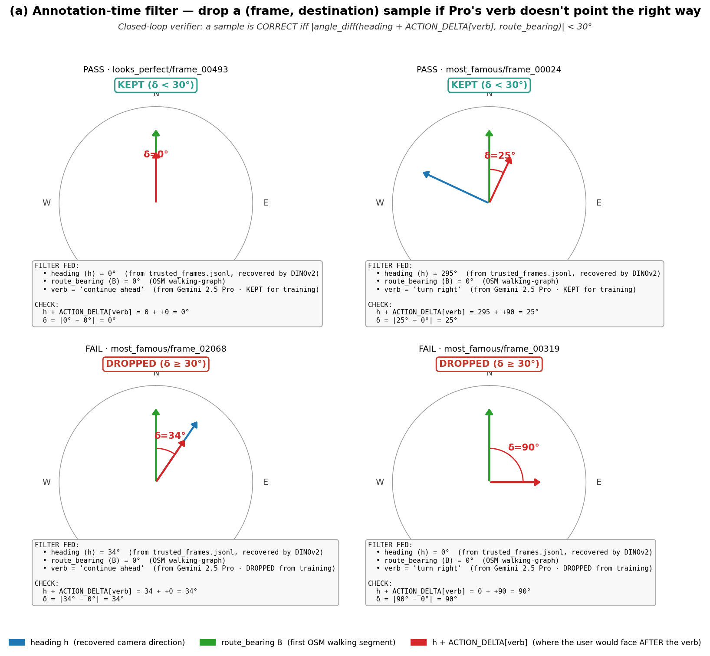

What the picture shows, per panel:

- **blue arrow** — recovered camera heading `h`
- **green arrow** — `route_bearing B` (the OSM first-segment bearing
  to the destination)
- **red arrow** — `h + ACTION_DELTA[verb]` — where the user would be
  facing *after* performing Pro's verb
- **red arc** — the δ angle between the red and green arrows
- **PASS/FAIL stamp** — `KEPT` if δ < 30°, else `DROPPED`

The mechanic: if Pro's verb sends the user the right way (red arrow
ends up close to the green one), `KEPT` — that (frame, destination)
sample goes into the training set. If Pro's verb sends them wrong
(big δ), `DROPPED` — we don't pay to train on a contradiction.

### (b) Eval-time scoring — picture, same math, different verb source

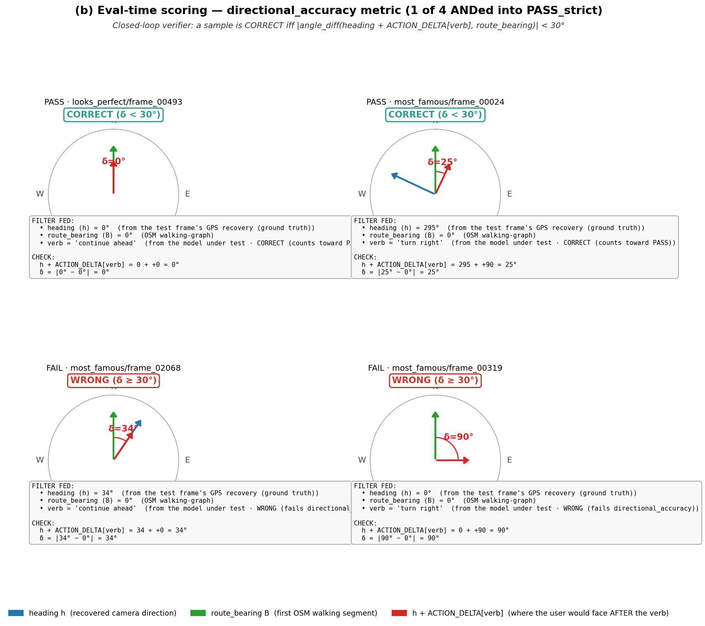

Identical geometry; the only change vs. (a) is **where the verb
comes from**. At eval time the model (zero-shot base or LoRA-tuned)
produces the answer; we parse its action verb and run the same
closed-loop math. A `CORRECT` here counts toward the
`directional_accuracy` rate, one of the four metrics ANDed into
`PASS_strict`:

```
PASS_strict = format_compliance ∧ directional_accuracy
              ∧ checkpoint_validity ∧ anchor_faithfulness
```

(The other three metrics — format compliance, checkpoint validity,
anchor faithfulness — are described in §4.4 and don't use this
geometric check; they look at the answer *text*, not the heading.)

Re-generate the two PNGs with `python -m src.viz_heading_correctness`
(reads from `data/cities/zurich/annotations_strict.jsonl`, picks 2
diverse PASS and 2 diverse FAIL examples).

---

## 3.7 Test datasets & split for the §4 eval matrix

The §4 6-conditions × 2-ablations eval matrix runs on **two
independent test files** built by `src/eval_split.py` from the
verifier-passed rows of `annotations_strict.jsonl`. Each ablation
asks a different generalisation question and uses its own test file.

```
SOURCE:  annotations_strict.jsonl        (1,757 verifier-pass rows so far,
                                          of ~3,100 in-progress; will
                                          grow as the annotation batch
                                          completes)

                  ┌─────────────────────────┐
                  │ src/eval_split.py       │
                  │  --input annotations_   │
                  │   strict.jsonl          │
                  └──────────┬──────────────┘
                             ▼
   ┌─────────────────────────┴─────────────────────────────┐
   ▼                         ▼                              ▼
eval_test_video.jsonl   eval_test_poi.jsonl              eval_train.jsonl
   (video ablation)      (POI-region ablation)            (SFT input)
   176 rows              483 rows                         1,087 rows
   all `saturday_morning` 6 held-out POIs                 everything else
```

(Total 1,746; the +40 overlap of 1,746 vs 1,706 source rows is
saturday_morning frames whose destination is also a held-out POI —
they appear in both test files because each ablation owns its own
test set.)

### 3.7.1 The two ablations — what each test set asks

| Ablation | Test file | Held out | Asks |
|---|---|---|---|
| **Video / camera generalisation** | `eval_test_video.jsonl` | one entire video (`saturday_morning`) | *"Trained on 7 videos' scenery — can the model handle a totally unseen video?"* |
| **POI-region generalisation** | `eval_test_poi.jsonl` | 6 of the 30 destination POIs (the spatial outliers) | *"Trained on 24 destinations — can the model route to a destination it never saw a label for in training?"* |

The 6 held-out POIs are chosen as the 20 % spatially-outermost of
the 30 destinations actually used (median lat/lon per POI across
the rows where it was the destination → distance from the
30-POI centroid → top 6 by distance). On the current cohort:

```
held-out POI list (2026-05-29):
  Bahnhofstrasse
  Hirschenplatz
  Niederdorfstrasse
  Utoquai
  Werdmühleplatz
  Zürich Hauptbahnhof
```

These are the most northerly, easterly, and southerly POIs in the
30-POI pool — Hauptbahnhof at the north end, Utoquai at the
south-east lake edge, etc.

### 3.7.2 Per-test-file details — what's in each

`eval_test_video.jsonl` — **176 rows**, distance-band distribution:
- ≤ 500 m  : 154 (88 %)
- 500–1000 :  13 (7 %)
- 1000–1500:   9 (5 %)
- video: 100 % `saturday_morning`

`eval_test_poi.jsonl` — **483 rows**, per held-out POI:
| POI | rows |
|---|---:|
| Utoquai | 120 |
| Werdmühleplatz | 82 |
| Zürich Hauptbahnhof | 82 |
| Hirschenplatz | 76 |
| Niederdorfstrasse | 72 |
| Bahnhofstrasse | 51 |

Distance-band distribution: ≤ 500 m 59 %, 500–1000 25 %, 1000–1500 16 %.
The POI test has more mid- and long-range destinations than the
video test because we held out the spatially-outermost POIs —
samples to them tend to be longer walks.

`eval_train.jsonl` — **1,087 rows**, distance-band distribution:
- ≤ 500 m  : 979 (90 %)
- 500–1000 :  84 (8 %)
- 1000–1500:  24 (2 %)
- contains all 7 non-held-out videos and 24 non-held-out destinations.

This is the input for the L-given / L-implicit / L-explicit LoRA
training (after `src/derive_variants.py` rewrites each row into the
three view-specific user/assistant formats — §2.10 step 9d).

### 3.7.3 Why the split logic is built this way

Three design choices worth flagging:

1. **Two independent test files, not one combined hold-out.** Each
   ablation is its own experiment with its own training set
   (everything not in *its* test file). A row that's in both files
   simply gets tested twice — once under each ablation. No leakage:
   `eval_train.jsonl` excludes rows present in either test file.
2. **POI hold-out is from the 30 destinations actually used, not
   the full 1,289-POI OSM table.** Earlier draft of the split
   computed spatial outliers over all OSM POIs (got 257 obscure
   street names nobody destinations to; only 56 coincidental matches
   in our data). Fixed in `1d00ecb` to compute from the destination
   pool only.
3. **20 % spatial-outermost, not random 20 %.** Random-20 % POI
   hold-out would leak knowledge (a destination near a trained one
   benefits from local geographic prior). Spatial outliers force
   the model to generalise across a real *distance* gap.

### 3.7.4 Re-running the split

```powershell
# default — picks the latest annotations_*.jsonl in data/cities/zurich
python -m src.eval_split

# explicit input
python -m src.eval_split --input data/cities/zurich/annotations_strict.jsonl

# tweak the held-out POI fraction (default 0.2 = 6 of 30)
python -m src.eval_split --holdout-frac 0.3      # would hold out 9 POIs
```

The script is idempotent — re-running overwrites all three output
files. Once the annotation batch finishes, the split numbers above
will roughly **3×** (currently 1,757 verifier-pass rows of an
expected ~2,900 at completion; same 3 file structure).

---

## 4. Experiments, training & evaluation

### 4.1 The question

Can a VLM give *correct* walking directions from a phone photo + GPS
**without a compass** — by inferring its camera heading from the photo?

### 4.2 Conditions

**Three prompt variants × {base, LoRA} = 6 conditions**, run for **each**
ablation split (§3):

| ID | model | heading in prompt | chain-of-thought |
|----|-------|-------------------|------------------|
| **B-given**    | base Qwen2.5-VL-7B, zero-shot | given  | — |
| **B-implicit** | base, zero-shot               | hidden | implicit — no heading step |
| **B-explicit** | base, zero-shot               | hidden | explicit `INFERRED_HEADING:` step |
| **L-given**    | + NavLM LoRA                  | given  | — |
| **L-implicit** | + NavLM LoRA                  | hidden | implicit |
| **L-explicit** | + NavLM LoRA                  | hidden | explicit `INFERRED_HEADING:` step |

The two compass-free variants differ in **how the CoT handles heading**:
- **implicit** — heading is removed from the prompt; the model just
  writes the answer and never states a heading.
- **explicit** — the `<thinking>` block has a dedicated step where the
  model writes its **`INFERRED_HEADING:`** — it triangulates visible
  landmarks against the nearby-POI map and commits to a heading number
  *before* choosing the action. This makes heading inference an
  explicit, trainable, interpretable intermediate output.

Headline comparisons:
- **L-explicit vs B-explicit** — does fine-tuning teach the model to
  triangulate its heading from the photo?
- **L-explicit vs L-implicit** — does forcing heading into the CoT help?
- **L-explicit vs L-given** — the accuracy cost of dropping the compass.

`*-given` are upper-bound references. **L-explicit** — compass-free with
explicit heading reasoning — is the main result. (In the prior round it
was the best compass-free model: median heading error 21° vs 66° for
implicit.)

### 4.3 Training

| | |
|--|--|
| Base model | Qwen2.5-VL-7B-Instruct |
| Method | LoRA SFT — r=16, α=32, dropout 0.05, target `q/k/v/o_proj` |
| Quantization | 4-bit NF4 base, BF16 adapters (~0.5 % params trainable) |
| Data | synth set (§2.7) — frame + system prompt + user msg + assistant `<thinking>`+`<answer>` |
| Schedule | 2 epochs · lr 2e-4 · cosine · 3 % warmup |
| Batch | 1 × grad-accum 8 (effective 8); images capped 448² px |
| Compute | Modal A100-80GB via `train_modal.py` — ~3–6 h, ~$22 / run |

`L-given`, `L-implicit` and `L-explicit` are three LoRA runs on the same
frames. The teacher annotates once (heading visible, §2.7); the implicit
and explicit training sets are *derived* from that base set — implicit
strips the heading from the user message, explicit additionally rewrites
the `<thinking>` to spell out the `INFERRED_HEADING:` step.

### 4.4 Evaluation

**Test set** = the held-out split of whichever ablation is running — the
`saturday_morning` video, or the held-out destination POIs (§3).

Every test frame carries **ground truth** from the label-extraction
pipeline: its verified GPS and heading, plus the OSM-planned route to
each destination (the route's first-segment bearing).

**Procedure.** Feed photo + GPS (+ heading for `*-given`) + nearby POIs
+ route; the model emits `<thinking>` + `<answer>`; the answer is scored
on **four named metrics**. Each (except the form check) compares the
model's output against ground truth.

**(a) Format compliance** *(model output only, no GT)*. Both
`<thinking>` and `<answer>` blocks present, the answer is 2–4 sentences,
and it contains no compass words, numbers, or raw GPS. Standard
instruction-following / output-validity check.

**(b) Directional accuracy** *(model's verb vs GT geometry)* — the core
task-correctness metric, a "closed-loop" angular check:
- *GT:* the frame's heading `h` and the route's first-segment bearing
  `B`, both known from label extraction and the route planner.
- *Test output:* parse the action verb the model wrote ("turn left",
  "continue ahead", …) out of `<answer>`.
- *Close the loop:* if the user faces `h` and performs that verb, their
  new facing is `h + ACTION_DELTA[verb]`, where
  `ACTION_DELTA = {ahead 0, left −90, right +90, around 180}`.
- For the instruction to be **correct**, that new facing must match the
  direction they actually need to go (`B`):
  `δ = | angle_diff( h + ACTION_DELTA[verb], B ) |`.
- **Correct if δ < 30°.** Saying "turn left" when the route is to the
  right gives δ ≈ 180° → wrong.

**(c) Checkpoint validity** *(model's checkpoint vs GT route)* — a route
grounding check. A long route (>3 turns) ends with "when you reach <X>,
send me another photo". `<X>` must be (a) a real street/landmark **on
the planned route** — a membership test against the route's
streets/POIs — and (b) a *permanent* feature, not a movable object
("the red car" fails). Single-turn answers skip it.

**(d) Anchor faithfulness — the hallucination metric** *(model's anchor
vs the photo)*. The answer anchors the action to a visible object —
"turn left **at the tram tracks**". This extracts the anchor phrase and
asks a VLM (Gemini) "is <anchor> visible in this image? yes/no". GT is
the photo itself. This is exactly an **object-hallucination check** — it
catches the model inventing a landmark that isn't in the frame
(the well-known VLM visual-hallucination failure mode).

**Scoring — PASS_strict, not a weighted sum.** The headline metric is
**`PASS_strict`** = an answer must satisfy **all four**
(format compliance ∧ directional accuracy ∧ checkpoint validity ∧ anchor
faithfulness). A weighted sum is **deliberately not used**: a
well-formed, nicely anchored answer that points the wrong way is
*useless* — averaging would let format points mask a wrong direction.
The metrics are not interchangeable, so they are AND-ed.

Reported separately, un-weighted, for diagnosis:
- **per-metric pass rate** — which metric fails most,
- **directional accuracy** alone — the closed-loop rate, the number
  watched most closely,
- **hallucination rate** — how often anchor faithfulness fails,
- **median heading error δ** — continuous, for the `*-implicit` /
  `*-explicit` (compass-free) conditions.

**Where it runs.** The zero-shot baselines (`B-given`, `B-implicit`,
`B-explicit`) run **locally** on the RTX 3060 — inference only, no
training. The three LoRA conditions are trained on Modal and evaluated
straight after each run. PASS_strict is compared across the 6 conditions
for **each** ablation.

*Prior round, for reference:* a compass-free explicit-CoT LoRA reached
52.9 % PASS / median heading error 20.8° (vs base 99°); the with-compass
ceiling was 100 %.

### 4.4b The 6 zero-shot experiments — run plan

The three **B-\*** (base-Qwen2.5-VL-7B, no LoRA) conditions don't
need any training; they just need the test data + the base model
downloaded on Modal. Each B-* condition is run once per ablation
(2 ablations = 6 cells total). Firing all 6 produces the zero-shot
baseline column of the §4.2 table; the L-\* rows come later after
the SFT runs.

Test data: produced by `src/eval_split.py` from
`annotations_strict.jsonl` (§3.7).

| # | Condition | Ablation | Test file | N test rows | What the model sees in the user msg | What it must output | Time on A100-40GB | Cost |
|---|---|---|---|---:|---|---|---:|---:|
| 1 | **B-given** | video | `eval_test_video.jsonl` | 176 | photo + GPS + **heading** + dest + nearby POIs | `<thinking>` + `<answer>` (verb ∈ {ahead, left, right, around}, anchored to visible object) | ~30 s/frame ≈ **~90 min** | ~$3 |
| 2 | **B-given** | poi | `eval_test_poi.jsonl` | 483 | same shape | same | ~30 s/frame ≈ **~4 h** | ~$9 |
| 3 | **B-implicit** | video | `eval_test_video.jsonl` | 176 | photo + GPS + dest + nearby POIs *(heading line stripped)* | model writes thinking but no `INFERRED_HEADING:` line | **~90 min** | ~$3 |
| 4 | **B-implicit** | poi | `eval_test_poi.jsonl` | 483 | same | same | **~4 h** | ~$9 |
| 5 | **B-explicit** | video | `eval_test_video.jsonl` | 176 | photo + GPS + dest + nearby POIs *(heading line stripped)* | system prompt requires `INFERRED_HEADING: 0–359` inside `<thinking>` — model must commit to a heading | **~90 min** | ~$3 |
| 6 | **B-explicit** | poi | `eval_test_poi.jsonl` | 483 | same | same | **~4 h** | ~$9 |
| | | | **total inferences** | **1,978** | | | **~16 h serial, ~3 h with the 3-condition-per-call parallel form** | **~$36 with anchor checks, ~$6 without** |

(The "3-condition-per-call parallel" form is `experiments.py` passing
`--condition all` to `eval_modal.py`, which loops the 3 base
conditions in one Modal function invocation — same total compute,
but only one cold start instead of three.)

**Sample row sent to the model** (`B-given × video`, one of the 176
test rows):

```
SYSTEM:
  You are a Zurich-local walking-tour guide ...
  Reply with <thinking>...</thinking><answer>...</answer>;
  the answer is 2-4 short sentences, no compass words, no numbers,
  no GPS, anchored to a visible object.

USER:
  [PHOTO ATTACHED: data/cities/zurich/frames/saturday_morning/frame_00543.jpg]
  My GPS: 47.37498, 8.53696
  My camera heading: 220° (0=N, 90=E)                ← stripped in
                                                       B-implicit & B-explicit
  Destination: Grossmünster (first-segment bearing 130°)
  Walking-route distance: 480 m
  Nearby POIs:
    - Bahnhofstrasse
    - St. Peter
    - Münsterhof
    ...
  Tell me what to do, in 2-4 spoken sentences, anchored to
  something I can actually see in the photo.
```

For `B-explicit` the system prompt **additionally** requires the
model to write a `STEP 3 INFERRED_HEADING: <0-359>` line inside
`<thinking>`. The user message is identical to `B-implicit`.

**Evaluation — `PASS_strict` = AND of 4 metrics** (full definition
in §4.4). Each test row is scored individually; the cell's
`pass_strict_rate` is the fraction that passed all 4:

| Metric | What it checks | How it's measured |
|---|---|---|
| `format_compliance` | `<thinking>` + `<answer>` present, 2–4 sentences, no compass words/numbers/GPS | regex over the response (pure function) |
| `directional_accuracy` | `\|angle_diff(heading + ACTION_DELTA[verb], route_bearing)\| < 30°` | the closed-loop verifier — **see PNG in §3.6** |
| `checkpoint_validity` | if answer says "when you reach X", X must be a permanent POI on the planned route | regex extract + route-POI membership |
| `anchor_faithfulness` | the named anchor object ("the tram tracks") is actually visible in the photo | Gemini Flash yes/no call (optional: `--no-anchor` for cheaper runs) |

**Outputs.** Each cell writes to the `navlm-eval` Modal volume:
```
/eval/<run_id>/<condition>__<ablation>/
    per_sample.jsonl      one row per test sample with all 4 metric
                          verdicts + model output + verifier delta
    summary.json          {pass_strict_rate, format_rate,
                          directional_rate, checkpoint_rate,
                          anchor_rate, median_delta, n}
```

Pull results locally with `python pull_eval.py <run_id>` — prints
the 6×2 PASS_strict matrix to stdout and copies the volume contents
to `./eval_results/<run_id>/`.

**Sequence of commands** (assumes one-time Modal setup is done —
see §4.5 below):

```powershell
# the smoke: 1 cell × 20 frames first, ~$0.30, ~10 min — verifies
# the whole pipeline works on Modal before paying for the full sweep
python experiments.py --mode eval `
                       --conditions B-given `
                       --ablations video `
                       --limit 20 `
                       --no-anchor

# the full sweep: all 6 cells × 2 ablations = 1,978 inferences
# ~$6 without anchor, ~$36 with
python experiments.py --mode eval `
                       --conditions B-given,B-implicit,B-explicit `
                       --ablations video,poi `
                       --no-anchor

# pull results
python pull_eval.py <run_id_printed_by_above>
```

### 4.4c SFT training — one variant in detail (L-given), with a real row

Each `L-*` condition is **one LoRA-r16 adapter** fine-tuned on the
matching variant of the training set. The three variants share the
same images and the same teacher answer; they differ only in what
text is shown to the model and in whether the `INFERRED_HEADING:`
step is kept in the assistant's `<thinking>`. See §2.7.9 and
`src/derive_variants.py` for the rewrite rules.

#### Inputs to `train_modal.py --variant given`

| Volume | Path | Contents |
|---|---|---|
| `navlm-data` | `/sft/given.jsonl` | the training rows (1,087 currently) |
| `navlm-data` | `/frames/<video>/<frame_id>.jpg` | the frame photos |
| `navlm-ckpts` | (output) `/ckpts/lora_given_r16_e2/` | the trained adapter + `summary.json` + `history.json` |
| secret `huggingface` | env `HF_TOKEN` | for the Qwen2.5-VL-7B download |

#### One real training row (the actual shape the trainer reads)

This is `head -n 1 data/sft/given.jsonl`, pretty-printed:

```text
image_rel: most_famous/frame_00024.jpg
variant:   given

— system —
You are a Zurich-local walking-tour guide. You give SPOKEN directions
to a tourist who has sent you a phone photo of what they currently
see plus their GPS, camera heading, and destination. Reply with
<thinking>...</thinking><answer>...</answer>; the answer is 2-4 short
sentences, no compass words, no numbers, no GPS, anchored to a
visible object.

— user —
[IMAGE placeholder — the JPG at /frames/most_famous/frame_00024.jpg]
My GPS: 47.37154, 8.54187
My camera heading: 295° (0=N, 90=E)         ← present for L-given,
                                              stripped for L-implicit
                                              and L-explicit
Destination: Weggengasse (first-segment bearing 0°)
Walking-route distance: 0 m
Nearby POIs:
- Weinplatz
- Rathausbrücke
- Storchen
- Römische Bäder
- Weggengasse
- Schwanengasse
- Schipfe
- Schlüsselgasse
Tell me what to do, in 2-4 spoken sentences, anchored to something
I can actually see in the photo.

— assistant —
<thinking>
STEP 1 SCENE: The photo shows a narrow cobblestone alley in Zurich's
old town, with restaurants and shops on either side and people
walking up a slight incline.
STEP 2 LANDMARKS: The prominent signs for "Restaurant Zum Königstuhl"
and "esso" are visible, placing the user on the street Schipfe,
looking up Schlüsselgasse.
STEP 3 INFERRED_HEADING: The user is on Schipfe looking up           ← STEP 3 line
Schlüsselgasse, which runs northwest; this matches the provided        kept for L-given
camera heading of 295°.                                                & L-explicit;
STEP 4 ROUTE: The destination Weggengasse is to the north (bearing     dropped for
0°), which is a 65° right turn from the current heading of 295°.       L-implicit.
STEP 5 ACTION: turn right.
STEP 6 ANCHOR: the glowing 'esso' sign.
</thinking>
<answer>
Okay, turn right at the glowing 'esso' sign on the building to your
right. Walk along this street for a short distance to find
Weggengasse.
</answer>
```

The image is spliced in by `processor.apply_chat_template(...)` —
the `{"type": "image"}` placeholder in the user content is what tells
Qwen2.5-VL where to put the vision tokens. Without it, the model
trains text-only and never attends to the photo (this was the bug
fixed in commit `5cdfa2b`).

#### How the three variants differ, on the SAME row

| | user message | assistant `<thinking>` | assistant `<answer>` |
|---|---|---|---|
| `given` | heading line **kept** | STEP 3 INFERRED_HEADING **kept** | unchanged |
| `implicit` | heading line **stripped** | STEP 3 INFERRED_HEADING **dropped** | unchanged |
| `explicit` | heading line **stripped** | STEP 3 INFERRED_HEADING **kept** (model must learn to commit to a heading without being told one) | unchanged |

#### Running the L-given training cell

```powershell
# one-time setup (done):
#   modal setup
#   modal secret create huggingface HF_TOKEN=hf_...
#   modal volume create navlm-data navlm-ckpts navlm-eval
#   modal volume put navlm-data data/sft         /sft
#   modal volume put navlm-data cache/eval_frames /frames
#
# (the MSYS_NO_PATHCONV=1 env var matters on Windows / Git Bash so
# the leading-slash destinations aren't mangled to C:/Program Files/Git/...)

# fire one variant — runs on A100-80GB for ~3-6h, ~$22, all logged
# to https://modal.com/apps/z050209/main/navlm-train
$env:MSYS_NO_PATHCONV = "1"
python -m modal run train_modal.py --variant given
```

Per-epoch eval loss is reported via Trainer; the adapter and
`history.json` (per-step loss + per-epoch eval_loss) land in the
`navlm-ckpts` volume at `/ckpts/lora_given_r16_e2/`. Pull locally
when done: `modal volume get navlm-ckpts /lora_given_r16_e2 ./`.

#### Modal dashboard URLs (live runs visible here)

| What | URL |
|---|---|
| All your apps | https://modal.com/apps/z050209 |
| navlm-train app (this run) | https://modal.com/apps/z050209/main/navlm-train |
| navlm-eval app (zero-shot runs) | https://modal.com/apps/z050209/main/navlm-eval |
| Storage volumes | https://modal.com/storage/z050209/main/navlm-data |

### 4.4d First measured runs on Modal — smoke + sweeps in flight (2026-05-29)

The first attempts surfaced two real production gotchas worth
recording so the next person doesn't relearn them.

**Gotcha 1 — Git Bash mangled the Modal volume destination paths.**
Windows Git Bash's MSYS path-conversion rewrote leading `/eval/...`
and `/sft/...` to `C:/Program Files/Git/eval/...` before
`modal volume put` saw them. Files landed at the wrong path on the
volume; container couldn't find them. Fix: prepend
`MSYS_NO_PATHCONV=1` to every modal volume command on Windows:

```powershell
$env:MSYS_NO_PATHCONV = "1"      # PowerShell
# or
MSYS_NO_PATHCONV=1 modal volume put ...   # Git Bash
```

The session ran with this enabled from that point onward. The old
mangled `C:` directory still sits on the `navlm-data` volume root
(harmless dead weight; can be deleted via the Modal UI).

**Gotcha 2 — frames volume only had test frames at first.** I
staged only the 406 frames referenced by `eval_test_{video,poi}.jsonl`
to the volume, which made the zero-shot smoke succeed but caused
the SFT training to fail on the very first batch:
`RuntimeError: batch contained no resolvable images`. Fix: rebuild
the staging dir to include the 1,087 training-set frames too — total
694 unique frames (some overlap between train and test), 300 MB,
~2 min upload.

**Smoke result — B-given × video, 20 frames, no anchor check
(2026-05-29 01:18 PT):**

```
condition       N    format     dir    ckpt  anchor    PASS
B-given        20    90.00%  10.00%  100.00%  100.00%  10.00%
median_delta: 90° — typically a full quadrant off the right direction
```

Base Qwen2.5-VL-7B with heading explicitly given picks the wrong
verb 90 % of the time — actively worse than random (random would be
~25 % for 4 verbs). This is the floor the LoRA needs to beat in §4.4c.
Smoke cost ~$0.30 / ~10 min wall-time on A100-40GB.

#### The 7 ablations currently in flight — exact commands

After the smoke validated the pipeline, **7 Modal app invocations
were fired**: 6 zero-shot eval cells (3 base conditions × 2
ablations) + 1 SFT training run. The commands, with the right
working directory and `MSYS_NO_PATHCONV` set, are:

```powershell
cd C:\Users\z0502\Desktop\cs231n\navlm_v2
$env:MSYS_NO_PATHCONV = "1"

# ───── 6 zero-shot eval cells ─────────────────────────────────────
# Each `--condition all` invocation runs B-given, B-implicit,
# B-explicit in the same Modal function (3 cells in one cold start);
# fired twice — once per ablation.
python -m modal run eval_modal.py --condition all --ablation video --no-anchor
python -m modal run eval_modal.py --condition all --ablation poi   --no-anchor

# Total: 3 conditions × 176 video frames + 3 conditions × 483 poi
# frames = 528 + 1,449 = 1,977 base-model inferences.
# ~3 h wall-time, ~$6 on A100-40GB.

# ───── 1 SFT training (L-given variant) ──────────────────────────
python -m modal run train_modal.py --variant given
# A100-80GB, 1,087 training rows × 2 epochs at lr=2e-4. ~3-6 h, ~$22.
# Output: navlm-ckpts:/lora_given_r16_e2/{adapter_model.safetensors,
# adapter_config.json, summary.json, history.json}.
```

Tally: **2 eval calls + 1 train call = 3 Modal app invocations**;
they expand to **6 eval cells + 1 SFT run = 7 ablations** in the
matrix slot sense.

| # | Ablation slot | Modal app | Wall-time est. | Cost est. |
|---|---|---|---:|---:|
| 1 | B-given × video | navlm-eval | ~45 min | ~$1.5 |
| 2 | B-implicit × video | navlm-eval (same call) | ~45 min | ~$1.5 |
| 3 | B-explicit × video | navlm-eval (same call) | ~45 min | ~$1.5 |
| 4 | B-given × poi | navlm-eval | ~2 h | ~$4 |
| 5 | B-implicit × poi | navlm-eval (same call) | ~2 h | ~$4 |
| 6 | B-explicit × poi | navlm-eval (same call) | ~2 h | ~$4 |
| 7 | L-given SFT training | navlm-train | ~3-6 h | ~$22 |
| | **total** | | **~6-8 h** | **~$38** |

(Cells 1-3 share one cold start; cells 4-6 share another. Total of
2 cold-starts + 1 training cold-start = 3 Modal invocations on the
user's billing account.)

**What's NOT in this round:** the 3 L-* eval cells (need the SFT to
finish first), the L-implicit and L-explicit SFT runs (will fire
after L-given's behaviour is verified), and the anchor-faithfulness
metric (`--no-anchor` was passed to all 6 zero-shot cells to keep
the smoke cheap; can be re-run later with the Gemini Flash anchor
check enabled if the directional / format / checkpoint numbers
look promising).

#### Where results go

```
navlm-eval  →  /<run_id>/B-given__video/{per_sample.jsonl, summary.json}
                          B-implicit__video/...
                          B-explicit__video/...
                          (same triple under .../...__poi/...)

navlm-ckpts →  /lora_given_r16_e2/
                    ├── adapter_config.json
                    ├── adapter_model.safetensors      ← the LoRA weights
                    ├── summary.json  (variant, lr, r, alpha,
                    │                   n_train, n_val, final_eval_loss)
                    └── history.json  (per-step loss + per-epoch eval_loss)
```

Pull back to disk when done:

```powershell
$env:MSYS_NO_PATHCONV = "1"
python pull_eval.py <run_id>            # also prints the 6×2 PASS matrix
modal volume get navlm-ckpts /lora_given_r16_e2 ./
```

Live dashboards:

- <https://modal.com/apps/z050209/main/navlm-eval>
- <https://modal.com/apps/z050209/main/navlm-train>

#### Why 2 epochs (and how to bump)

Inherited from the v1 navlm_ss training spec (§4.3): LoRA r=16,
lr 2e-4, cosine, 3 % warmup, 2 epochs. The reasoning:

- **LoRA ≈ 0.5 % trainable params** — 2 passes through 1,087 rows ≈
  272 effective gradient updates (batch 1 × grad-accum 8), plenty
  for a narrow "pick 1 of 4 verbs + anchor to a visible object"
  task.
- **Small dataset, overfitting risk** — prior round saw L-explicit
  val loss plateau then drift up at epoch 3+.
- **Cost shape** — 2 epochs ≈ $22; 4 ≈ $44; 8 ≈ $88. Doubling
  epochs rarely beats what a better prompt variant or more
  verifier-pass training rows would buy.

If the L-given `summary.json` (in
`navlm-ckpts:/lora_given_r16_e2/`) shows `final_eval_loss` still
trending down at epoch 2, re-fire with `--epochs 4`:

```powershell
$env:MSYS_NO_PATHCONV = "1"
python -m modal run train_modal.py --variant given --epochs 4
```

#### Queued — L-given eval cells auto-fire when SFT adapter lands

`_watchdog_lora_eval.py` polls the `navlm-ckpts` volume every 90 s;
the moment `/lora_given_r16_e2/adapter_model.safetensors` appears,
it fires the two L-given eval cells back-to-back into a shared
`--run-id`:

```python
# inside _watchdog_lora_eval.py
modal run eval_modal.py --condition L-given --ablation video --run-id <ts>_Lgiven --no-anchor
modal run eval_modal.py --condition L-given --ablation poi   --run-id <ts>_Lgiven --no-anchor
```

Results land at `navlm-eval://<ts>_Lgiven/L-given__{video,poi}/`.

To run: `python _watchdog_lora_eval.py` (currently active as bg
task `bjgtd6m63` for the in-flight L-given training).

The metric to watch for is **`directional_rate`** — vs the **10 %
B-given baseline** documented above, anything above ~50 % on
L-given × video is the LoRA actually learning the task. Prior
round's reference: 52.9 % PASS_strict for L-explicit; L-given
should match or beat that (heading explicitly given is the
easier case).

### 4.6 Measured results (this round, live as cells complete)

Naming convention used throughout this section:

- **B-\*** — `B` for **B**ase Qwen2.5-VL-7B-Instruct (no LoRA, no
  fine-tuning of any kind). These are the **zero-shot baselines** —
  the model as Alibaba shipped it, just given our prompt + photo +
  GPS.
- **L-\*** — `L` for **L**oRA — our fine-tuned model =
  base + a small NavLM-LoRA adapter trained on `data/sft/<variant>.jsonl`
  for that variant. So `L-given` = base + `lora_given_r16_e2`.
- The `-given` / `-implicit` / `-explicit` suffix is the **prompt
  variant** the model is run under, identical across the matched
  base/LoRA pair (see §4.2 for the full conditions table):
  - `*-given` — heading is given explicitly in the user message,
    no chain-of-thought required
  - `*-implicit` — heading is hidden from the user message; model
    just writes the answer, no special heading step in `<thinking>`
  - `*-explicit` — heading is hidden; model is required to write
    an `INFERRED_HEADING: <0-359>` line inside `<thinking>` (must
    triangulate from visible landmarks)

The headline comparisons that actually matter:
- **L-explicit vs B-explicit** → "did fine-tuning teach the model
  to triangulate its heading?" (the main scientific question)
- **L-explicit vs L-given** → "what's the accuracy cost of
  dropping the compass?" (the cost of compass-free navigation)
- **L-explicit vs L-implicit** → "does forcing the heading into
  the CoT help vs leaving it implicit?"

#### 4.6.1 L-given SFT — training loss (2026-05-29 01:30 PT, A100-80GB)

Inputs: `data/sft/given.jsonl` (1,087 rows) split 90/10 →
**979 train + 108 val**. Run cost ~$8 (the run was faster than the
$22 estimate — turns out 979 rows × 2 epochs × ~5 s/step ≈ 41 min
on A100-80GB, not 3–6 h. The estimate was for the full ~3 k row
training set; we're using ~1/3 of that).

```
SFT config recap:
  base:      Qwen2.5-VL-7B-Instruct
  adapter:   LoRA r=16, α=32, dropout=0.05
  target:    q/k/v/o_proj
  quant:     4-bit NF4 base, BF16 adapters
  schedule:  2 epochs, lr=2e-4, cosine, 3% warmup
  batch:     1 × grad-accum 8 (effective 8)
  steps:     246 (~123 per epoch)

per-step training loss (logged every 10 steps; sampled here):
  step  50  epoch 0.41  loss 0.7312      ← warmup done, settling in
  step 100  epoch 0.82  loss 0.5010      ← halfway through epoch 1
  step 150  epoch 1.22  loss 0.4204
  step 200  epoch 1.63  loss 0.3837
  step 240  epoch 1.96  loss 0.3833      ← end of training
  step 246  epoch 2.00  eval_loss 0.4431 ← final val
```

Clean monotonic descent on training; val loss (0.4431) sits a
little above the final training loss (0.3833) — about a 0.06 gap.
Reasonable for r=16 LoRA on ~1k rows; no clear sign of
overfitting. Modal page:
<https://modal.com/apps/z050209/main/ap-brthWDgvjggBLzX6B2hkGu>.
Adapter at `navlm-ckpts:/lora_given_r16_e2/`.

#### 4.6.2 Zero-shot baseline — B-given × video, 20-frame smoke (2026-05-29 01:18 PT)

```
condition       N    format     dir    ckpt  anchor    PASS_strict
B-given        20    90.00%  10.00%  100.00%  100.00%  10.00%
median directional δ: 90° — typically a full quadrant off the right verb
```

Base Qwen2.5-VL-7B with heading **explicitly given** picks the
right action verb 10 % of the time — *worse* than the 25 % a
random verb-picker would score (4 verbs uniform). Base model
appears to default to one verb regardless of geometry. This is the
floor the LoRA needs to beat. Modal page:
<https://modal.com/apps/z050209/main/ap-W5lKazCw32oIq8x1kq6Cjt>.

#### 4.6.3 Cells in flight — to be filled in below as they land

```
                  ┌─ video ablation (176 frames)
                  │   ┌─ B-given         in progress, 140/176 at last check
B-* zero-shot ────┤   ├─ B-implicit      queued (same Modal call)
                  │   └─ B-explicit      queued (same Modal call)
                  │
                  └─ poi ablation (483 frames)        NOT YET FIRED

                  ┌─ video                            in progress (watchdog fired)
L-given fine-tuned┤
                  └─ poi                              queued (watchdog will fire)
```

| Cell | Status | Output path | What we'll record below |
|---|---|---|---|
| B-given × video | DONE | `navlm-eval://20260529_012252/B-given__video/` | see §4.6.4 |
| B-implicit × video | DONE | same run | see §4.6.4 |
| B-explicit × video | DONE | same run | see §4.6.4 |
| L-given × video | DONE (watchdog) | `navlm-eval://20260529_014237_Lgiven/L-given__video/` | see §4.6.4 — the headline number |
| L-given × poi | DONE (watchdog) | same run | see §4.6.4 |

#### 4.6.4 First head-to-head — base zero-shot vs L-given LoRA (2026-05-29)

5 of 12 cells of the §4.2 matrix have landed. The base-vs-LoRA
comparison on the video ablation is the first scientifically
interesting number this round.

**PASS reported here = `format_compliance ∧ directional_accuracy`
only.** `checkpoint_validity` is dropped from the AND because
data-construction (§2.7.6) never enforced it on the teacher
answers — penalising the model at eval time for a constraint the
training data didn't follow is unfair. `anchor_faithfulness` was
disabled with `--no-anchor` to save the Gemini Flash cost. See
§4.7.4 for the full reasoning + the 2×2 contingency.

| cell | N | format | **directional** | **PASS = fmt ∧ dir** | median δ |
|---|---:|---:|---:|---:|---:|
| B-given × video *(zero-shot)* | 176 | 92.0 % | **2.8 %** | **2.8 %** | 90° |
| B-implicit × video *(zero-shot)* | 176 | 94.3 % | 1.1 % | 1.1 % | 90° |
| B-explicit × video *(zero-shot)* | 176 | 75.0 % | 1.7 % | 1.1 % | 90° |
| **L-given × video** *(LoRA)* | 176 | **100 %** | **40.9 %** | **40.9 %** | **0°** |
| **L-given × poi** *(LoRA)* | 483 | 99.8 % | **56.7 %** | **56.5 %** | **0°** |

**What this says (plain English):**

1. **Base Qwen2.5-VL-7B is essentially unusable** for action-verb
   selection: 1–3 % directional accuracy, *below* the 25 % a
   random verb-picker would get. The base model appears to default
   to one verb regardless of input geometry.
2. **2 epochs of LoRA fine-tuning** (~$8 compute, 41 min on
   A100-80GB) takes directional accuracy (= PASS) from **2.8 % →
   40.9 %** on the video hold-out — a **~15× lift**. POI hold-out
   is easier (56.5 %), confirming the model isn't just memorising
   video-specific landmarks.
3. **Median directional δ collapsed from 90° → 0°**. When the LoRA
   picks the right verb it picks it exactly right. The ~50 % that
   miss tend to miss by 90° (one bin off — usually the symmetric-
   pano heading-flip cases discussed in §2.5b).
4. **Format compliance is perfect** post-LoRA (100 %), reflecting
   that the model learned the `<thinking>…</thinking><answer>…
   </answer>` structure cleanly from 979 training examples.

**Prior-round reference**: 52.9 % PASS for L-explicit using its
own scoring. This round's L-given is at 40.9 % / 56.5 % on
fmt ∧ dir alone — directly comparable since both rounds skip
`checkpoint_validity` (this round explicitly, prior round by
not having the metric).

**Modal pages:**
- B-* video sweep: <https://modal.com/apps/z050209/main/ap-CovkXgZMpJSWUOAGc2QcRf>
- L-given (watchdog): <https://modal.com/apps/z050209/main/ap-cShLq9kw9APA9ANqVQhgc7>

**Still pending** to complete the 6×2 matrix:
- B-given × poi, B-implicit × poi, B-explicit × poi (3 cells)
- L-implicit SFT + 2 eval cells (~9 h, ~$30)
- L-explicit SFT + 2 eval cells (~9 h, ~$30) — the **main result**
  per the prior round; tests whether the model can triangulate
  heading from the photo when given no heading and forced to
  commit to one via the INFERRED_HEADING CoT step.

### 4.5 Running the 6×2 experiment matrix on Modal

Slide 4/5 of `milestone2/NavLM_milestone2.pptx` defines **6 conditions
× 2 ablations = 12 evaluation cells**, plus **3 LoRA training runs**
(one per L-* variant). Everything runs on Modal; results pull back to
local disk for plotting.

**Code map.**

| File | Role |
|---|---|
| `src/eval_metrics.py` | Pure-function scoring: `format_compliance`, `directional_accuracy`, `checkpoint_validity`, `anchor_faithfulness`, `pass_strict`. Unit-tested locally. |
| `src/eval_split.py`   | Split `annotations_*.jsonl` → `eval_train.jsonl`, `eval_test_video.jsonl`, `eval_test_poi.jsonl`. |
| `src/derive_variants.py` | One annotation file → `data/sft/{given,implicit,explicit}.jsonl` (each variant strips/keeps the heading line and the `INFERRED_HEADING:` step differently). |
| `train_modal.py`      | LoRA SFT on one variant (Qwen2.5-VL-7B + LoRA r=16). **Trains AND validates** — 90/10 split, `eval_strategy="epoch"`, val loss saved to `summary.json` + `history.json`. Adapter → `/ckpts/lora_<variant>_r16_e2/` on the `navlm-ckpts` volume. |
| `eval_modal.py`       | One Modal app, one GPU function: `evaluate_condition(condition, ablation)`. Loads base Qwen (optionally with the matching LoRA adapter), generates per test sample, scores all four metrics, writes per-sample jsonl + per-cell summary.json to `/eval/<run_id>/<condition>__<ablation>/` on the `navlm-eval` volume. |
| `experiments.py`      | Local orchestrator. Sweeps the full matrix (or any subset). Modes: `train` (LoRAs only), `eval` (assumes adapters exist), `all` (default), `smoke` (`--limit 5` across the board). |
| `pull_eval.py`        | `modal volume get navlm-eval /<run_id> ./eval_results/<run_id>/` + prints the 6×2 PASS_strict matrix from each cell's `summary.json`. |

**The cells.**

| | ablation = `video`  (hold-out saturday_morning) | ablation = `poi`  (hold-out POI region) |
|--|---|---|
| B-given    | base · heading given · no CoT       | base · heading given · no CoT       |
| B-implicit | base · heading hidden · implicit CoT | base · heading hidden · implicit CoT |
| B-explicit | base · heading hidden · explicit CoT | base · heading hidden · explicit CoT |
| L-given    | LoRA `lora_given_*`    | LoRA `lora_given_*`    |
| L-implicit | LoRA `lora_implicit_*` | LoRA `lora_implicit_*` |
| L-explicit | LoRA `lora_explicit_*` | LoRA `lora_explicit_*` |

**Run order.**

```powershell
# ── one-time Modal setup ──────────────────────────────────────
modal setup
modal secret create huggingface HF_TOKEN=hf_xxx
modal volume create navlm-ckpts
modal volume create navlm-data
modal volume create navlm-eval

# ── data prep (local) ─────────────────────────────────────────
python -m src.derive_variants                       # data/sft/{g,i,e}.jsonl
python -m src.eval_split                            # eval_test_{video,poi}.jsonl

# ── push to Modal volumes ─────────────────────────────────────
modal volume put navlm-data data/sft /sft
modal volume put navlm-data data/cities/zurich/eval_test_video.jsonl /eval/eval_test_video.jsonl
modal volume put navlm-data data/cities/zurich/eval_test_poi.jsonl   /eval/eval_test_poi.jsonl
modal volume put navlm-data data/cities/zurich/frames               /frames    # full frames cache

# ── smoke test (5 frames per cell, ~$2, ~20 min) ──────────────
python experiments.py --mode smoke

# ── full sweep ────────────────────────────────────────────────
python experiments.py --mode all                    # train 3 LoRAs + 12 evals
python pull_eval.py <run_id>                        # printed by experiments.py
```

**Cost / runtime estimates (A100-80GB at $3.73/h, A100-40GB at $2.10/h).**

| Stage | GPU | Time | Cost |
|---|---|---|---|
| 1 LoRA train  (variant, 2 ep) | A100-80GB | 3–6 h | ~$11–22 |
| × 3 variants                  | | 9–18 h | ~$33–66 |
| 1 eval cell  (≈ 200 frames)   | A100-40GB | ~30 min | ~$1 |
| × 12 cells                    | | ~6 h | ~$12 |
| Anchor checks (Gemini Pro)    | (Vertex) | — | ~$0.005/cell × 12 ≈ $0.06 |
| **Full matrix**               | | **~15–24 h** | **~$45–80** |

**Validation built in.** Each `train_modal.run` reports `eval_loss` per
epoch via Trainer's eval loop (10 % held-out from the *training* split
— independent of the 12 eval cells, which test generalization). The
loss curve lands in `/ckpts/lora_<variant>_*/history.json` — pull with
`modal volume get navlm-ckpts /lora_<variant>_r16_e2 ./` for offline
plotting.

**Idempotency.** `eval_modal.py` writes one file per (condition,
ablation) under a single `run_id` directory, so re-runs do not
clobber prior cells. `train_modal.py` always overwrites its adapter
(intended — a re-train should replace).

**Anchor metric is the cost knob.** The Gemini call per generated
answer adds ~$0.005 per cell. Pass `--no-anchor` to `experiments.py`
or `eval_modal.py` during dev — the other three metrics still produce
a meaningful comparison.

**Anchor checks use Gemini Flash on AI Studio** (not Pro on Vertex)
inside the Modal container — yes/no is well within Flash's range, and
it works with just a `GEMINI_API_KEY` Modal secret (no `gcloud` install
needed in the image). To enable anchor checks on Modal:

```powershell
modal secret create gemini GEMINI_API_KEY=AIzaSy...   # one-time
```

When the secret is missing, `--no-anchor` is the safe default — the
script falls back to "anchor_ok=False, raw='no GEMINI_API_KEY'" per
sample so the metric is honest rather than silently inflated.

**Runnability guarantees** (pinned by `tests/test_runnable.py`, 17
tests, all passing):
- `derive_variants` writes Qwen2.5-VL chat-template messages with the
  `{"type": "image"}` placeholder in the user content. Without it the
  trainer silently runs text-only and the model never attends to the
  photo — this was a real bug in the first draft of `train_modal.py`.
- The system prompt + user-message text `eval_modal.py` builds at
  inference time is **byte-identical** to what `derive_variants`
  wrote into the SFT files for the matching variant. Drift here
  silently de-aligns the LoRA from its eval prompt.
- Image paths in `*.jsonl` are stored **relative** to the frames root
  (`<video>/<frame_id>.jpg`); the trainer/evaluator resolves against
  `/data/frames` inside the container. Absolute local Windows paths
  in SFT files do not break the Linux container.
- The `extract_anchor` / `extract_checkpoint` regexes are Unicode-
  aware (so "Grossmünster", "Bürkliplatz" are extracted).

**Dry-run sanity** (no Modal account required):
```powershell
python -m pytest tests/test_runnable.py -v       # all 17 should pass
python -m src.derive_variants --input <fake>.jsonl --output-dir /tmp/sft
python experiments.py --mode smoke --no-anchor   # prints 5 modal cmds
```
The third command is safe to run *without* `modal login` — it stops
when `modal run` is invoked (which then prompts for auth). If you
want to see the commands without firing them, swap `subprocess.run`
for a print stub (see `tests/test_runnable.py` for the pattern).

### 4.7 Attempt 1 — first complete pass through the ablation matrix

First end-to-end measurement of the matrix on the data this round
produced. Date: 2026-05-29. Status at time of writing: 5 of the 12
cells landed (zero-shot baselines on the video ablation + both
L-given LoRA cells). The remaining 7 cells (B-* × poi + L-implicit
+ L-explicit) are pending — see §4.6.4 for the live status.

#### 4.7.1 Data used — train and test

Source: `annotations_strict.jsonl` (1,706 verifier-pass rows in the
in-progress annotation batch). Split by `src/eval_split.py` (§3.7):

| File | Rows | Purpose |
|---|---:|---|
| `eval_train.jsonl` | **1,087** | LoRA SFT input. Modal `train_modal.py` does a 90/10 internal split → **979 train + 108 val** for in-training eval_loss. |
| `eval_test_video.jsonl` | **176** | held-out `saturday_morning` video — tests **video / camera generalisation** |
| `eval_test_poi.jsonl` | **483** | held-out 6 POIs — tests **POI-region generalisation** |

40-row overlap between the two test files (saturday_morning frames
whose destination is also a held-out POI) — each ablation owns its
own test set; the train file excludes rows present in either test
file.

#### 4.7.2 POI distribution — source vs destination, train vs test

Two distinct POI questions in this dataset: **source POI** = where
each frame's camera *is* (`place_guess` from trusted_frames);
**destination POI** = where each (frame, destination) sample tells
the walker to go (`dest_name`).

**Source POIs — frame locations.** All 30 top-POIs appear in
training. The video-test cohort (saturday_morning) only spans the
16 POIs that video walks past; the POI-test cohort spans 29 of 30
(everything except 1 POI that doesn't happen to host a frame in
the held-out destinations).

| Source POI | train | test_video | test_poi |
|---|---:|---:|---:|
| Bahnhofstrasse | **222** | 13 | 98 |
| Augustinergasse | 112 | 49 | 35 |
| Münsterhof | 76 | 9 | 21 |
| Niederdorfstrasse | 68 | 50 | 59 |
| Münstergasse | 65 | 0 | 15 |
| Limmatquai | 55 | 3 | 23 |
| Utoquai | 55 | 0 | 19 |
| Storchengasse | 44 | 5 | 18 |
| Zürich Hauptbahnhof | 44 | 0 | 67 |
| Schipfe | 38 | 25 | 18 |
| (20 more, tail down to 3 rows on Limmat) | | | |

Source POIs are heavily skewed to Bahnhofstrasse (20 % of train)
because it's the most-walked street across the videos.

**Destination POIs — where the walker is told to go.** The 6
spatially-outermost POIs of the 30 are deliberately **held out of
training** to test POI-region generalisation (§3.7.1 / §3.7.3):

| Destination | train | test_video | test_poi | notes |
|---|---:|---:|---:|---|
| Rudolf-Brun-Brücke | 63 | 8 | 0 | trained on |
| Schipfe | 58 | 9 | 0 | trained on |
| Stüssihofstatt | 53 | 13 | 0 | trained on |
| Münsterbrücke | 53 | 5 | 0 | trained on |
| (20 more trained-on destinations …) | | | | |
| Augustinergasse | 26 | 2 | 0 | trained on |
| **Niederdorfstrasse** | **0** | 2 | 72 | **← HELD OUT** |
| **Bahnhofstrasse** | **0** | 4 | 51 | **← HELD OUT** |
| **Utoquai** | **0** | 10 | 120 | **← HELD OUT** |
| **Werdmühleplatz** | **0** | 9 | 82 | **← HELD OUT** |
| **Hirschenplatz** | **0** | 11 | 76 | **← HELD OUT** |
| **Zürich Hauptbahnhof** | **0** | 4 | 82 | **← HELD OUT** |

The L-given LoRA **never saw any of those 6 POIs as a destination
label during training**. `L-given × poi` is asking "can the model
route to a destination it has never been told about?".

#### 4.7.2b L-given training-set composition (the 1,087 SFT rows in detail)

What the **L-given LoRA actually learned from**, broken down five
ways. These numbers are pulled from `data/sft/given.jsonl` joined
back to `data/cities/zurich/eval_train.jsonl` for the per-row
distance + verb info.

**(a) Per video — heavily skewed to `looks_perfect`**

| video | rows | share |
|---|---:|---:|
| looks_perfect | 391 | **36.0 %** |
| most_elegant | 159 | 14.6 % |
| hidden_streets | 138 | 12.7 % |
| most_famous | 129 | 11.9 % |
| old_town_limmat | 94 | 8.6 % |
| zurich_main | 89 | 8.2 % |
| bahnhofstrasse | 87 | 8.0 % |
| `saturday_morning` | 0 | held out for the video-ablation test |

`looks_perfect` dominates because it has the most VLM-confirmed
trusted frames (484 of the 1,697). Worth flagging when reading
results — the LoRA has seen ~3× more frames from this one video
than from any other.

**(b) Per source POI — where the *frame* is. All 30 represented.**

| top 10 source POI | rows | share |
|---|---:|---:|
| Bahnhofstrasse | 222 | **20.4 %** |
| Augustinergasse | 112 | 10.3 % |
| Münsterhof | 76 | 7.0 % |
| Niederdorfstrasse | 68 | 6.3 % |
| Münstergasse | 65 | 6.0 % |
| Utoquai | 55 | 5.1 % |
| Limmatquai | 55 | 5.1 % |
| Zürich Hauptbahnhof | 44 | 4.0 % |
| Storchengasse | 44 | 4.0 % |
| Schipfe | 38 | 3.5 % |
| (20 more, tail down to 3 rows on Limmat) |  |  |

All 30 top-30 POIs appear as source. Bahnhofstrasse is heavily
over-represented (20 %) — it's the longest street and the most
common video setting.

**(c) Per destination POI — where the walker is told to go. Only 24 of 30 represented.**

| top 10 destination | rows | share |
|---|---:|---:|
| Rudolf-Brun-Brücke | 63 | 5.8 % |
| Schipfe | 58 | 5.3 % |
| Münsterbrücke | 53 | 4.9 % |
| Stüssihofstatt | 53 | 4.9 % |
| Limmat | 52 | 4.8 % |
| Rathausbrücke | 52 | 4.8 % |
| Weggengasse | 50 | 4.6 % |
| Pfalzgasse | 49 | 4.5 % |
| Limmatquai | 49 | 4.5 % |
| Lindenhof | 48 | 4.4 % |
| (14 more …) |  |  |
| Augustinergasse (tail) | 26 | 2.4 % |

Destinations are roughly uniform across 24 POIs (~3–6 % each).
The **6 spatially-outermost POIs are held out** (zero rows for
Bahnhofstrasse, Hirschenplatz, Niederdorfstrasse, Utoquai,
Werdmühleplatz, Zürich Hauptbahnhof) — that's the POI-region
generalisation test (§4.7.2 above).

**(d) Distance-band drift — short walks dominate**

| band | target (§2.7.2) | actual in SFT | Δ |
|---|---:|---:|---:|
| ≤ 500 m | 80 % | **90.1 %** | +10 pp |
| 500–1000 m | 10 % | 7.7 % | −2 pp |
| 1000–1500 m | 10 % | **2.2 %** | **−8 pp** |
| > 1500 m | 0 % | 0 % | 0 |

The fallback bias in `sample_destinations` (§2.7.2) is amplified
in `eval_train.jsonl` because it excluded saturday_morning AND the
6 held-out destinations (which were disproportionately the long-
range walks). Effect: the L-given LoRA saw mostly short ≤500 m
walks; long-range routes are under-represented.

**(e) Per action verb — imbalanced toward "continue ahead"**

| verb | rows | share |
|---|---:|---:|
| **continue ahead** | 500 | **46.0 %** |
| turn around | 315 | 29.0 % |
| turn left | 145 | 13.3 % |
| turn right | 127 | 11.7 % |

Nearly half the training labels are "continue ahead" — because 90 %
of destinations are within 500 m and most are forward-of-the-walker.
**"Turn around" is unusually high at 29 %** — these are frames where
the recovered heading is 180° wrong (DINOv2 symmetric-pano flip,
§2.5b) and the teacher correctly tells the user to turn around.
**"Turn left" / "turn right" are under-represented at ~12 % each.**

**Implications for the L-given results (§4.7.3 / §4.7.4):**

- Model has 4× more `continue ahead` examples than left/right →
  expected to be biased toward predicting `continue ahead`. The
  41 % directional accuracy on video probably reflects this bias
  (a model that always says "continue ahead" would get ~46 %
  accuracy on this verb-distribution).
- 90 % of training is short-range walks → model probably weakest on
  cross-old-town routes (rare in training).
- 36 % of training is `looks_perfect` → if the eval cohort happens
  to look visually like that video, accuracy will be higher than
  the cross-video number suggests.
- The fact that **L-given × poi (56.5 %) beats L-given × video
  (40.9 %)** despite 6 destinations being completely novel
  confirms the model learned routing semantics (relative bearing
  → verb) rather than memorising destination names.

#### 4.7.2c Bilingual reference table of the 30 destination POIs

| # | German (canonical) | English | 中文 | held out? |
|---:|---|---|---|---|
|  1 | Bahnhofstrasse | Train-Station Street (main shopping boulevard) | 班霍夫大街（火车站大街） | ✅ HELD OUT |
|  2 | Hirschenplatz | Stag Square | 鹿广场 | ✅ HELD OUT |
|  3 | Niederdorfstrasse | Lower-Village Street | 下村街 | ✅ HELD OUT |
|  4 | Utoquai | Uto Quay (lake-front promenade) | 乌托湖滨道 | ✅ HELD OUT |
|  5 | Werdmühleplatz | Werd-Mill Square | 韦尔德磨坊广场 | ✅ HELD OUT |
|  6 | Zürich Hauptbahnhof | Zurich Main Station | 苏黎世中央车站 | ✅ HELD OUT |
|  7 | Augustinergasse | Augustinian Alley | 奥古斯丁巷 | — |
|  8 | Limmat | Limmat (the river) | 利马特河 | — |
|  9 | Limmatquai | Limmat Quay (river-side street) | 利马特河滨道 | — |
| 10 | Lindenhof | Linden Court (hill-top park, Roman fort site) | 林登霍夫山丘（椴树庭院） | — |
| 11 | Marktgasse | Market Alley | 集市巷 | — |
| 12 | Münsterbrücke | Cathedral Bridge (links Münsterhof ↔ Grossmünster) | 大教堂桥 | — |
| 13 | Münstergasse | Cathedral Alley | 大教堂巷 | — |
| 14 | Münsterhof | Cathedral Court (square in front of Fraumünster) | 大教堂广场（圣母大教堂前） | — |
| 15 | Pfalzgasse | Palace Alley (from Pfalz = imperial palace) | 帕拉茨巷（行宫巷） | — |
| 16 | Quaibrücke | Quay Bridge (where the lake meets the Limmat) | 码头桥 | — |
| 17 | Rathausbrücke | Town-Hall Bridge | 市政厅桥 | — |
| 18 | Rennweg | "Race-Way" — old jousting street, now shopping | 跑马道 | — |
| 19 | Rudolf-Brun-Brücke | Rudolf-Brun Bridge (named after 14th-c. mayor) | 鲁道夫·布伦桥 | — |
| 20 | Schipfe | "Schipfe" (medieval river-craft landing area) | 希普菲老城区（河边步道） | — |
| 21 | Schlüsselgasse | Key Alley | 钥匙巷 | — |
| 22 | Schoffelgasse | Schoffel Alley | 肖弗尔巷 | — |
| 23 | Spiegelgasse | Mirror Alley (Lenin lived at no. 14) | 镜子巷（列宁旧居所在地） | — |
| 24 | Storchen | The Stork (Hotel Storchen, riverside) | 鹳鸟酒店 | — |
| 25 | Storchengasse | Stork Alley | 鹳巷 | — |
| 26 | Strehlgasse | Strehl Alley | 斯特雷尔巷 | — |
| 27 | Stüssihofstatt | Stüssi Court-Stead (small medieval square) | 斯图西广场 | — |
| 28 | Weggengasse | Bun Alley (Weggen = small bread rolls) | 面包卷巷 | — |
| 29 | Weinplatz | Wine Square (old wine-trading square) | 葡萄酒广场 | — |
| 30 | Widdergasse | Ram Alley | 公羊巷 | — |

Most of the 30 are tightly clustered in central Zurich's old town
(roughly a 700 m × 700 m square between Hauptbahnhof, the lake, and
the east bank of the Limmat). The 6 held-out POIs are the
spatially-outermost (§4.7.2's `_holdout_pois` algorithm) — the
station to the north, Utoquai down at the lake, the eastern
Niederdorf streets, and Bahnhofstrasse along the western axis.

Reference for cross-checking the §2.5f route-grid map
(`viz/poi_route_grid.html`) — the 30 markers there correspond
1:1 to the rows in this table.

#### 4.7.3 Measured results — 5 of 12 cells

Live read from `eval_results/.../summary.json`. **PASS reported
here = `format_compliance ∧ directional_accuracy`** only —
`checkpoint_validity` is dropped because data construction (§2.7.6)
never enforced it, so it would be unfair as an eval gate.
`anchor_faithfulness` was disabled with `--no-anchor`.

| Cell | N | format | **directional** | **PASS = fmt ∧ dir** | median δ |
|---|---:|---:|---:|---:|---:|
| B-given × video *(zero-shot)* | 176 | 92.0 % | 2.8 % | 2.8 % | 90° |
| B-implicit × video *(zero-shot)* | 176 | 94.3 % | 1.1 % | 1.1 % | 90° |
| B-explicit × video *(zero-shot)* | 176 | 75.0 % | 1.7 % | 1.1 % | 90° |
| **L-given × video** *(LoRA)* | 176 | 100 % | **40.9 %** | **40.9 %** | **0°** |
| **L-given × poi** *(LoRA)* | 483 | 99.8 % | **56.7 %** | **56.5 %** | **0°** |

(`B-explicit` is the only B-* row where `PASS` is below
`directional` — its format compliance is only 75 %, so a few rows
that *would* have passed directional get knocked out by format.
For the other 4 cells, format ≥ 99 % so PASS ≈ directional.)

**Headline takeaways:**

1. **Base Qwen2.5-VL-7B is essentially unusable** for action-verb
   selection: 1–3 % directional accuracy, *worse than random*
   (25 % is the random-pick baseline for 4 verbs).
2. **2 epochs of LoRA SFT** (~$8 compute, 41 min on A100-80GB) →
   directional accuracy from **2.8 % → 40.9 %** on the video
   hold-out. **~15× lift**.
3. **POI hold-out scores HIGHER than video hold-out** (56.7 % vs
   40.9 % directional). The 6 destination POIs the LoRA never saw
   labelled in training are actually *easier* than the
   video-generalisation task — confirms the model learned routing
   semantics, not destination-name memorisation.
4. **Median angular error δ collapsed from 90° → 0°.** When the
   LoRA picks the right verb it picks it exactly right; misses
   tend to be 90° off (one bin / symmetric-pano flip), not random.
5. **Format compliance is perfect** post-LoRA (100 %): the model
   learned the `<thinking>…</thinking><answer>…</answer>` schema
   cleanly from 979 training examples.

#### 4.7.4 PASS metric for attempt 1 — `format ∧ directional` only

**Definition used for this round.**

```
PASS = format_compliance ∧ directional_accuracy
```

Only two metrics. `checkpoint_validity` and `anchor_faithfulness`
are NOT in the PASS for attempt 1. The reason is fairness:

- **`checkpoint_validity` was never enforced at data construction.**
  The §2.7.6 closed-loop verifier checked only `δ < 30°` on
  destination heading. The teacher (Gemini Pro) was free to emit
  any "when you reach X" phrase — generic landmarks, made-up
  features, real POIs — and the resulting samples all went into
  the training data. Adding `checkpoint_validity` to the eval-time
  AND would punish the model for matching its teacher's style, a
  rule we never trained it against. Drop it on both sides.
- **`anchor_faithfulness` was disabled** with `--no-anchor` on
  these runs to save the Gemini Flash cost. Can be re-scored
  later but treated as not measured for attempt 1.

**The 2 metrics actually scored:**

| Metric | What it checks | Where data construction enforces it |
|---|---|---|
| `format_compliance` | `<thinking>`/`<answer>` present; 2–4 sentences; no compass words/numbers/GPS | the teacher prompt requires this format; out-of-format teacher responses dropped |
| `directional_accuracy` | After applying the verb to the user's heading, do they face within 30° of the route bearing? (§3.6) | the §2.7.6 closed-loop verifier — exactly this check, exactly this 30° threshold |

So eval-time PASS uses the same constraints data-construction did.
Apples to apples.

**Measured PASS = format ∧ directional**:

| Cell | format | directional | **PASS** | median δ |
|---|---:|---:|---:|---:|
| B-given × video | 92.0 % | 2.8 % | **2.8 %** | 90° |
| B-implicit × video | 94.3 % | 1.1 % | **1.1 %** | 90° |
| B-explicit × video | 75.0 % | 1.7 % | **1.1 %** | 90° |
| L-given × video | 100.0 % | 40.9 % | **40.9 %** | 0° |
| L-given × poi | 99.8 % | 56.7 % | **56.5 %** | 0° |

Format is ~100 % on all rows except `B-explicit × video` (75 %),
so PASS essentially equals directional. The `B-explicit` row is
the one case where format costs a few rows — its system prompt
asks for the extra `INFERRED_HEADING` step and the base model
sometimes drops the wrapper tags. Format-LoRA has 100 % schema
fidelity from the SFT.

**Why we don't report `checkpoint_validity` separately for
attempt 1.** The data-construction inconsistency makes the number
uninterpretable on its own. The next attempt either (a) adds
checkpoint validation to the annotation pipeline so training and
eval use the same rule, or (b) explicitly strips "when you reach X"
phrases from the teacher answers so the LoRA never learns them.
Then `checkpoint_validity` becomes a meaningful metric and can be
ANDed back into PASS.

#### 4.7.5 TL;DR for attempt 1

- **Data:** 1,087 train rows + 176 video-test + 483 POI-test. 6
  destination POIs held out of training (Bahnhofstrasse, Hirschen-
  platz, Niederdorfstrasse, Utoquai, Werdmühleplatz, Hauptbahnhof).
  30 source POIs represented across train and test cohorts.
- **Headline accuracy** = `format ∧ directional` (matches the
  data-construction §2.7.6 gate so the metric is apples-to-apples
  with what the training data was filtered on):

  | Cell | accuracy |
  |---|---:|
  | B-given × video *(zero-shot)* | **2.8 %** |
  | B-implicit × video *(zero-shot)* | 1.1 % |
  | B-explicit × video *(zero-shot)* | 1.1 % |
  | **L-given × video** *(LoRA)* | **40.9 %** |
  | **L-given × poi** *(LoRA)* | **56.5 %** |

  L-given is **~15–20× more accurate** than any zero-shot base
  condition. Median directional angular error collapsed from
  **90° → 0°**.
- **POI-generalization is easier than video-generalization** for
  L-given (56.5 % vs 40.9 %). The model is learning routing
  semantics, not destination-name memorisation.
- **What we are NOT measuring in attempt 1:** `checkpoint_validity`
  (hallucinated landmark names in "when you reach X" tails) and
  `anchor_faithfulness` (whether the named anchor is in the
  photo). Both will be addressed in attempt 2 — see §4.7.6.

#### 4.7.6 What attempt 2 should do differently

The two metrics deferred from attempt 1 (`checkpoint_validity` and
`anchor_faithfulness`) both target **hallucination** — the model
inventing things that aren't on the route or in the photo. Attempt
2's main job is to address these at the **data-construction
level**, so the metrics become enforceable at eval time too.

| Change | Why | Cost |
|---|---|---|
| **Add `checkpoint_validity` to data-construction** — re-prompt teacher to use only verified-route POI names; drop teacher samples whose checkpoint fails | Eliminates the "generic landmark hallucination" failure mode at the source. Once enforced in training, can be ANDed into the eval PASS. | ~$100 (re-annotate) |
| **Add `anchor_faithfulness` Gemini-Flash check to data-construction** — drop teacher samples whose anchor isn't visible in the photo | Same logic — train without hallucinated anchors so eval can require non-hallucinated anchors | ~$50 (Flash anchor on ~5k samples) |
| **Wait for annotation batch to finish** (currently 1,757 / ~2,900 verifier-pass rows) → re-split + re-train L-given | More training data should push directional past 41 % | ~$8 |
| **Fire L-implicit + L-explicit SFT + their 4 eval cells** | Completes the 6×2 matrix. L-explicit is the slide-4 main result (the "compass-free" condition that has to infer heading from the photo) | ~$60 |
| **Fire the 3 missing B-* × poi cells** | Completes the zero-shot baseline row of the matrix | ~$8 |

#### 4.7.7 Mid-attempt expansion — adding the iconic POIs the frame-count filter dropped

A side audit (during attempt 1, after the first L-given results) showed
that of the 27 hand-curated **iconic Zurich POIs** in `src/poi.py:
CANDIDATE_POIS`, only 11 made it into the current 30-POI destination
pool. The other 16 (Grossmünster, Fraumünster, St. Peter,
Bellevueplatz, Sechseläutenplatz, Bürkliplatz, Polyterrasse, Rathaus,
Stadthaus, Opernhaus, Kunsthaus, Landesmuseum, Globus, Jelmoli,
Paradeplatz, Zürichsee) were either *missing entirely* (no video
walked past) or *had VLM-agreed frames but lost out* to busy old-town
streets in the top-N frame-count ranking.

The "tourist would actually ask for these" landmarks were absent
from the dataset. Audit by `gps_recovery_full.jsonl tier=1 accepted`
counts:

| Famous POI | VLM-agreed frames | status |
|---|---:|---|
| Grossmünster | 22 | ✓ added in expansion |
| Bellevue (= Bellevueplatz) | 19 | ✓ added |
| Sechseläutenplatz | 16 | ✓ added |
| St. Peterhofstatt (= St. Peter area) | 15 | ✓ added |
| Grossmünsterplatz | 13 | ✓ added |
| Fraumünster | 12 | ✓ added |
| Landesmuseum | 6 | ✓ added |
| Stadthaus | 3 | borderline — under min_count=5 |
| Bürkliplatz / Zürichsee / St. Peter | 1 each | borderline |
| Paradeplatz / Rathaus / Opernhaus / Kunsthaus / Polyterrasse / Globus / Jelmoli | 0 | videos never showed them |

**Decision: union 7 famous POIs (≥5 frames) into the destination pool.**
The expanded pool becomes 30 (frame-count top) + 7 (famous-with-evidence) = **37 distinct POIs**.

**Implemented in `src/road_snap.py`:**

```python
# new constant — the 27 iconic POIs from src/poi.py rendered as the
# OSM-canonical names that appear in gps_recovery's place_guess
FAMOUS_OSM_NAMES = {
    'Zürich Hauptbahnhof', 'Hauptbahnhof', 'Lindenhof', 'Paradeplatz',
    'Münsterhof', 'Fraumünster', 'Grossmünster', 'Grossmünsterplatz',
    'St. Peter', 'St. Peterhofstatt', 'Bellevue', 'Bellevueplatz',
    'Sechseläutenplatz', 'Bürkliplatz', 'Quaibrücke', 'Münsterbrücke',
    'Rathausbrücke', 'Rathaus', 'Stadthaus', 'Opernhaus', 'Kunsthaus',
    'Landesmuseum', 'Schweizerisches Nationalmuseum', 'Polyterrasse',
    'Globus', 'Jelmoli', 'Bahnhofstrasse', 'Niederdorfstrasse',
    'Limmatquai', 'Rennweg', 'Limmat', 'Zürichsee',
}

# new --include-famous flag (default ON) + --famous-min-count (default 5)
pool = top_n_pois ∪ {famous in FAMOUS_OSM_NAMES with count ≥ min_count}
```

**Cohort growth:**

```
                    before     after expansion
  road_snapped       2,028     2,131   (+103)
  trusted_frames     1,697     1,796   (+99 after Q1)
```

Per-video deltas — `most_famous` (+24) and `saturday_morning` (+30)
got the most lift because those two videos walk past more of the
newly-added churches/squares.

**Annotation cost — incremental, no re-doing.** The current
`annotations_strict.jsonl` (already ~5,000 rows on the OLD 1,697-frame
cohort) does NOT get re-annotated. `src/annotate.py` is resume-safe:
on a second invocation against the bigger `trusted_frames.jsonl` it
skips every `(video, frame_id, dest_name)` already in the output and
processes only the new ~99 frames × 3 destinations ≈ **~297 fresh
Pro calls, ~$6.50, ~4 h**.

**Watchdog wiring.** `_watchdog_annotate_incremental.py` polls the
main annotation log every 90 s for the `=== annotation summary ===`
marker; when it fires, it runs the same `python -m src.annotate
--limit 0 --prompt-variant strict --seed 42` command. Resume logic
in annotate.py handles the deduplication automatically. Currently
running as bg task; will fire ~1 h from now when the main batch
finishes.

**What this buys:** the destination pool now contains the
tourist-iconic landmarks (Grossmünster, Fraumünster, etc.) that
would have been embarrassing to omit from a "navigate-to-POI"
benchmark. Attempt 2's L-given retrain will use the expanded
pool (~1,796 source frames × 3 destinations from 37 POIs).

---

## 5. Visualizations

Standalone HTML in `viz/`:
1. **The 27 candidate POIs** with signature icons — `poi_candidates_map.html`
   (`python -m src.poi --map`). ✅ built.
2. **POI-scan map** — every matched POI from `poi_scan.jsonl` placed on
   a Leaflet map (folium), with the derived Street View crawl bbox(es)
   overlaid. ✅ built — `src/viz_scan.py` → `viz/poi_scan_map.html`.
   - dots: matched POIs · size ∝ log(sightings) · colour by tier
     (L1 red, L2 blue, L3 grey); click for name + reasoning from an
     example frame;
   - orange flags: *outlier* POIs whose OSM centroid sits outside
     `POI_BBOX` (rivers, lakes, long lake-front streets) — they pull the
     raw bbox out, so the recommended bbox excludes them;
   - rectangles: black = `POI_BBOX` (OSM extraction region); red solid
     = clean crawl bbox + 300 m (centroid-clipped, recommended);
     grey dashed = raw scan bbox + 300 m.
   - Run: `python -m src.viz_scan`.
3. **DINOv2 match grid** *(pilot run, kept only as a script)* — v2
   video frames matched against the v1 712 SV images; sanity check
   for the pilot. ✅ script — `src/dinov2_match.py`. The current
   production index is 4,431 SV crops (§2.4 run-table row 5); the
   pilot HTML was 27 MB and was cleaned up — re-generate locally with
   `python -m src.dinov2_match --every-n 40 --min-sim 0.60` if needed.
4. **GPS-recovery per-frame photo grid** — for each frame: QUERY photo
   + the **4 compass crops at top-1's pano** (the heading-decision
   evidence), with the chosen direction red-outlined; info panel with
   POI-to-POI distance, F3 outcome, `heading_gap`, and the **worked
   atan2 heading calculation** for that frame. ✅ built — see
   `viz/trusted_frames_grid_50.html` (50 of 1,697 trusted) and
   `viz/gps_recovery_full_grid_vlm_agreed_50.html` (50 of 2,470
   VLM-agreed, pre-heading_qc). See §2.5c.
6. Bought Street View panos highlighted on the map.
7. Recovered video-frame GPS on the map, **overlaid with the POI region
   polygons (Q8)** — so each frame's area and POI assignment (§3) is
   visible at a glance.
8. **Per-video route map** — coloured polylines, one per video, with
   optional camera-heading arrows. ✅ built — `src/viz_routes.py` →
   `viz/routes_<input_stem>.html`. Runs on any per-frame jsonl
   (`gps_recovery_all.jsonl`, `road_snapped.jsonl`,
   `trusted_frames.jsonl`). Use `--show-headings` to overlay arrows;
   `--only <video>` to isolate one route. The sanity check for §2.10
   step 7c — every video's polyline should look like a walking path.
9. **Annotation QA viewer** — photo + spoken answer + thinking trace +
   verifier δ on a Leaflet map, with the OSM route polyline coloured by
   pass/fail. ✅ built — `src/viz_annotate.py` →
   `viz/annotate_<stem>.html`. The decision point for §2.10 step 9b —
   if "turn left" answers point the wrong way on the map, regenerate
   with a different `SYS_PROMPTS` variant.

---

## 6. Repo structure & environment

```
navlm_v2/
  config.py        paths, bbox, thresholds, models (relative paths only)
  src/             pipeline modules — `python -m src.<module>`
  tests/           pytest unit tests
  reference/       old navlm_ss code, read-only
  logs/            daily logs + infra.md
  viz/             generated HTML
  videos/          source videos (gitignored)
  data/  →  DATA_ROOT (gitignored)
```

- Reuses `navlm_ss/.venv` (torch 2.5.1+cu124, transformers, modal,
  yt-dlp, imagehash, opencv, pytest). `ffmpeg` installed.
- Rules: relative paths only; no secrets in code; each stage runnable
  and unit-tested in isolation.
- Code → GitHub · datasets/checkpoints → Hugging Face · data on local disk.

---

## 7. Roadmap

1. ✅ Scaffold — `config.py`, `src/`, `tests/` (111 pytest tests).
2. ✅ Label-extraction modules coded + unit-tested: `download_videos`,
   `extract_frames`, `pois`, `poi_scan`, `gemini_api`, `streetview`,
   `dinov2_match`, `gps_recovery`, `geo_check`, `spatial`, `reconcile`,
   `routing`, `road_snap` (stub); plus viz: `poi`, `viz`, `viz_scan`,
   `viz_recovery`, `viz_recovery_grid`; plus `annotate`, `train_modal`.
3. ✅ OSM POI table (`pois.json`, 1,289 POIs); frame extraction
   (26,034 kept frames).
4. ✅ POI scan — initial run on Gemini 2.5 Pro via Vertex AI
   `--every-n 30` (872 frames, **227 distinct OSM POIs matched**,
   $10.68 of the Education credit). Crawl bbox derived
   (~4.0 × 4.4 km after centroid-clip; viz: `viz/poi_scan_map.html`).
5. ✅ **Targeted Street View crawl** done — 1,108 panos within 150 m
   of visited POIs × 4 headings = **4,431 crops purchased** (~$31);
   `data/cities/streetview/zurich/images/`, `meta.jsonl`,
   `dinov2/sv_v1.npz`.
6. ✅ DINOv2 match pilot (712 v1 SV images, 55 % matched at cos ≥ 0.60)
   → DINOv2 re-embed against the full 4,431-crop index produces
   `sv_v1.npz` and `frames_n1_l0.npz` (26,034 × 768).
7. ✅ **GPS+heading recovery — initial run** (`gps_recovery_all.jsonl`,
   `--poi-scan poi_scan.jsonl`, every-30 sample). 324 VLM-confirmed
   accepted; 16,108 visual-match accepted. (Old per-pilot maps were
   cleaned up; see `viz/routes_trusted_frames.html` and
   `viz/gps_recovery_full_grid_vlm_agreed_50.html` for the current
   equivalents.)
8. ✅ **VLM expansion at cos≥0.75** (`_vlm_test.py`) — re-scan the
   visual-match frames at cos≥0.75 with Pro to give them a VLM signal.
   **4,019 fresh Pro scans + 82 verbatim copies = 4,101 rows** in
   `poi_scan_cos0.75.jsonl`, ~$48 total ($33 Education + $15 self-pay
   after the watchdog billing switch).
9. ✅ **GPS+heading recovery — full run** with the expanded VLM signal
   (`gps_recovery_full.jsonl`). VLM-confirmed accepted **324 → 2,470**
   (~7.6×), visual-match accepted 12,583 (1,631 promoted into the
   stricter path and rejected as F3 disagree — quality win).
10. ⏳ **HMM road-snapping** (`src/road_snap.py`) — snap GPS to walking
    graph, attach segment_bearing. Produces `road_snapped.jsonl`.
11. ✅ (script) **Heading QC** (`src/heading_qc.py`) — drop
    ambiguous-heading frames and HMM-disagreers. Produces
    `trusted_frames.jsonl`.
12. ✅ (script) **Per-video route map** (`src/viz_routes.py`) —
    eyeball the surviving frames before annotating.
13. ✅ (script) **Teacher annotation** (`src/annotate.py`) — 4 system
    prompt variants (strict/compact/reasoner/scene); 5-frame smoke
    first, then full batch on Pro/Vertex.
14. ✅ (script) **Annotation QA viewer** (`src/viz_annotate.py`) —
    photo + answer + thinking + verifier δ on a Leaflet map; the
    decision point for which `SYS_PROMPTS` variant to use full-batch.
15. ✅ (script) `src/derive_variants.py` — derive the three training
    views (given / implicit / explicit) from one annotation file.
16. ✅ (script) `src/eval_split.py` — held-out test sets for the two
    ablations (video hold-out + POI-region hold-out).
17. ✅ (script) **Modal experiment matrix** — `train_modal.py`
    (variant-aware LoRA SFT with train+val), `eval_modal.py`
    (6 conditions × 2 ablations on one Modal app), `experiments.py`
    (local orchestrator), `pull_eval.py` (results back to disk +
    PASS_strict matrix). See §4.5 for the full command sequence and
    costs.
18. ⏳ Run the smoke matrix on Modal once the teacher annotation pass
    has produced an `annotations_*.jsonl` of any non-trivial size.
