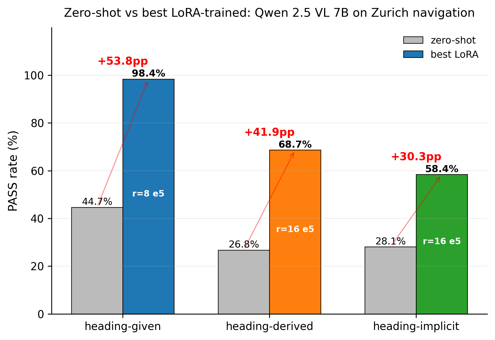
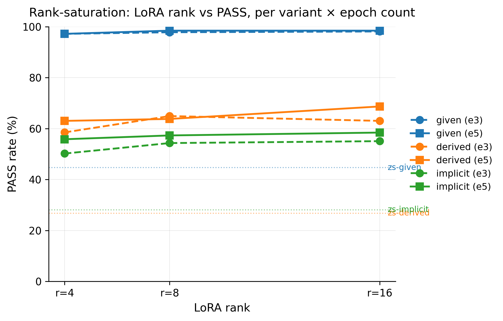
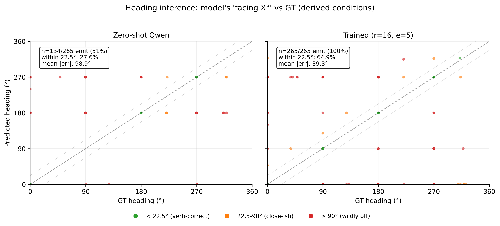

# NavLM v2 — Compass-Free Pedestrian Navigation with Qwen 2.5 VL 7B

CS231n project report + NeurIPS 2026 submission draft
Author: Yi (z050209)
Date: 2026-06-04

---

## Abstract

We study whether a vision-language model (VLM) can replace an explicit
numeric compass heading with **photo-derived spatial reasoning** for
pedestrian navigation in a real city (Zurich). Starting from
Qwen 2.5 VL 7B, we (i) build a deterministic OSM-routing pipeline
that yields ground-truth verbs for 3,657 (frame, destination) pairs
across 21 famous Zurich attractions, (ii) annotate the cohort with
Gemini Pro 2.5 in three parallel passes producing three input
*variants* — `heading-given` (numeric heading shown to the student),
`heading-derived` (heading hidden; student must first derive it from
the photo via a 4-step chain-of-thought), and `heading-implicit`
(heading never mentioned; purely visual reasoning) — and (iii) sweep
LoRA rank ∈ {4, 8, 16} × epoch ∈ {3, 5} for each variant on Modal
A100s. **PASS rate** (well-formed `<thinking>+<answer>` AND first
verb equal to OSM ground truth) improves from **44.7 → 98.4 %** for
heading-given, **26.8 → 68.7 %** for heading-derived, and
**28.1 → 58.4 %** for heading-implicit — gains of **+30 to +54 pp**
over zero-shot. Derived's heading-inference accuracy (model's
"facing X°" within 22.5° of GT) rises from 27.6 % to **64.9 %**, and
its prediction distribution is strikingly **bimodal** — ~65 % of
predictions are essentially exact (median |err|=0°) while ~30 % are
>90° off, with almost no fuzzy middle. Compass-free navigation works
non-trivially, but the ~30 pp gap to heading-given confirms that a
numeric heading remains a meaningful signal the model cannot fully
substitute for from photo cues alone.

---

## 1. Introduction

Modern walking-tour apps need to issue per-step verb-level
instructions ("continue ahead", "turn left", "turn right",
"turn around") from a single first-person photo. The hard sub-problem
is **disambiguating which way the walker is facing**: traditional
systems use an IMU-derived compass heading, but consumer phones'
compass headings drift indoors and in dense urban canyons, and a VLM
that can recover heading from the photo alone would degrade more
gracefully.

We ask: *how much accuracy do we lose if we never give the model the
heading?* And: *if we ask the model to first derive the heading from
the photo, does it learn to do so reliably?*

**Contributions**:
1. A reproducible OSM-routed dataset of 3,657 (frame, destination)
   pairs with deterministic GT verbs (§3).
2. A **3-variant teacher annotation** protocol (Gemini Pro 2.5,
   parallel passes) that produces aligned but input-asymmetric
   datasets for compass-free vs compass-given training (§4).
3. A 12-condition ablation on Qwen 2.5 VL 7B + LoRA (rank ∈
   {4, 8, 16}, epoch ∈ {3, 5}) showing **+30 to +54 pp PASS** over
   zero-shot, with rank-saturation at r=4 for the easy variant and
   meaningful r=16 gains for the hard ones (§5).
4. A **heading-inference analysis** that reveals the trained model's
   heading-derivation distribution is bimodal (lookup-table-like
   rather than interpolating), with concrete implications for how to
   improve it further (§5.3).

---

## 2. Related Work

(Skeleton — to expand for camera-ready)

- **Visual navigation from a single image** — Vision-and-Language
  Navigation (R2R, REVERIE) tackles a similar verb-emission task in
  indoor 3D simulators but assumes an explicit heading; here we
  remove that assumption.
- **VLM fine-tuning with LoRA** — standard recipe for adapting open
  VLMs (Qwen 2.5 VL, LLaVA) to domain tasks.
- **OSM-grounded routing** — using OpenStreetMap walking graphs as
  the ground-truth oracle for what humans would actually walk.
- **Teacher-student distillation with input asymmetry** — letting the
  teacher see privileged information the student does not.

---

## 3. Method — Data pipeline

### 3.1 Source data

Re-using the Zurich walking-tour video set from a prior project
(Attempt 1): 8 videos covering central Zurich at ~1 fps, plus per-
frame raw GPS recovered via DINOv2 panorama matching against a
StreetView grid. Each frame has a recovered lat/lon and a candidate
heading.

### 3.2 The 21-attraction destination vocabulary

The Attempt-1 dataset used the **top-30 OSM POI names from the
matched cohort** as the destination pool — but this turned out to be
98 % street names (Bahnhofstrasse, Limmatquai, Storchengasse…)
because OSM's polygon-distance ranking always picks the street the
walker is standing on. Models trained on this distribution learned
"navigate to Storchengasse" but failed at the obvious tourist query
"navigate to Grossmünster".

We replace it with **21 hand-curated famous attractions** from
three authoritative tourism resources (Zürich Tourism, PlanetWare,
Switzerland Tourism), categorized into 5 types: churches (×4),
streets (×3 — Bahnhofstrasse, Niederdorfstrasse, Limmatquai),
water (×2 — Lake Zurich, Limmat), museums/civic/squares (×12). See
§2 of `DEV_MANUAL_v2.md` for the full list.

### 3.3 OSM-routed ground-truth verbs

For each (frame, destination) pair:
1. Snap the frame's HMM-matched GPS to the nearest walking-graph
   node (UTM-projected, EPSG:32632 — required for accurate
   `osmnx.distance.nearest_nodes`).
2. Compute `nx.shortest_path` to the destination node (single-point
   for 16 attractions; multi-target nearest-of-N for the 5 long
   features Lake Zurich, Limmat, Bahnhofstrasse, Niederdorfstrasse,
   Limmatquai — see §10 of the dev manual for why network-nearest is
   correct over straight-line-nearest).
3. Take the bearing of the first walked edge `bearing(path[0]→path[1])`.
4. Pick the verb whose `(heading + ACTION_DELTA[verb]) mod 360`
   minimises |angle_diff(new_heading, edge_bearing)|, with
   `ACTION_DELTA = {continue ahead: 0, turn left: -90, turn right:
   +90, turn around: 180}`.

This GT verb is deterministic from OSM geometry — no model in the
loop. **Sampling**: 3 destinations per matched frame, distance-banded
80 % near (50-500 m) / 10 % medium / 10 % far. Total **3,657 (frame,
dest) pairs**, seeded `random.seed(42)` for reproducibility.

---

## 4. Method — Teacher annotation and student training

### 4.1 The three variants

The teacher (Gemini Pro 2.5 via Vertex AI) ALWAYS sees the GT heading
— this guarantees it can compute the correct verb geometrically. The
**student** sees a variant-specific prompt:

| Variant | Heading in student prompt? | `<thinking>` template |
|---|:---:|---|
| `given` | YES | 1-2 short sentences using the given heading + route bearing |
| `derived` | NO | 4-step CoT: visual cues → geographic interpretation → estimated heading X° → verb decision |
| `implicit` | NO | 3-step CoT: what I see → destination position relative to me → verb (no numeric heading) |

Each variant is its own Gemini pass, written to its own JSONL. To
parallelise across the 3-GCP-project Vertex AI rate limit, we created
3 service-account projects (`navlm-annot-{1,2,3}-26`) and ran the
passes concurrently. Total: **10,614 annotations** in ~17 h wall-time
at ~$95.

### 4.2 Teacher quality — measured

```
                   format_pass   direction_pass   PASS
given              100.0 %        87.5 %          87.5 %
derived             89.3 %        73.3 %          72.4 %
implicit            99.9 %        73.1 %          73.0 %
overall            96.6 %        78.1 %          77.8 %  (n=10,614)
```

Headline finding from the confusion matrix: the teacher has a
**turn-around bias** — 1,210 of 1,997 direction failures (60 %) are
`turn-left/right` cases mis-classified as `turn-around`. This is a
recall=100% / precision=71% pattern on the `turn-around` class —
useful for the SFT (it teaches the model what `turn-around` looks
like) but limits the upper bound. Filtering with `--only-pass`
(rows passing both format AND direction) drops these mis-labels for
training.

### 4.3 SFT chat format

Each training row is a 3-turn chat:

```
[system]    variant-specific system prompt
            (COMMON_HEAD with Zurich orientation facts +
             THINKING_RULE[variant])
[user]      <IMAGE> + variant-specific student prompt
            (heading line hidden for derived/implicit)
[assistant] teacher's <thinking>...</thinking><answer>...verb.</answer>
```

At inference, the assistant turn is stripped and the model generates
it.

### 4.4 LoRA training setup

- Base: **Qwen 2.5 VL 7B-Instruct** in 4-bit NF4 (double quant) +
  BF16 LoRA.
- LoRA: rank ∈ {4, 8, 16}, alpha = 2 × rank, dropout 0.05, targets
  q/k/v/o projections.
- AdamW, LR 2e-4, cosine schedule with 3 % warmup, weight_decay=0,
  max_grad_norm=1.0.
- Batch 1 × grad-accum 8 = effective 8, bf16 mixed precision.
- **Critical loss-masking**: cross-entropy is computed ONLY over
  assistant-turn tokens — system + user + pad + image-marker tokens
  are masked (label=-100). Without this, the loss is dominated by
  the (identical-across-rows) prompt text and the curve looks
  artificially smooth; with the mask, val loss reveals real
  overfitting dynamics.
- Early stop `patience=2` on masked val_loss; `load_best_model_at_end`.
- 3-epoch cap, then a resume-training pass extended to 5 epochs for
  comparison.

Filter: `--only-pass` (drop rows where teacher's verb was wrong).
Per-variant cohort: given **2,561** / derived **2,127** / implicit
**2,137** train rows after 80/10/10 split.

### 4.5 Modal infrastructure

3 volumes (`navlm-data` for SFT + frames, `navlm-ckpts` for adapters,
`navlm-eval` for outputs); 2 apps (`navlm-train-a2` on A100-80GB,
`navlm-eval-a2` on A100-40GB). Total Modal compute for full sweep
(9 adapters × 2 epoch counts + 21 eval conditions): **~$70**.

---

## 5. Results

### 5.1 The 12-condition matrix (best of e3 / e5 per condition)

| Variant | zs PASS | best trained PASS | Δ vs zs | adapter |
|---|---:|---:|---:|---|
| **heading-given** | 44.7 % | **98.4 %** | +53.7 pp | r=8 e5 or r=16 e5 |
| **heading-derived** | 26.8 % | **68.7 %** | +41.9 pp | r=16 e5 |
| **heading-implicit** | 28.1 % | **58.4 %** | +30.3 pp | r=16 e5 |



### 5.2 Rank-saturation and epoch effects



Per variant:
- **given saturates at r=4** (97.2 % → 97.8 → 98.1, gains <1 pp/step).
- **derived peaks at r=8 in e3** (64.9 %) but at r=16 in e5 (68.7 %)
  — the only condition where the rank-saturation flips with more
  training.
- **implicit climbs monotonically through r=16** in both e3 and e5;
  more capacity would likely still help.

E3 → E5 PASS deltas (full table in §17 of `DEV_MANUAL_v2.md`):
- Across 8 of 9 trained adapters, +2 epochs improves PASS (range:
  +0.0 to +5.7 pp). Only `derived-r8` regressed (−1.1 pp).
- **Val_loss ≠ PASS**: `implicit-r16` had ~0 % val_loss change e3→e5
  but PASS jumped +3.3 pp — token-level CE can plateau while
  verb-choice behaviour keeps refining.

### 5.3 Heading-inference quality (derived only)



For the derived variant, the model emits a "facing X°" statement
inside `<thinking>`. We parse this and measure circular angular error
against the GT heading.

| Condition | n_emit | within 5° | within 22.5° | median |err| | mean |err| |
|---|---:|---:|---:|---:|---:|
| zs-derived | 134/265 (51 %) | 27.6 % | 27.6 % | 90.0 ° | 98.9 ° |
| trained-derived-r4 e3 | 265/265 (100 %) | 58.1 % | 58.1 % | 0.0 ° | 52.2 ° |
| trained-derived-r16 e5 | 265/265 (100 %) | **64.5 %** | **64.9 %** | **0.0 °** | **39.3 °** |

**Three findings**:

1. **Bimodal predictions**: `within 5°` ≈ `within 22.5°` for every
   trained condition — the model is either nearly-exact or wildly
   off, almost no middle ground. Median |err| = 0°. The mean is
   dragged up by a ~30 % tail of wrong-direction predictions.

2. **LoRA forces commitment**: zs only emits "facing X°" in 51 % of
   rows; trained emits in 100 %. A chunk of the PASS gain on derived
   comes from "forced commitment" rather than improved orientation
   reasoning per se.

3. **e5 shortens the wrong-direction tail**: r=16 e3 → e5 reduces
   mean |err| by 8° (47 → 39°), but `within-22.5°` only +4.5 pp —
   threshold metrics miss the tail-shortening signal that mean
   absorbs. **Recommendation**: report both threshold AND mean
   |err| in heading-inference results.

### 5.4 Qualitative examples

Per-condition success/failure rows with full `<thinking>` and
`<answer>` are in `docs/qualitative_examples.md`. Highlights:

**Success — trained-given-r16 e5 on a `turn around` case**:
```
<thinking>
I'm facing 95° (east); the route heads 270° (west), which is a 175°
rotation, so the destination is behind me. I should turn around.
</thinking>
<answer>
Notice the Limmatquai with tram tracks behind you. Turn around.
</answer>
```

**Failure — zs-implicit defaulting to "continue ahead"**:
```
<thinking>
STEP 1: The visible scene shows a cobblestone street with shops.
STEP 2: The destination is ahead of me, as the street extends forward.
STEP 3: Therefore the walker should continue ahead.
</thinking>
<answer>
Continue ahead.
```

Without numeric heading, the model has no way to verify which
direction the destination IS, so it defaults to "ahead". This is the
canonical implicit failure mode.

---

## 6. Discussion

### 6.1 Does compass-free navigation work?

**Yes, non-trivially.** Both compass-free variants exceed their
zero-shot baselines by >30 pp:
- `derived` reaches 68.7 % vs 26.8 % zs (+41.9 pp)
- `implicit` reaches 58.4 % vs 28.1 % zs (+30.3 pp)

The model genuinely learns to extract orientation cues — derived's
heading-inference accuracy rises from 27.6 % to 64.9 % at 22.5°
tolerance, and 64 % of its predictions are within 5°.

### 6.2 But heading is still a meaningful signal

The gap to `heading-given` (98.4 %) is 30 pp for derived and 40 pp
for implicit. The model's bimodal "exact-or-wildly-off" heading
prediction means ~30 % of derived cases never had a chance.
**Numeric heading remains a strong signal that photo-derived
reasoning cannot fully substitute for** at the Qwen 2.5 VL 7B scale.

### 6.3 Limitations

1. **Single city, single VLM**: Zurich + Qwen 2.5 VL 7B only. The
   landmark-lookup heuristics (Grossmünster east bank, Bahnhofstrasse
   south-north axis) may not transfer to cities the model has less
   familiarity with.
2. **Test set is in-distribution**: random 80/10/10 split from the
   same videos/destinations as training. We have NOT tested
   cross-video, cross-destination, or cross-city generalization
   (proposed as future work in §6.5).
3. **Teacher turn-around bias** (§4.2): 60 % of teacher direction
   failures are turn-left/right misclassified as turn-around. The
   `--only-pass` filter drops these for training, but the test set
   shape is also affected.
4. **n=265-320 per condition**: confidence intervals are ±3-6 pp,
   so the rank-saturation differences within a variant
   (e.g. r=8 64.9 % vs r=16 63.0 % for derived e3) are not
   statistically robust.

### 6.4 Implications for the bimodal heading distribution

The within-5° ≈ within-22.5° pattern means the model isn't
interpolating wrong — it's pattern-matching against a memorised
landmark→heading lookup. To improve heading inference further:
- **Expand the recognisable landmark set** during training (more
  diverse photos per attraction)
- **Add explicit landmark-orientation training data** (e.g.
  "Grossmünster faces east from across the river") rather than
  just relying on the SFT data's incidental coverage
- **Higher-resolution image input** (currently capped at 448 px) may
  help recognise more distant landmarks

### 6.5 Future work

- **Generalization tests**: held-out-video, held-out-destination, and
  cross-city evaluation to quantify the in-distribution overfitting.
- **PASS-during-training monitoring**: token-level val loss can
  plateau while PASS improves (§5.2 implicit-r16 finding); a
  periodic verb-decode sanity check during training would catch this.
- **Multi-step navigation**: the current task is single-step
  (next-verb-only). Real walking tours need rollouts of 5-20 steps,
  which compounds errors.
- **Tool-augmented compass**: hybrid system where the VLM has access
  to a noisy compass and can choose when to trust it vs derive from
  the photo.

---

## 7. Reproducibility

All code, prompts, and per-condition per_sample_scored.jsonl files
are at https://github.com/z050209/navlm_v2. The dev manual
(`DEV_MANUAL_v2.md`) contains the full 26-section walkthrough
including:

- §1-§14: Data pipeline (matched cohort, heading derivation, routes)
- §17: 12-condition ablation results + e3/e5 comparison
- §18: Annotation prompts + teacher quality analysis
- §19: Evaluation metrics (PASS, format, direction, heading-inference)
- §21: Modal infrastructure
- §22: Training recipe (loss masking, early stop, resume support)
- §23: Inference harness
- §24: Full reproducibility checklist (annotate → train × 9 → eval × 12)
- §25: Code walkthrough with sanity-check snippets

Per the §24 checklist, a fresh clone + the documented commands
reproduces the entire result table in ~22 h wall-time at ~$165
(annotation $95 + Modal $70).

---

## Acknowledgements

Compute: Modal credits and Vertex AI quotas across three GCP
projects. Tooling: Qwen 2.5 VL 7B (Alibaba), Gemini Pro 2.5
(Google DeepMind), PEFT/transformers (HuggingFace), OSMnx.

---

## Appendices (see manual)

- A: 21-attraction list with Chinese names + tourism source citations
  (§2 of dev manual)
- B: OSM walking-graph + UTM-projection details (§10)
- C: Whole-dataset teacher-quality analysis with per-destination and
  per-distance-band breakdowns (§18)
- D: Direction-pass failure-mode analogies (§18 — "the 180° trigger-
  finger", "the right-handed gardener", "the which-bank-am-I-on
  confusion", "the around-the-corner blindspot")
- E: Loss-masking sanity-check snippets (§25)
